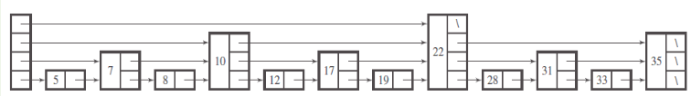

<div align="center"><h1> COS 212 Semester Test 1 </h1></div>
<div align="center"><h4> BigO Notation; Self Organising Lists; Stacks & Queues; Recursion; Binary Trees </h4></div>


## Question 1: [BigO Notation](https://gitlab.com/Paul_Wood_96/tutoring/-/blob/master/COS212/notes/BigONotation/README.md)

For each of the following right down the complexity of the algorithm in the form of BigO Notation

1.1.
```java
int method(int i, int n) {
    if (i < n) {
        return 0;    
    }
    else if(i > n) {
        return 1;
    }
    else {
        return method(i, n -1) * method(i, n - 2)
    }
}
```

```java


```

1.2 
```java
int k = 0;
for (int i = n; i > 0; i / 2) {
    for (int j = 0; j < 5; j++) {
        k++;
    }
}
```

```java


```

1.3 
```java
for (int i = 0; i < n; i++) {
    for(int j = 0; j < n; j++) {
        for(int k = i - 2; k <= i; k++)
            for(int l = 0; l < n; l++) {
                System.Println("hello world")
            }
        }
    }
}
```

```java


```

1.4 
```java
for (int i = 0; i < n; i++) {
    for (int p = n; p > 0; p--) {
       a = b + c; 
    }
}
```

````java


````

1.5
```java
int i = 0;
while (i < n) {
    
    tmp = i;
    
    if (i % 2 == 0) {
       tmp *= i * 2;
    } else {
        tmp /= i / 2;
    }
    i++;
}
```

```java


```

1.6

```java
int i = 0;
while (i < n) {
    
    if (i % 2 == 0) {
        i *= 2;
    } else {
        i += 1;
    }
}
```

```java


```

1.7 
```java
int method(int n) {
    if (n < 0) {
        return y;
    }
    
    return method(n - 1) * (n - 1)
}
```
```java


```

1.8 
```java
for (int i = 0; i < n; i++) {
    for (int j = 0; j <= i; j++) {
        sum += j;
    }
}
```

```java


```

1.9
```java
int sum = 0;
for (int a = 0; a < n; a++) {
    for (int b = 0; b < n; b++) {
        for (int c = 0; c < n; n++) {
            if (n > 0) {
                return sum += a + b + c; 
            }   
        }
    }
}
```

```java


```
1.10
```java
void method(int i, int n) {
    
    if (n < 0) {
        return;
    }
    for ( ; i < n; i++) {
        mehod(i, n / 2)
    }
}
```

```java


```

## Question 2: [Skip Lists](https://gitlab.com/Paul_Wood_96/tutoring/-/blob/master/COS212/notes/SkipLists/README.md)

2.1 Assume a Skip List with a max height of 6, provide the *Array of Powers* for the Skip List.
 
```text

```

2.2 What is the max level of a Skip List if there are only 4 references in the Array of Powers in the 3rd level?  

```text

```

2.3 Assume the following SkipList 



2.3.1 Assume Node `35` was deleted, indicate all affected Nodes, for each Node indicate at which level the Node has been 
affected, if the Node affected was the first Node you may assume `Root` at level *x*. Please only identify the Nodes 
that will be affected when removing Node `35`.

```text

```

2.3.2 Assume Node 22 was deleted, indicate all affected Nodes, for each Node indicate at which level the Node has been 
affected, if the Node affected was the first Node you may assume `Root` at level *x*. Please only identify the Nodes 
that will be affected when removing Node `22`

```text

```

### Question 3: [Self Organinizing Lists](https://gitlab.com/Paul_Wood_96/tutoring/-/tree/master/COS212/notes/SelfOrganizingLists/README.md)

For all questions that follow assume the following Circular List Class and List Node class

```java
class ListNode<T> {

    T key;
    int counter = 0;

    List<T> next;
    
    // constructor ...
}

class CircularListSelfOrganizingList<T> {

    ListNode<T> tail;
    
    public void addToTail(T elem);
    public void deleteFromHead();
    public void access(T elem);
}

```

3.1 Implement the `addToTail()` method you may assume you have a working implementation of the *isEmpty()* method. The list 
may not allow duplicates if any duplicate is added your method must output the following: "Invalid Duplicate Key Exception". (4)

```java

```

3.2 Implement the `deleteFromHead()` method you may assume you a working implementation of the *isEmpty()* method. (3)

```java

```

3.3 Assume the Self Organizing List makes use of the *Count* self organizing strategy, implement the access method. The access 
method should take in an element to search for in the list, if the element is not found in the List the method should output 
the following: "Invalid Key Exception". If the element is found in the List the counter for the key should be incremented, 
and the list sorted.

```java

```

3.4 Assume you have a working implementation of the **move-to-front** strategy, being applied to the following List:

> A -> B -> D -> M -> N -> F

Give the final List after the Nodes have been visited in the following order 

> M, B, G, F, D, M

```text

```

3.5 Assume the same List in Question 3.4 was instead implemented as a **transpose** strategy, give the final List if 
the elements where accessed in the same order as before.

```text

```

### Question 4: [Stacks and Queues](https://gitlab.com/Paul_Wood_96/tutoring/-/blob/master/COS212/notes/StacksAndQueus/README.md)

For all questions that follow assume the following implementation of the `Stack` class implemented as a Queue

```java
class Stack<T> extends Queue<T> {

    Stack() {
        stack = new Queue<>();
    }
    
    public void push(T elem) {
        stack.enqueu();
    }
    
    public T pop() {
        // implementation left for you
    }
    
    public int size() {
        // implementation left for you
    }
}
```

4.1 Implement the `pop()` method for the stack, you may assume a working `isEmpty()` method exists on the 
`Queue` class. 

```java

```

4.2 Implement the `size()` method for the stack, you may also assume a working `isEmpty()` method exist on the 
`Queue` class.

```java

```

### Question 5: [Recursion](https://gitlab.com/Paul_Wood_96/tutoring/-/blob/master/COS212/notes/Recuriosn/README.md)

5.1 Convert the following iterative method to a recursive function. This iterative method finds and returns the 
first occurrence of an integer in a List

```java
int findFirstOccurance(int[] array, int element) {
    int index = 0;
    
    while (index < array.length()) {
        if (array[index] == element) {
            return index;
        }
        
        index++;
    }
    
}
```

5.2 Convert the following recursive function to an iterative function. The following function calculated the greatest 
common denominator between two numbers 

```java
int findGreatestCommonDom(int x, int y) {
    
    if (x == y) {
        return x;
    }
    
    if (x > y) {
        return findGreatestCommonDom(x - y, y)
    } else {
        return findGreatestCommonDom(x, y - x)
    }
}

```


