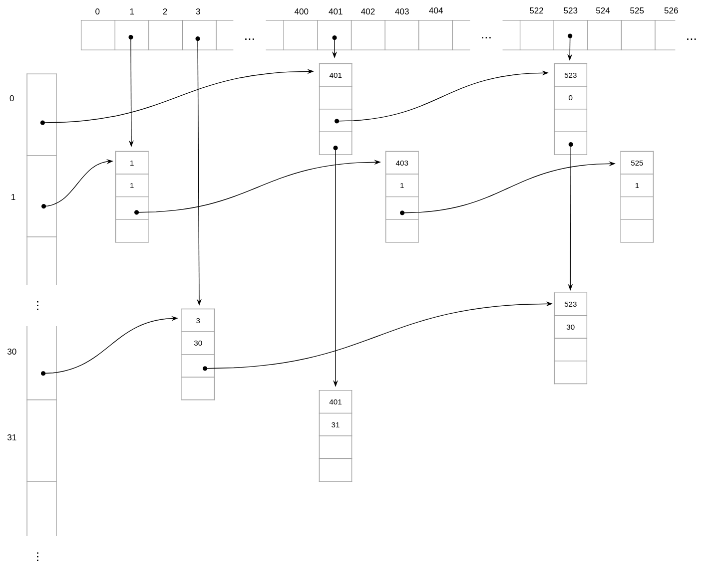

<div align="center"><h1> COS 212 Semester Test 1 </h1></div>
<div align="center"><h4> BigO Notation; Self Organising Lists; Stacks & Queues; Recursion; Binary Trees </h4></div>


## Question 1: [BigO Notation](https://gitlab.com/Paul_Wood_96/tutoring/-/blob/master/COS212/notes/BigONotation/README.md)

For each of the following right down the complexity of the algorithm in the form of BigO Notation

1.1.
```java
int method(int i, int n) {
    if (i < n) {
        return 0;    
    }
    else if(i > n) {
        return 1;
    }
    else {
        return method(i, n -1) * method(i, n - 2)
    }
}
```

> ### O(1)

1.2
```java
int k = 0;
for (int i = n; i > 1; i / 2) {
    for (int j = 0; j < 5; j++) {
        k++;
    }
}
```

> ### O(log(n))

1.3
```java
for (int i = 0; i < n; i++) {
    for(int j = 0; j < n; j++) {
        for(int k = i - 2; k <= i; k++)
            for(int l = 0; l < n; l++) {
                System.Println("hello world")
            }
        }
    }
}
```

> ### O(n)<sup>3</sup>

1.4
```java
for (int i = 0; i < n; i++) {
    for (int p = n; p > 0; p--) {
       a = b + c; 
    }
}
```

> ### O(n)<sup>2</sup>

1.5
```java
int i = 0;
while (i < n) {
    
    tmp = i;
    
    if (i % 2 == 0) {
       tmp *= i * 2;
    } else {
        tmp /= i / 2;
    }
    i++;
}
```

> ### O(n)

1.6

```java
int i = 0;
while (i < n) {
    
    if (i % 2 == 0) {
        i *= 2;
    } else {
        i += 1;
    }
}
```

> ### O(log(n))

1.7
```java
int method(int n) {
    if (n < 0) {
        return y;
    }
    
    return method(n - 1) * (n - 1)
}
```

> ### (O)<sup>n</sup>

1.8 (1)
```java
int i = n, b = 0;
while (i < n) {
    for (int j = i - n; j < i; j++){
        b *= j + i;
    }
    i--;
}
```

> ###  O(n)<sup>2</sup>

1.9
```java
int sum = 0;
for (int a = 0; a < n; a++) {
    for (int b = 0; b < n; b++) {
        for (int c = 0; c < n; n++) {
            if (n > 0) {
                return sum += a + b + c; 
            }   
        }
    }
}
```

> ### O(1)

1.10
```java
void method(int i, int n) {
    
    if (n < 0) {
        return;
    }
    for ( ; i < n; i++) {
        mehod(i, n / 2)
    }
}
```

> ### O(n(log(n)))

## Question 2: [Skip Lists](https://gitlab.com/Paul_Wood_96/tutoring/-/blob/master/COS212/notes/SkipLists/README.md) + Sparse Tables

2.1 Assume a Skip List with a max height of 6, provide the *Array of Powers* for the Skip List. (4)

```text

```

2.2 What is the max level of a Skip List if there are only 4 references in the Array of Powers in the 3rd level? (1)

```text

```

2.3 Assume the following SkipList


2.3.1 Assume Node `35` was deleted, indicate all affected Nodes, for each Node indicate at which level the Node has been
affected, if the Node affected was the first Node you may assume `Root` at level *x*. Please only identify the Nodes
that will be affected when removing Node `35`. (2)

```text

```

2.3.2 Assume Node 22 was deleted, indicate all affected Nodes, for each Node indicate at which level the Node has been
affected, if the Node affected was the first Node you may assume `Root` at level *x*. Please only identify the Nodes
that will be affected when removing Node `22`. (2)

```text

```

2.4 Assume the following Sparse Table. The top array represents Student Numbers while the secondary array represents
class's. Provide the implementation for the expected Node Class for elements within the Sparse Table. (3)



```java

```

### Question 3: [Self Organinizing Lists](https://gitlab.com/Paul_Wood_96/tutoring/-/tree/master/COS212/notes/SelfOrganizingLists/README.md)

3.4 Assume you have a working implementation of the **move-to-front** strategy, being applied to the following List:

> A -> B -> D -> M -> N -> F

Give the final List after the Nodes have been visited in the following order. (2)

> M, B, G, F, D, M

```text

```

3.5 Assume the same List in Question 3.4 was instead implemented as a **transpose** strategy, give the final List if
the elements where accessed in the same order as before. (2)

```text

```

3.6 Assume the Nodes in the first List where modified to now contain a counter variable the resulting List now looks as
follows

> A/5 -> B/4 -> D/4 -> M/2 -> N/1 -> F/0

Give the final List after the Nodes have been visited in the following order. (2)

> F, F, M, D, N, D, A, G

```text

```

### Question 4: [Stacks and Queues](https://gitlab.com/Paul_Wood_96/tutoring/-/blob/master/COS212/notes/StacksAndQueus/README.md)

For all questions that follow assume the following implementation of the `Stack` class implemented as a Queue

```java
class Stack<T extends Comparable<? super T>> extends Queue<T> {

    Stack() {
        stack = new Queue<>();
    }
    
    public void push(T elem) {
        stack.enqueu();
    }
    
    public T pop() {
        // implementation left for you
    }
    
    public int size() {
        // implementation left for you
    }
}
```

4.1 Implement the `pop()` method for the stack, you may assume a working `isEmpty()` method exists on the
`Queue` class. (4)

```java

```

4.2 Implement the `size()` method for the stack, you may also assume a working `isEmpty()` method exist on the
`Queue` class, you may not make use of any other methods on the Queue class besides the `isEmpty()` method. (3)

```java

```

### Question 5: [Recursion](https://gitlab.com/Paul_Wood_96/tutoring/-/blob/master/COS212/notes/Recuriosn/README.md)

5.1 Convert the following iterative method to a recursive method. This iterative method finds and returns the
first occurrence of an integer in a List. (3)

```java
int findFirstOccurance(int[] array, int element) {
    int index = 0;
    
    while (index < array.length()) {
        if (array[index] == element) {
            return index;
        }
        
        index++;
    }
    
}
```

5.2 Convert the following recursive function to an iterative function. The following function calculates the Greatest
Common Denominator between two numbers. (3)

```java
int findGreatestCommonDom(int x, int y) {
    
    if (x == y) {
        return x;
    }
    
    if (x > y) {
        return findGreatestCommonDom(x - y, y)
    } else {
        return findGreatestCommonDom(x, y - x)
    }
}

```

5.3

Assume the following LinkedNode Class

```java
class LinkedNode<T extends Comparable<? super T>> {
    
    int key;
    LinkedNode<T> next;
    
    // constructor ...
}
```

5.3.1 Write down a recursive method called `findFours(LinkedNode<T> node)` that takes in a LinkedNode and counts the amount of elements in the List divisible by `4`. (3)

```java

```

5.3.2 Is your method an example of `Tail Recursion` or `Non Tail Recursion`, explain your answer. (2)

```text

```

5.4 Assume the following sudo code for the N Queens Algorithm. Identify the base case of the algorithm (1)

```kotlin
fun placeQueen(row: Int) {
    foreach col at a valid position
            place queen at position
            if (row < rows)
                placeQueen(row + 1)
            else
                printBoard()

    remove queen at position
}   
```

```text

```

## Question 6.1 [Binary Trees](https://gitlab.com/Paul_Wood_96/tutoring/-/blob/master/COS212/notes/BinaryTreesPart1/README.md)


6.1.1 What is the maximum number of nodes a Binary tree can have at level 7? (1)

```text

```

6.1.2 What is the maximum number of Leaf Nodes a Binary Tree can have at level 9? (1)

```text

```

6.1.3 What condition must be true for both your answers in 6.1 and 6.2 to be valid? (1)

```text

```

#### For all questions that follow, assume the following BSTNode Class

```java
class BSTNode<T extends Comparable<? super T>> {
    
    T key;
    BSTNode<T> right, left;
    
    // constructor
}
```

6.1.3 Provide the simplest implementation for a *recursive* function that will return the number of Nodes in the tree that
have a *Right Child*. If a Nodes right Child has is not null you should consider the Node to be a valid accumulator. (3)

```java


```

6.1.4 Provide the simplest implementation for an *iterative* function that will return the number of Nodes in the tree that
have a *Left Child*. If the Nodes left child is not null you should consider the Node to a valid accumulator. (3)

```java


```

6.1.5 Provide an example of a *recursive* function that will return the largest element in a tree, your function
should not make use of any unnecessary parameters. (2)

```java


```

## Question 6.2 [Threads](https://gitlab.com/Paul_Wood_96/tutoring/-/blob/master/COS212/notes/BinaryTreesPart2/Part2.2/README.md)

#### For all questions that follow, assume the enhanced BSTNode class

```java
class TNode<T extends Comparable<? super T>> {
    
    T key;
    TNode<T> left, right;
    boolean hasRightThread, hasLeftThread;
}
```

6.2.1 Integers are added into a *double-threaded* BST in the following order;

> 7, 20, 12, 5, 35, 6, 9, 8, 10, 1

a) What is the height of the Tree (2)

```text

```

b) How many *Left Threads* dose the resulting Tree have? (2)

```text

```

c) Node 7 is deleted by *Merging with its Successor*, how many right threads dose the resulting Tree have? (3)

```text

```

d) Node 9 is deleted by *Copying its Predecessor*, please draw the final Tree, with the Threads, marks will be deducted
for any invalid Threads. (3)

```text

```

6.2.2 Write a method `getHeight(TNode<T> node)` which calculates the height of a sub-tree whose root is node. You may
not use any additional libraries. (5)

```java

```

