### Question 1

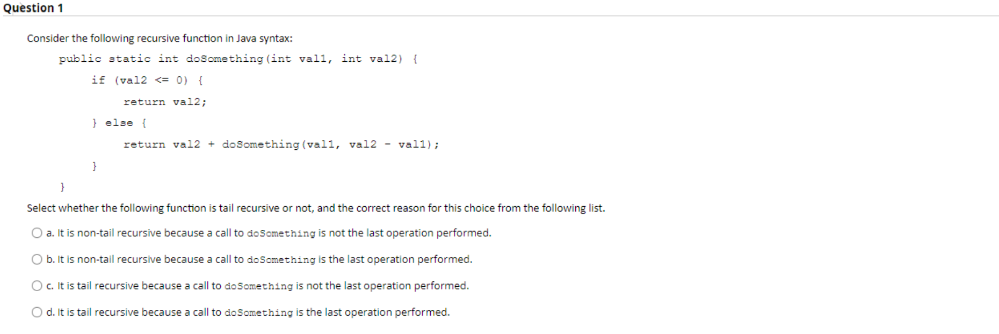

### Answer

> a. It is non-tail recursive function because a call to doSomething is not the last operation performed. 

### Question 2

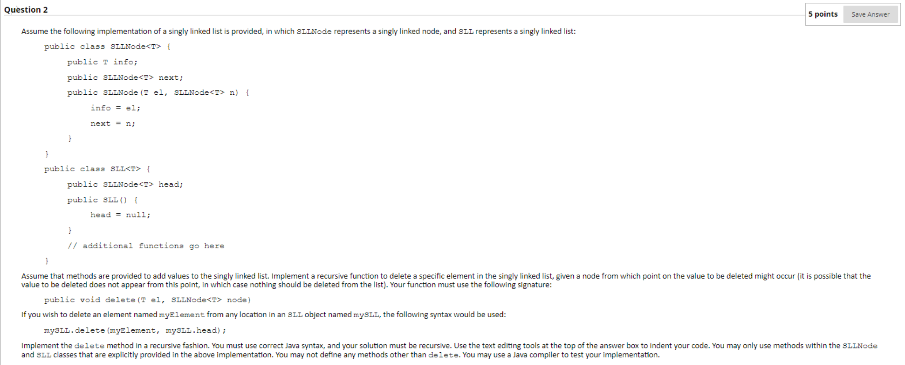

### Answer:

**YOUR FUNCTION MUST MAKE USE OF THE FOLLOWING SIGNATURE:**

```java
public void delete(T el, SLLNode<T> node)
```

```java
public void delete(T el, SLLNode<T> node) {
    
    if (node == null) {
        return null;
    }
    
    // on this functions first entry, check if the node being sent in is equal to the element
    if (node.info.equals(el)) {
        if (node == head) {
            head = head.next;
        } else {
            // it is impossible to delete this item from the list: DO Nothing 
            // CCONDITION: node sent in to be deleted from external function call is in the middle of the list 
            // and equal to the item we wish to delete
        }
        
        return; // no need to make a recursive function
    }
    
    if (node.next != null && node.next.info.equals(el)) {
        node.next = node.next.next;
    } else {
        delete(el, node.next);
    }
}
```

### Question 3

Assume the following tree was implemented as a double threading, how many **LEFT** threads would the resulting tree have

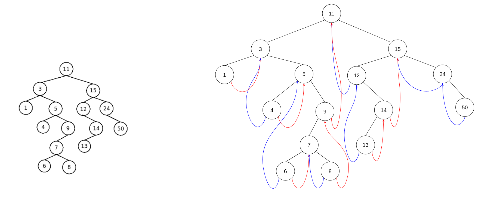

### Answer 

> 7

### Question 4

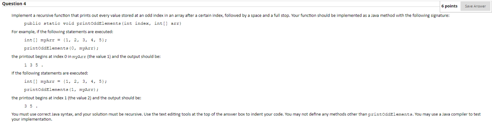

### Answer

> Implement a recursive function that prints out every value **stored at on odd INDEX**

```java
// you had to realise the question was asking to print values at on odd index not odd values, indices in this question also
// started at 1 not 0. 

public static void printOddElements(int index, int[] arr) {
    
    if (index >= arr.length()) {
        // if you used println you would add a new line after each character, make sure you made use of print
        System.out.print( "." );
        return;
    }
    
    // if odd index
    if ((index + 1) % 2 != 0) {
        // the final character will add the space needed between characters and the full stop
        System.out.print( arr[index] + " " );
    }
    
    // make sure you printed the characters at odd index before the recursive call, if after the elements 
    // would have been printed in repeat order starting with the full stop
    printOddElements(index + 1, arr);
}
```

### Question 5

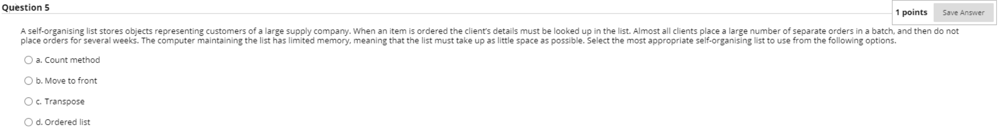

### Motivation & Answer 
The computer has limited memory so Count method would not be suitable as it adds memory, to store count variables.
Ordered List is not self organising and should not be considered as a valid option, so in that regard 1 and 4 should 
be invalid.

Between Transpose and MTF, both will use about the same memory so both could be possible solutions BUT the questions says 
> Almost all clients place a large number of separate orders in a batch, and then do not place orders for several weeks

This favors the MTF algorithm as moving clients orders closer to the front will speed search operations up significantly 
if they have not placed orderes in several weeks, whereas the Transpose method would only slowly move the client 
closer the front, and it may not even get there by the time the batch finishes

Therefore I would answer: 
> 2: Move to Front

### Question 6

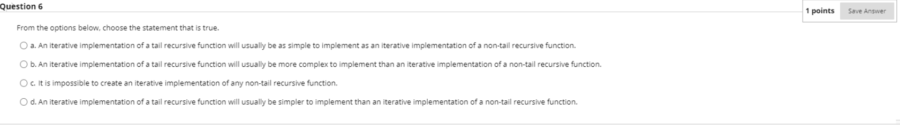

### Answer 

> d

### Question 7

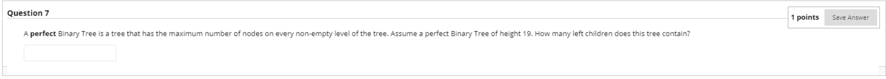

### Motivation & Answer 

2<sup>n</sup> - 1 = total Nodes in a binary tree (where n = height)<br />
In a Complete tree all non-terminal nodes will have both children, we can reduce height by 1 to get all 
non-terminal nodes. <br />
All non-terminal nodes will have a left and right child, therefore we can divide by 2 to find all left children

> dividing by 2 => subtracting a power

> (2 <sup> 19 - 2 </sup> - 1) = 131071

### Question 8

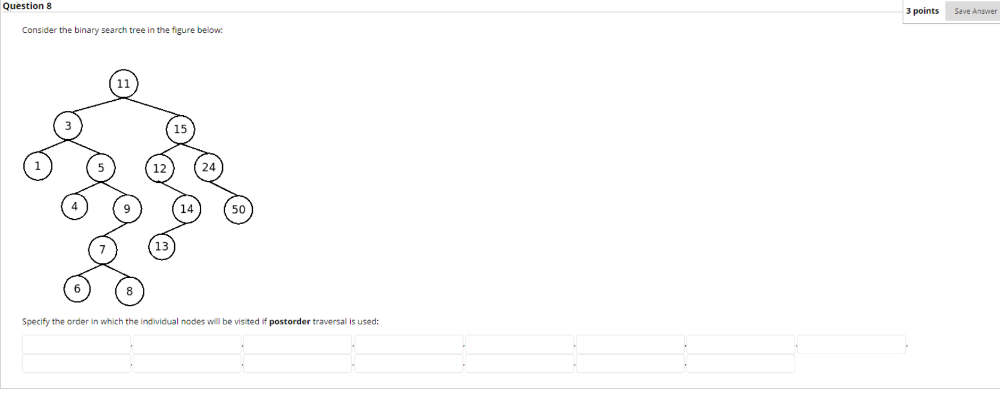

### Answer

> 1 -> 4 -> 6 -> 8 -> 7 -> 9 -> 5 -> 3 -> 13 -> 14 -> 12 -> 50 -> 24 -> 15 -> 11

### Question 9

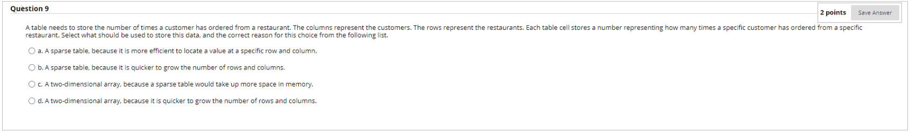

### Motivation & Answer 
**Motivation for not an array**: Most customers are not going to go to every restaurant, therefore it is likely
that the data will be sparse

> a. A sparse table, because it is more efficient to locate a value at a specific row and column

### Question 10

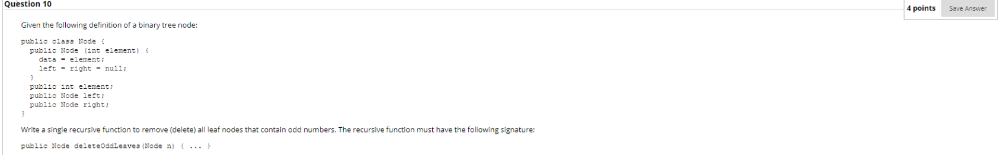

The recursive function must have the following signature 
```java
public Node deleteOddLeaves(Node n) {}
```

### Answer

```java
public Node deleteOddLeaves(Node n) {
    if (n == null) {
        return null;
    }
    
    // Preorder traversal visit the node first
    // check if the nodes left and right child are leaf nodes
    if (n.left != null && n.left.left == null && n.left.right == null) {
        // left child is a leaf node 
        if (n.left.data % 2 != 0) { // left is an odd leaf node
            // I could have added this to the outer if but this is just so many conditions
            n.left = null;
        }
    }

    if (n.right != null && n.right.left == null && n.right.right == null) {
        // right child is a leaf node 
        if (n.right.data % 2 != 0) { // right is an odd leaf node
            // I could have added this to the outer if but this is just so many conditions
            n.right = null;
        }
    }
    
    if (n.left != null) {
        deleteOddLeaves(n.left);
    }
    if (n.right != null) {
        deleteOddLeaves(n.right);
    }
    
    return n // for some reason;
}
```

### I am missing a question 11

### Question 12

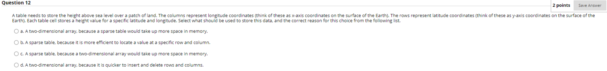

### Answer
 **Motivation for NOT a Sparse table**, it is likely that every coordinate indicated in the question is
 going to need an associated value for each longitude and latitude value therefore, our data is not
 sparse.

> a. A two-dimensional array because a sparse table would take up too much data in memory <br />

### Question 13
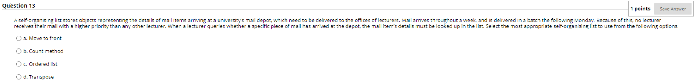

### Answer 

> b

### Question 14
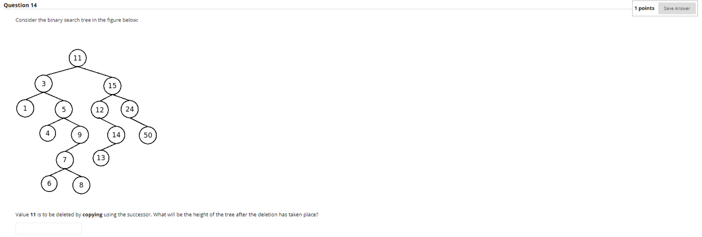

### Answer 

**deleted by COPYING with SUCCESSOR**

> 6

### Question 15

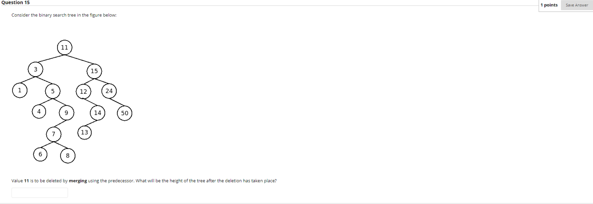

**deleted by MERGING with PREDECESSOR**

### Answer 

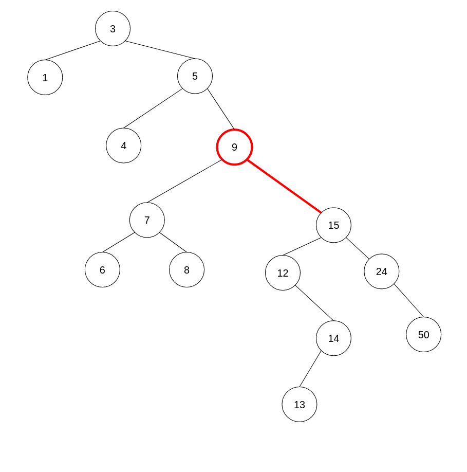

> 7

### Question 16

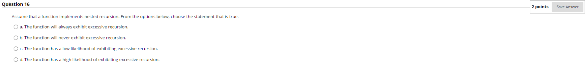

### Answer 

> d. High likelihood

### Question 17

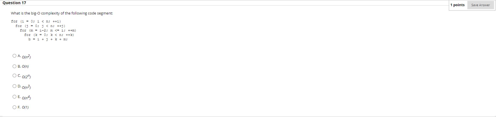

### Answer
> for (m = i -2; m <= i; m++) // I hope you noticed this

> d. O(n<sup>3</sup>)


### I am missing question 18

### Question 19

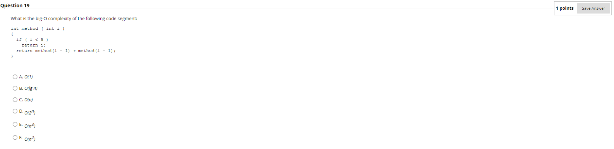

### Answer
> d. O(2<sup>n</sup>)

### I am missing question 20

### Question 21

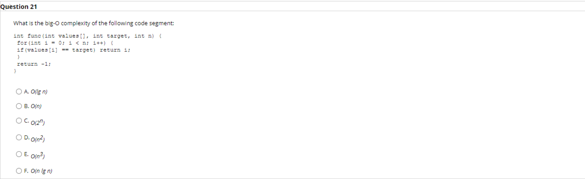

### Answer
> b. O(n)

### Question 22

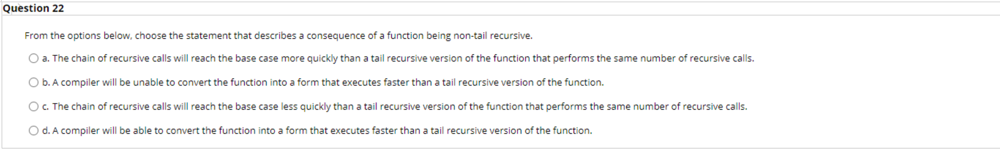

### Answer
> b.

### Question 23

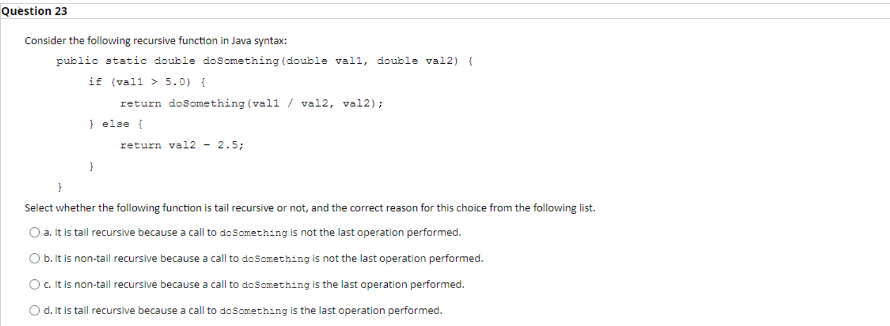

### Answer
> d.
