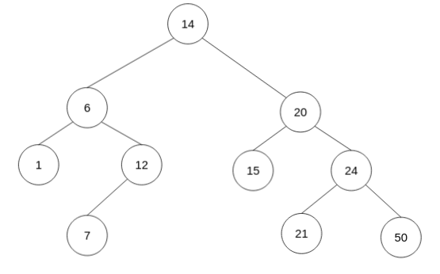
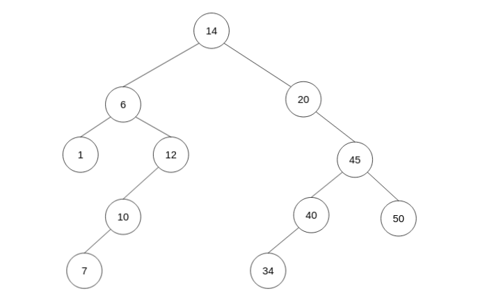
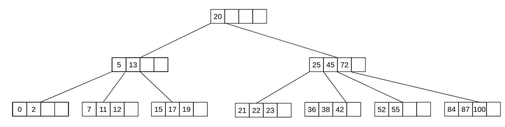
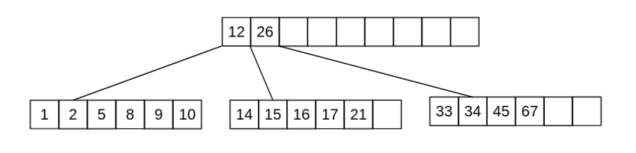
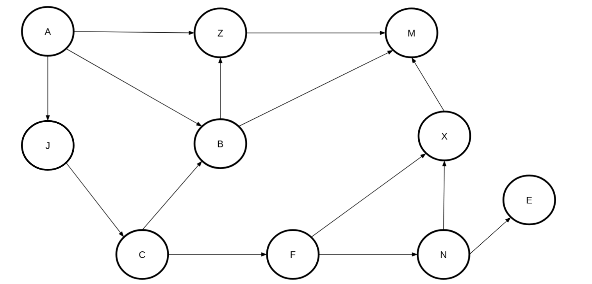
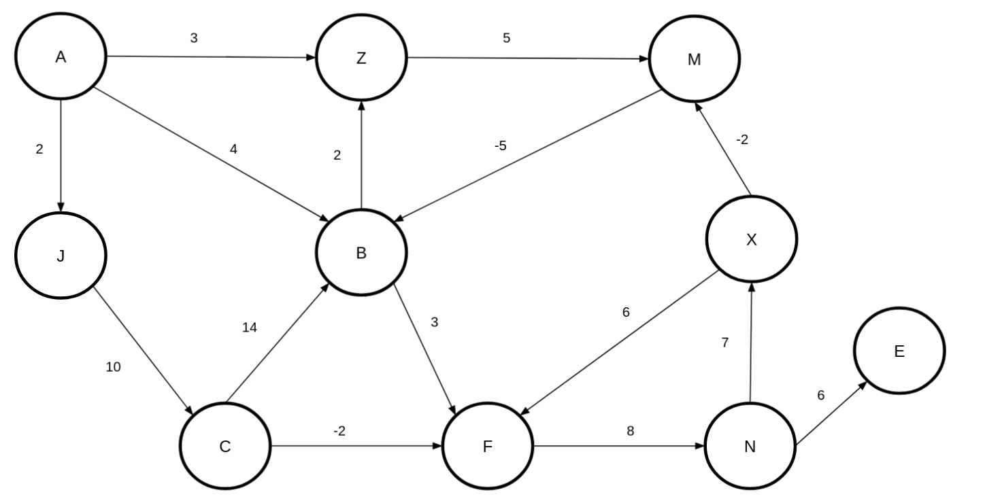

<div align="center"><h1> COS 212 Semester Test 2</h1></div>
<div align="center"><h4> Tree Balancing; Self Organising Trees; Heaps; B-Trees; B+ & B* Trees; Graphs </h4></div>

## Question 1: [Tree Balancing](https://gitlab.com/Paul_Wood_96/tutoring/-/tree/master/COS212/notes/Questions/BalancingABinaryTree)

1.1) The DSW algorithm is being applied a tree of 35 Nodes, How many rotations will happen on the first rotation of the
backbone?

    *

1.2) For all questions that follow assume the following Binary Tree


1.2.1) Show the backbone of the tree after applying the DSW algorithm

    *

1.2.2) Perform the rotations needed to balance the Tree on the backbone from `1.2.1.`

    *

1.3) For all questions that follow assume the following AVL Tree



1.3.1) What rotations need to be performed if the value 8 was inserted into the Tree

    *

1.3.2) Show the final tree after the rotations have been performed

    *       

1.4) A Node with the key F has two children with keys C and K. Node K has two children with the keys Z and I . Node C
has one child with the key A. Node I has one child with the key H. Node C is deleted from the tree. Rebalanced the tree by completing the following sentence
by substituting the letters in place of the roman numerals. Rotate (i) about (ii) and then rotate (iii) about (iv)

```text
    i.
    ii.
    iii.
    iv.
```

## Question 2: [Self Adjusting Trees](https://gitlab.com/Paul_Wood_96/tutoring/-/blob/master/COS212/notes/SelfAdjustingTrees/README.md)

For all questions that follow assume the tree



2.1) Show the final tree after the value 7 was accessed using a full Splay

    *

2.2) Using the original tree before your answer in 2.1 show the final tree if instead value 34 was accessed using a semi
splay

    *

## Question 3: [Heaps](https://gitlab.com/Paul_Wood_96/tutoring/-/blob/master/COS212/notes/Heaps/README.md)

For all question that follow, assume the following array

> [14, 2, 13, 7, 4, 5, 16, 22, 2, 12, 8]


3.1.1) Using Fords "heapifying" algorithm convert the above array to a binary **min-heap**

    *

3.1.2) Insert the following in order into your min heap, show the final min heap after all inserts have been completed

> 3, 1, 10, 3

    * 

3.1.3) Perform 3 deletions to your min heap as it stands, show the final min heap after the 3 deletions

    * 

3.2) A d-heap is a heap which can have up to *d* children per node, the more children the lower the height of the
heap. <br />
Assume the following table and fill in the index of the second child for a node at the specified index

| d | index of parent | index parents second child | 
| --- | --- | --- |
| 5  | 33 | |
| 3  | 12 | |
| 4  | 43 | |
| 8  | 57 | |

## Question 4: [B-Trees](https://gitlab.com/Paul_Wood_96/tutoring/-/blob/master/COS212/notes/MWayTreesPart1/README.md)

4.1) Assuming a B-Tree of height 9 and order 5, what are the minimum number of keys that should be contained on level 5.

    *

4.2) Why is it suggested, to use an odd number as the M value in an M-Way tree

    * 

4.3) Are B Trees immune to the order in which values are inserted into the data structure? Motivate your answer

    *

4.4) What is the maximum height of a B-Tree of an order = 7 and 400 keys?

    *

For all Questions tha follow assume the following B-Tree, when performing a delete operation on a non-leaf key perform
the deletion by copying direct predecessor, when borrowing from a neighbour first look to your right neighbour before
looking to your left, and when merging merge with the right neighbor if not possible chose the left.



4.5.1) Delete the key 72, draw the final tree after you have performed the operation.

    *

4.5.2) Delete the key 87, draw the final tree after you have performed the operation

    *

## Question 5: [B+](https://gitlab.com/Paul_Wood_96/tutoring/-/blob/master/COS212/notes/B+Trees/README.md) & [B*](https://gitlab.com/Paul_Wood_96/tutoring/-/blob/master/COS212/notes/BStarTrees/README.md)

5.1) Name 2 advantages of a B+ Tree over a regular B Tree

    *

5.2) Name 2 disadvantages of a B* Tree over a regular B Tree

    *

5.3) Is 8 a valid order M for a B*Tree? Show your proof.

    *

5.4) What is the minimum number of keys of an order M of 6 B* Tree at level 5

    *

For all the questions that follow assume the following B* Tree, when a Node overflows assume you should pass left before
passing right.



5.5.1) Insert the key 3 and, draw the final tree

    *

5.5.2) Insert the key 4 and, draw the final tree

    *

## Question 6: Tries

The following keys must be stored in a trie:

```text
 bad  bat  bar  bard  bargain  int  in  gain
```

6.1) If the keys are stored in a fixed array with an end of word character at the beginning, what array size should be
used for the given set of strings.

    *

6.2) What is the height of the resulting trie?

    *

6.3) What is the height of the trie if it was constructed as a Tergo?

    *

## Question 7: [Graphs](https://gitlab.com/Paul_Wood_96/tutoring/-/tree/master/COS212/notes/GraphsPart1)

*IMPORTANT*: Whenever there is a choice among vertices in a graph to be processed next, choose them alphabetically

For all questions that follow assume the following Graph



7.1) Give the order in which vertices will be visited if you apply the breadth first algorithm

    *

For all remaining questions assume the following Vertex class

```java
class Vertex() {

    int key;
    List<Edges> edges;
}
```

7.2.1) Update the vertex class so that you are able to perform the *all-to-all* shortest path algorithm, only add the
necessary field/fields needed if you add any unnecessary fields negative marking will be applied.

    *

7.2.2) Update the vertex class so that you can perform the strongly connected algorithm, do not include any unecessary
fields from your answer in `7.2.1.`

    *

7.3.1) Define the term articulation point?

    *

7.3.2) How many articulation points does a complete Binary Tree of height 18 have?

    *

7.4) For all questions that follow assume the following Graph



1. Perform Dijkstra Fixed algorithm on the graph above and fill in all the values for the pred and dist fields for all
   the vertices

   | Vertex | Dist | Pred |
      | --- | --- | --- |
   | A | | |
   | B | | |
   | C | | |
   | E | | |
   | F | | |
   | J | | |
   | M | | |
   | N | | |
   | X | | |
   | Z | | |

   1.1 How many times will the vertex B be inserted into the Queue
      ```text

   ```

   1.2 How many times will the value X be inserted into the Queue

   ```text

   ```

2. Perform the Strong DFS algorithm on the Graph and right out the value for num & pred for all the Nodes in the Graph

   | Vertex | Num | Pred |
      | --- | --- | --- |
   | A | | |
   | B | | |
   | C | | |
   | E | | |
   | F | | |
   | J | | |
   | M | | |
   | N | | |
   | X | | |
   | Z | | |

2.1 How many Strongly connected vertices will the algorithm find?

   ```text

   ```
