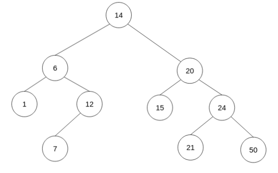

<div align="center"><h1> COS 212 Semester Test 2: MEMO</h1></div>
<div align="center"><h4> Tree Balancing; Self Organising Trees; Heaps; B-Trees; B+ & B* Trees; Graphs </h4></div>

## Question 1: [Tree Balancing](https://gitlab.com/Paul_Wood_96/tutoring/-/tree/master/COS212/notes/BalancingABinaryTree)

1.1) The DSW algorithm is being applied a tree of 35 Nodes, How many rotations will happen on the first rotation of the
backbone?

> m = 2<sup>⌊ Lg(n + 1) ⌋ </sup> - 1 &nbsp;&nbsp;&nbsp;&nbsp;&nbsp; // (⌊ => means floor) **step  1**: get m <br />
> m = s<sup>5</sup> - 1 <br />
> m = 31
>
> make n - m rotations at first step <br />
> r = 35 - 31 <br />
> r = 4

1.2) For all questions that follow assume the following Binary Tree


1.2.1) Show the backbone of the tree after applying the DSW algorithm


1.2.2) Perform the rotations needed to balance the Tree on the backbone from `1.2.1.`


1.3) For all questions that follow assume the following AVL Tree



1.3.1) What rotations need to be performed if the value 8 was inserted into the Tree

```text

8 needs to perform a left rotation around 7, and then 8 needs to perform a second right rotation around 12
```

1.3.2) Show the final tree after the rotations have been performed


1.4) A Node with the key F has two children with keys C and K. Node K has two children with the keys Z and I . Node C
has one child with the key A. Node I has one child with the key H. Node C is deleted from the tree. Rebalanced the tree by completing the following sentence
by substituting the letters in place of the roman numerals. Rotate (i) about (ii) and then rotate (iii) about (iv)

```text
    i. I
    ii. K
    iii. I
    iv. F
```


[comment]: <> (## Question 2: [Self Adjusting Trees]&#40;https://gitlab.com/Paul_Wood_96/tutoring/-/blob/master/COS212/notes/SelfAdjustingTrees/README.md&#41;)

[comment]: <> (For all questions that follow assume the tree)

[comment]: <> ()

[comment]: <> (2.1&#41; Show the final tree after the value 7 was accessed using a full Splay)

[comment]: <> ()

[comment]: <> (2.2&#41; Using the original tree before your answer in 2.1 show the final tree if instead value 34 was accessed using a half)

[comment]: <> (splay)

[comment]: <> ()


[comment]: <> (## Question 3: [Heaps]&#40;https://gitlab.com/Paul_Wood_96/tutoring/-/blob/master/COS212/notes/Heaps/README.md&#41;)

[comment]: <> (For all question that follow, assume the following array)

[comment]: <> (> [14, 2, 13, 7, 4, 5, 16, 22, 2, 12, 8])


[comment]: <> (3.1.1&#41; Using Floyd's "heapifying" algorithm convert the above array to a binary **min-heap**)

[comment]: <> (```text)

[comment]: <> ([14, 2, 13, 7, |4|, 5, 16, 22, 2, 12, 8])

[comment]: <> ([14, 2, 13, |2|, 4, 5, 16, 22, 7, 12, 8])

[comment]: <> ([14, 2, |5|, 2, 4, 13, 16, 22, 7, 12, 8])

[comment]: <> ([14, |2|, 5, 2, 4, 13, 16, 22, 7, 12, 8])

[comment]: <> ([|2|, 2, 5, 7, 4, 13, 16, 22, 14, 12, 8])

[comment]: <> ([2, 2, 5, 7, 4, 13, 16, 22, 14, 12, 8])

[comment]: <> (```)

[comment]: <> ()

[comment]: <> (3.1.2&#41; Insert the following in order into your min heap, show the final min heap after all inserts have been completed)

[comment]: <> (> 3, 1, 10, 3)

[comment]: <> ()

[comment]: <> (3.1.3&#41; Perform 3 deletions to your min heap as it stands, show the final min heap after the 3 deletions)

[comment]: <> ()

[comment]: <> (3.2&#41; A d-heap is a heap which can have up to *d* children per node, the more children the lower the height of the)

[comment]: <> (heap. <br />)

[comment]: <> (Assume the following table and fill in the index of the second child for a node at the specified index)

[comment]: <> (| d | index of parent | index parents second child | )

[comment]: <> (| --- | --- | --- |)

[comment]: <> (| 5  | 33 | 167 |)

[comment]: <> (| 3  | 12 | 38 |)

[comment]: <> (| 4  | 43 | 174 |)

[comment]: <> (| 8  | 57 | 458 |)

[comment]: <> (## Question 4: [B-Trees]&#40;https://gitlab.com/Paul_Wood_96/tutoring/-/blob/master/COS212/notes/MWayTreesPart1/README.md&#41;)

[comment]: <> (4.1&#41; Assuming a B-Tree of height 9 and order 5, what are the minimum number of keys that should be contained on level 5.)

[comment]: <> (```text)

[comment]: <> (54)

[comment]: <> (```)

[comment]: <> (4.2&#41; Why is it suggested, to use an odd number as the M value in an M-Way tree)

[comment]: <> (```text)

[comment]: <> (When performing a split we divide the keys array by two to get a dividing index, odd m values will provide a )

[comment]: <> (index that has an equal left and right sized array, even values will be skewed to some degree and not ensure that )

[comment]: <> (nodes are 50% full after the split operation)

[comment]: <> (```)

[comment]: <> (4.3&#41; Are B Trees immune to the order in which values are inserted into the data structure? Motivate your answer)

[comment]: <> (```text)

[comment]: <> (No B trees are not immune to inorder traversal, as nodes will remain half full. If nodes are continuously inserted in )

[comment]: <> (ascending order the tree will become skewed to the right with nodes on the left side of the tree maintaining a 50% )

[comment]: <> (capacity and no more)

[comment]: <> (```)

[comment]: <> (4.4&#41; What is the maximum height of a B-Tree of an order = 7 and 400 keys?)

[comment]: <> (```text)

[comment]: <> (5 )

[comment]: <> (minimum value of nodes at level:)

[comment]: <> (1=1 +)

[comment]: <> (2=2 +)

[comment]: <> (3=8 +)

[comment]: <> (4=32 +)

[comment]: <> (5=128)

[comment]: <> (6= 512 != )

[comment]: <> (```)

[comment]: <> (For all Questions tha follow assume the following B-Tree, when performing a delete operation on a non-leaf key perform)

[comment]: <> (the deletion by copying direct predecessor, when borrowing from a neighbour first look to your right neighbour before)

[comment]: <> (looking to your left, and when merging merge with the right neighbor if not possible chose the left.)

[comment]: <> ()

[comment]: <> (4.5.1&#41; Delete the key 72, draw the final tree after you have performed the operation.)

[comment]: <> ()

[comment]: <> (4.5.2&#41; Delete the key 87, draw the final tree after you have performed the operation)

[comment]: <> ()

[comment]: <> (## Question 5: [B+]&#40;https://gitlab.com/Paul_Wood_96/tutoring/-/blob/master/COS212/notes/B+Trees/README.md&#41; & [B*]&#40;https://gitlab.com/Paul_Wood_96/tutoring/-/blob/master/COS212/notes/BStarTrees/README.md&#41;)

[comment]: <> (5.1&#41; Name 2 advantages of a B+ Tree over a regular B Tree)

[comment]: <> (```text)

[comment]: <> (1. Inorder Traversal )

[comment]: <> (2. Sequential searching where each node is accessible on the last level)

[comment]: <> (```)

[comment]: <> (5.2&#41; Name 2 disadvantages of a B* Tree over a regular B Tree)

[comment]: <> (```text)

[comment]: <> (1. More complex algorithms for node overflowing requires extra complexity )

[comment]: <> (2. Not all values of M are valid)

[comment]: <> (```)

[comment]: <> (5.3&#41; Is 8 a valid order M for a B*Tree? Show your proof.)

[comment]: <> (```text)

[comment]: <> (max = &#40;2&#40;8-1&#41;&#41; + 1 = 14)

[comment]: <> (min = &#40;3&#40;2 * 8 - 1&#41; / 3&#41; + 2 = 17)

[comment]: <> (Therefore 8 is not a valid order M for a B* Tree as there are not enough values given to fill 3 minumum nodes )

[comment]: <> (when two nodes at max capacity split)

[comment]: <> (```)

[comment]: <> (5.4&#41; What is the minimum number of keys of an order M of 6 B* Tree at level 5)

[comment]: <> (```text)

[comment]: <> (128)

[comment]: <> (```)
