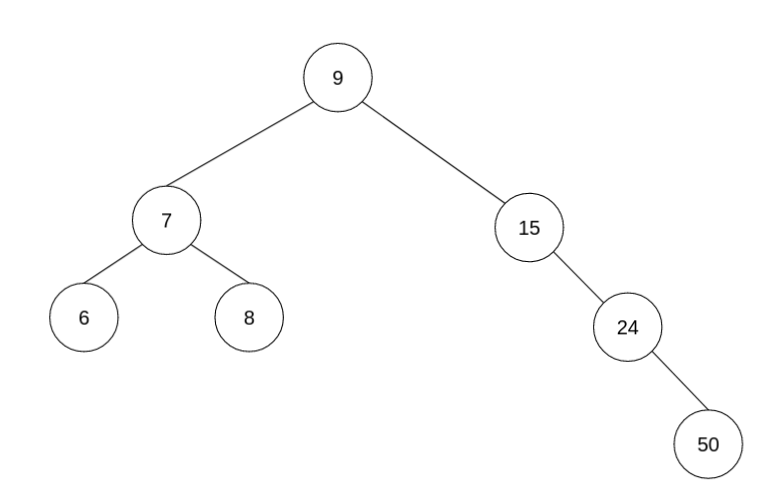

<div align="center"><h1> COS 212 Semester Test 2: MEMO</h1></div>
<div align="center"><h4> Tree Balancing; Self Organising Trees; Heaps; B-Trees; B+ & B* Trees; Graphs </h4></div>

## Question 1: [Tree Balancing](https://gitlab.com/Paul_Wood_96/tutoring/-/tree/master/COS212/notes/BalancingABinaryTree)

1.1) The DSW algorithm is being applied a tree of 35 Nodes, How many rotations will happen on the first rotation of the
backbone?

> m = 2<sup>⌊ Lg(n + 1) ⌋ </sup> - 1 &nbsp;&nbsp;&nbsp;&nbsp;&nbsp; // (⌊ => means floor) **step  1**: get m <br />
> m = s<sup>5</sup> - 1 <br />
> m = 31
>
> make n - m rotations at first step <br />
> r = 35 - 31 <br />
> r = 4

1.2) For all questions that follow assume the following Binary Tree



1.2.1) Show the backbone of the tree after applying the DSW algorithm


1.2.2) Perform the rotations needed to balance the Tree on the backbone from `1.2.1.`


1.3) For all questions that follow assume the following AVL Tree


1.3.1) What rotations need to be performed if the value 8 was inserted into the Tree

```text
8 needs to perform a left rotation around 7, and then 8 needs to perform a second right rotation around 12
```

1.3.2) Show the final tree after the rotations have been performed


1.4) A Node with the key F has two children with keys C and K. Node K has two children with the keys Z and I . Node C
has one child with the key A. Node I has one child with the key H. Node C is deleted from the tree. Rebalanced the tree by completing the following sentence
by substituting the letters in place of the roman numerals. Rotate (i) about (ii) and then rotate (iii) about (iv)

```text
    i.
    ii.
    iii.
    iv.
```
