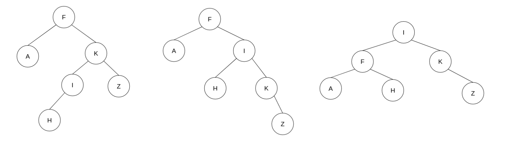
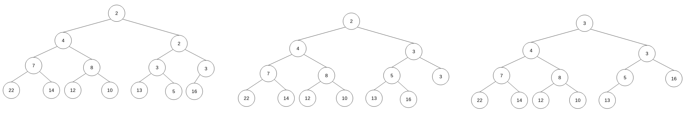
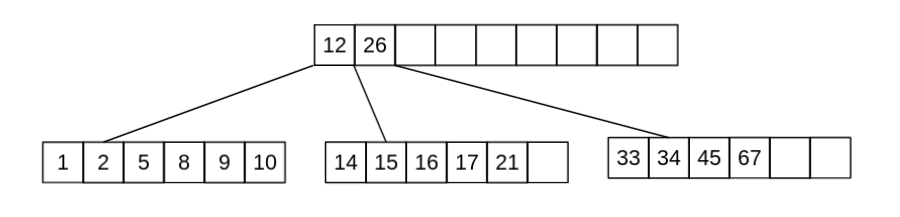
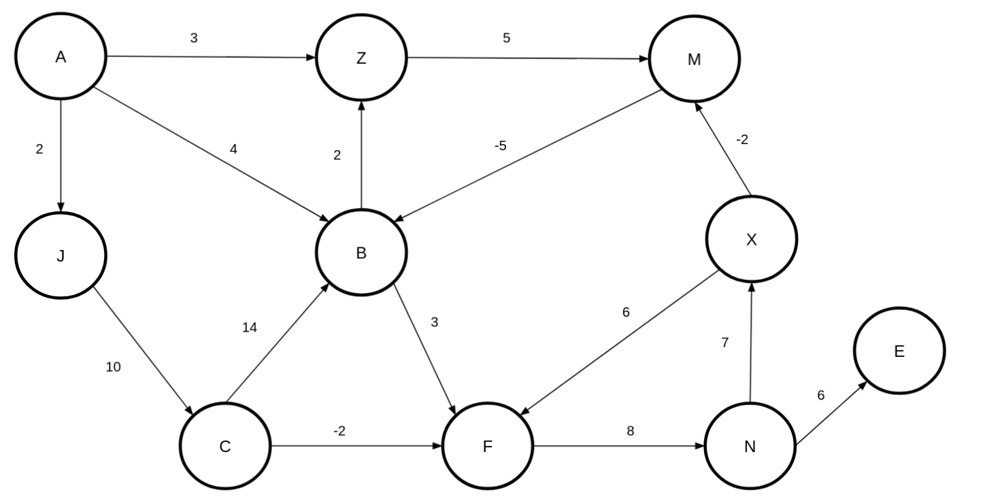

<div align="center"><h1> COS 212 Semester Test 2: MEMO</h1></div>
<div align="center"><h4> Tree Balancing; Self Organising Trees; Heaps; B-Trees; B+ & B* Trees; Graphs </h4></div>

## Question 1: [Tree Balancing](https://gitlab.com/Paul_Wood_96/tutoring/-/tree/master/COS212/notes/BalancingABinaryTree)

1.1) The DSW algorithm is being applied a tree of 35 Nodes, How many rotations will happen on the first rotation of the
backbone?

> m = 2<sup>⌊ Lg(n + 1) ⌋ </sup> - 1 &nbsp;&nbsp;&nbsp;&nbsp;&nbsp; // (⌊ => means floor) **step  1**: get m <br />
> m = s<sup>5</sup> - 1 <br />
> m = 31
>
> make n - m rotations at first step <br />
> r = 35 - 31 <br />
> r = 4

1.2) For all questions that follow assume the following Binary Tree


1.2.1) Show the backbone of the tree after applying the DSW algorithm


1.2.2) Perform the rotations needed to balance the Tree on the backbone from `1.2.1.`


1.3) For all questions that follow assume the following AVL Tree


1.3.1) What rotations need to be performed if the value 8 was inserted into the Tree

```text
8 needs to perform a left rotation around 7, and then 8 needs to perform a second right rotation around 12
```

1.3.2) Show the final tree after the rotations have been performed


1.4) A Node with the key F has two children with keys C and K. Node K has two children with the keys Z and I . Node C
has one child with the key A. Node I has one child with the key H. Node C is deleted from the tree. Rebalanced the tree
by completing the following sentence by substituting the letters in place of the roman numerals. Rotate (i) about (ii)
and then rotate (iii) about (iv)



```text
    i. I
    ii. K
    iii. I
    iv. F
```

## Question 2: [Self Adjusting Trees](https://gitlab.com/Paul_Wood_96/tutoring/-/blob/master/COS212/notes/SelfAdjustingTrees/README.md)

For all questions that follow assume the tree


2.1) Show the final tree after the value 7 was accessed using a full Splay


2.2) Using the original tree before your answer in 2.1 show the final tree if instead value 34 was accessed using a half
splay


## Question 3: [Heaps](https://gitlab.com/Paul_Wood_96/tutoring/-/blob/master/COS212/notes/Heaps/README.md)

For all question that follow, assume the following array

> [14, 2, 13, 7, 4, 5, 16, 22, 2, 12, 8]


3.1.1) Using Floyd's "heapifying" algorithm convert the above array to a binary **min-heap**

```text
[14, 2, 13, 7, |4|, 5, 16, 22, 2, 12, 8]
[14, 2, 13, |2|, 4, 5, 16, 22, 7, 12, 8]
[14, 2, |5|, 2, 4, 13, 16, 22, 7, 12, 8]
[14, |2|, 5, 2, 4, 13, 16, 22, 7, 12, 8]
[|2|, 2, 5, 7, 4, 13, 16, 22, 14, 12, 8]

[2, 2, 5, 7, 4, 13, 16, 22, 14, 12, 8]

```


3.1.2) Insert the following in order into your min heap, show the final min heap after all inserts have been completed

> 3, 1, 10, 3


3.1.3) Perform 3 deletions to your min heap as it stands, show the final min heap after the 3 deletions



3.2) A d-heap is a heap which can have up to *d* children per node, the more children the lower the height of the
heap. <br />

Assume the following table and fill in the index of the second child for a node at the specified index

| d | index of parent | index parents second child |
| --- | --- | --- |
| 5  | 33 | 167 |
| 3  | 12 | 38 |
| 4  | 43 | 174 |
| 8  | 57 | 458 |

## Question 4: [B-Trees](https://gitlab.com/Paul_Wood_96/tutoring/-/blob/master/COS212/notes/MWayTreesPart1/README.md)

4.1) Assuming a B-Tree of height 9 and order 5, what are the minimum number of keys that should be contained on level 5.

```text
54(Nodes) * 2 = 108 
```

4.2) Why is it suggested, to use an odd number as the M value in an M-Way tree

```text
When performing a split we divide the keys array by two to get a dividing index, odd m values will provide a 
index that has an equal left and right sized array, even values will be skewed to some degree and not ensure that 
nodes are 50% full after the split operation
```
4.3) Are B Trees immune to the order in which values are inserted into the data structure? Motivate your answer

```text
No B trees are not immune to inorder traversal, as nodes will remain half full. If nodes are continuously inserted in 
ascending order the tree will become skewed to the right with nodes on the left side of the tree maintaining a 50% 
capacity and no more
```

4.4) What is the maximum height of a B-Tree of an order = 7 and 400 keys?

```text
5 
minimum value of nodes at level:

1=1 +
2=2 +
3=8 +
4=32 +
5=128

6= 512 != 
```

For all Questions tha follow assume the following B-Tree, when performing a delete operation on a non-leaf key perform
the deletion by copying direct predecessor, when borrowing from a neighbour first look to your right neighbour before
looking to your left, and when merging merge with the right neighbor if not possible chose the left.


4.5.1) Delete the key 72, draw the final tree after you have performed the operation.


4.5.2) Delete the key 87, draw the final tree after you have performed the operation


[comment]: <> (## Question 5: [B+]&#40;https://gitlab.com/Paul_Wood_96/tutoring/-/blob/master/COS212/notes/B+Trees/README.md&#41; & [B*]&#40;https://gitlab.com/Paul_Wood_96/tutoring/-/blob/master/COS212/notes/BStarTrees/README.md&#41;)

[comment]: <> (5.1&#41; Name 2 advantages of a B+ Tree over a regular B Tree)

[comment]: <> (```text)

[comment]: <> (1. Inorder Traversal )

[comment]: <> (2. Sequential searching where each node is accessible on the last level)

[comment]: <> (```)

[comment]: <> (5.2&#41; Name 2 disadvantages of a B* Tree over a regular B Tree)

[comment]: <> (```text)

[comment]: <> (1. More complex algorithms for node overflowing requires extra complexity )

[comment]: <> (2. Not all values of M are valid)

[comment]: <> (```)

[comment]: <> (5.3&#41; Is 8 a valid order M for a B*Tree? Show your proof.)

[comment]: <> (```text)

[comment]: <> (max = &#40;2&#40;8-1&#41;&#41; + 1 = 14)

[comment]: <> (min = &#40;3&#40;2 * 8 - 1&#41; / 3&#41; + 2 = 17)

[comment]: <> (Therefore 8 is not a valid order M for a B* Tree as there are not enough values given to fill 3 minumum nodes )

[comment]: <> (when two nodes at max capacity split)

[comment]: <> (```)

[comment]: <> (5.4&#41; What is the minimum number of keys of an order M of 6 B* Tree at level 5)

[comment]: <> (```text)

[comment]: <> (128)

[comment]: <> (```)

[comment]: <> (For all the questions that follow assume the following B* Tree, when a Node overflows assume you should pass left before)

[comment]: <> (passing right.)

[comment]: <> ()

[comment]: <> (5.5.1&#41; Insert the key 3 and, draw the final tree)

[comment]: <> ()

[comment]: <> (5.5.2&#41; Insert the key 4 and, draw the final tree)

[comment]: <> ()

[comment]: <> (```text)

[comment]: <> (&#40;2 * 8 - 1&#41; / 3&#41; => index of first parent : x)

[comment]: <> (2 * x + 1 => index of second parent )

[comment]: <> (```)

[comment]: <> ( )

[comment]: <> (## Question 6: Tries)

[comment]: <> (The following keys must be stored in a trie:)

[comment]: <> (```text)

[comment]: <> ( bad  bat  bar  bard  bargain  int  in  gain)

[comment]: <> (```)

[comment]: <> (6.1&#41; If the keys are stored in a fixed array with an end of word character at the beginning, what array size should be)

[comment]: <> (used for the given set of strings.)

[comment]: <> (```text)

[comment]: <> (9)

[comment]: <> (```)

[comment]: <> (6.2&#41; What is the height of the resulting trie?)

[comment]: <> (```text)

[comment]: <> (5)

[comment]: <> (```)

[comment]: <> (6.3&#41; What is the height of the trie if it was constructed as a Tergo?)

[comment]: <> (```text)

[comment]: <> (6)

[comment]: <> (```)

[comment]: <> (## Question 7: [Graphs]&#40;https://gitlab.com/Paul_Wood_96/tutoring/-/tree/master/COS212/notes/GraphsPart1&#41;)

[comment]: <> (*IMPORTANT*: Whenever there is a choice among vertices in a graph to be processed next, choose them alphabetically)

[comment]: <> (For all questions that follow assume the following Graph)

[comment]: <> ()

[comment]: <> (7.1&#41; Give the order in which vertices will be visited if you apply the breadth first algorithm)

[comment]: <> (```text)

[comment]: <> (    A -> B -> J -> Z -> M -> C -> F -> N -> X -> E)

[comment]: <> (```)

[comment]: <> (For all remaining questions assume the following Vertex class)

[comment]: <> (```java)

[comment]: <> (class Vertex&#40;&#41; {)

[comment]: <> (    int key;)

[comment]: <> (    List<Edges> edges;)

[comment]: <> (})

[comment]: <> (```)

[comment]: <> (7.2.1&#41; Update the vertex class so that you are able to perform the *all-to-all* shortest path algorithm, only add the)

[comment]: <> (necessary field/fields needed if you add any unnecessary fields negative marking will be applied.)

[comment]: <> (```java)

[comment]: <> (class Vertex&#40;&#41; {)

[comment]: <> (    int key;)

[comment]: <> (    List<Edges> edges;)

[comment]: <> (    int dist;)

[comment]: <> (})

[comment]: <> (```)

[comment]: <> (7.2.2&#41; Update the vertex class so that you can perform the strongly connected algorithm, do not include any unecessary)

[comment]: <> (fields from your answer in `7.2.1.`)

[comment]: <> (```java)

[comment]: <> (class Vertex&#40;&#41; {)

[comment]: <> (    int key;)

[comment]: <> (    List<Edges> edges;)

[comment]: <> (    int num;)

[comment]: <> (    int pred;)

[comment]: <> (    Vertex parent;)

[comment]: <> (})

[comment]: <> (```)

[comment]: <> (7.3.1&#41; Define the term articulation point?)

[comment]: <> (```text)

[comment]: <> (An articulation point is any vertex within a graph which must be included in a path to another vertex or subgraph, )

[comment]: <> (if the vertex in that path is to be removed there would be no way of accessing the remaining vertex or subgraph.)

[comment]: <> (```)

[comment]: <> (7.3.2&#41; How many articulation points does a complete Binary Tree of height 18 have?)

[comment]: <> (The only points in the tree that are not articulation points are the leaf nodes so we need the number of nodes - the)

[comment]: <> (leaf level)

[comment]: <> (> 2<sup>18 - 1</sup> - 1)

[comment]: <> (> 131071)

[comment]: <> (7.4&#41; For all questions that follow assume the following Graph)

[comment]: <> ()

[comment]: <> (1. Perform Dijkstra Fixed algorithm on the graph above and fill in all the values for the pred and dist fields for all)

[comment]: <> (   the vertices)

[comment]: <> (   | Vertex | Dist | Pred |)

[comment]: <> (   | --- | --- | --- |)

[comment]: <> (   | A | 0 | null |)

[comment]: <> (   | B | 3 | M |)

[comment]: <> (   | C | 12 | J |)

[comment]: <> (   | E | 20 | N |)

[comment]: <> (   | F | 6 | B |)

[comment]: <> (   | J | 2 | A |)

[comment]: <> (   | M | 8 | Z |)

[comment]: <> (   | N | 14 | F |)

[comment]: <> (   | X | 21 | N |)

[comment]: <> (   | Z | 3 | A |)

[comment]: <> (1.1 How many times will the vertex B be inserted into the Queue)
            
[comment]: <> (```text)

[comment]: <> (    2)

[comment]: <> (```)

[comment]: <> (1.2 How many times will the value X be inserted into the Queue)

[comment]: <> (```text)

[comment]: <> (    2)

[comment]: <> (```)
