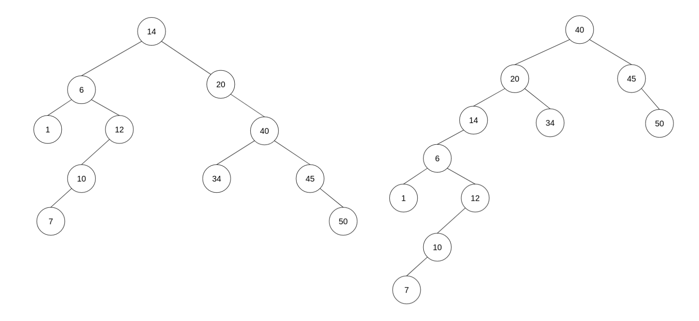

[comment]: <> (<div align="center"><h1> COS 212 Semester Test 2: MEMO</h1></div>)

[comment]: <> (<div align="center"><h4> Tree Balancing; Self Organising Trees; Heaps; B-Trees; B+ & B* Trees; Graphs </h4></div>)

[comment]: <> (## Question 1: [Tree Balancing]&#40;https://gitlab.com/Paul_Wood_96/tutoring/-/tree/master/COS212/notes/BalancingABinaryTree&#41;)

[comment]: <> (1.1&#41; The DSW algorithm is being applied a tree of 35 Nodes, How many rotations will happen on the first rotation of the)

[comment]: <> (backbone?)

[comment]: <> (> m = 2<sup>⌊ Lg&#40;n + 1&#41; ⌋ </sup> - 1 &nbsp;&nbsp;&nbsp;&nbsp;&nbsp; // &#40;⌊ => means floor&#41; **step  1**: get m <br />)

[comment]: <> (> m = s<sup>5</sup> - 1 <br />)

[comment]: <> (> m = 31)

[comment]: <> (>)

[comment]: <> (> make n - m rotations at first step <br />)

[comment]: <> (> r = 35 - 31 <br />)

[comment]: <> (> r = 4)

[comment]: <> (1.2&#41; For all questions that follow assume the following Binary Tree)

[comment]: <> ()

[comment]: <> (1.2.1&#41; Show the backbone of the tree after applying the DSW algorithm)

[comment]: <> ()

[comment]: <> (1.2.2&#41; Perform the rotations needed to balance the Tree on the backbone from `1.2.1.`)

[comment]: <> ()


[comment]: <> (1.3&#41; For all questions that follow assume the following AVL Tree)

[comment]: <> ()

[comment]: <> (1.3.1&#41; What rotations need to be performed if the value 8 was inserted into the Tree)

[comment]: <> (```text)

[comment]: <> (8 needs to perform a left rotation around 7, and then 8 needs to perform a second right rotation around 12)

[comment]: <> (```)

[comment]: <> (1.3.2&#41; Show the final tree after the rotations have been performed)

[comment]: <> ()

[comment]: <> (1.4&#41; A Node with the key F has two children with keys C and K. Node K has two children with the keys Z and I . Node C)

[comment]: <> (has one child with the key A. Node I has one child with the key H. Node C is deleted from the tree. Rebalanced the tree by completing the following sentence)

[comment]: <> (by substituting the letters in place of the roman numerals. Rotate &#40;i&#41; about &#40;ii&#41; and then rotate &#40;iii&#41; about &#40;iv&#41;)

[comment]: <> (```text)

[comment]: <> (    i. I)

[comment]: <> (    ii. K)

[comment]: <> (    iii. I)

[comment]: <> (    iv. F)

[comment]: <> (```)


[comment]: <> (## Question 2: [Self Adjusting Trees]&#40;https://gitlab.com/Paul_Wood_96/tutoring/-/blob/master/COS212/notes/SelfAdjustingTrees/README.md&#41;)

[comment]: <> (For all questions that follow assume the tree)

[comment]: <> ()

[comment]: <> (2.1&#41; Show the final tree after the value 7 was accessed using a full Splay)

[comment]: <> ()

[comment]: <> (2.2&#41; Using the original tree before your answer in 2.1 show the final tree if instead value 34 was accessed using a half)

[comment]: <> (splay)

[comment]: <> ()


[comment]: <> (## Question 3: [Heaps]&#40;https://gitlab.com/Paul_Wood_96/tutoring/-/blob/master/COS212/notes/Heaps/README.md&#41;)

[comment]: <> (For all question that follow, assume the following array)

[comment]: <> (> [14, 2, 13, 7, 4, 5, 16, 22, 2, 12, 8])


[comment]: <> (3.1.1&#41; Using Floyd's "heapifying" algorithm convert the above array to a binary **min-heap**)

[comment]: <> (```text)

[comment]: <> ([14, 2, 13, 7, |4|, 5, 16, 22, 2, 12, 8])

[comment]: <> ([14, 2, 13, |2|, 4, 5, 16, 22, 7, 12, 8])

[comment]: <> ([14, 2, |5|, 2, 4, 13, 16, 22, 7, 12, 8])

[comment]: <> ([14, |2|, 5, 2, 4, 13, 16, 22, 7, 12, 8])

[comment]: <> ([|2|, 2, 5, 7, 4, 13, 16, 22, 14, 12, 8])

[comment]: <> ([2, 2, 5, 7, 4, 13, 16, 22, 14, 12, 8])

[comment]: <> (```)

[comment]: <> ()

[comment]: <> (3.1.2&#41; Insert the following in order into your min heap, show the final min heap after all inserts have been completed)

[comment]: <> (> 3, 1, 10, 3)

[comment]: <> ()

[comment]: <> (3.1.3&#41; Perform 3 deletions to your min heap as it stands, show the final min heap after the 3 deletions)

[comment]: <> ()

[comment]: <> (3.2&#41; A d-heap is a heap which can have up to *d* children per node, the more children the lower the height of the)

[comment]: <> (heap. <br />)

[comment]: <> (Assume the following table and fill in the index of the second child for a node at the specified index)

[comment]: <> (| d | index of parent | index parents second child | )

[comment]: <> (| --- | --- | --- |)

[comment]: <> (| 5  | 33 | 167 |)

[comment]: <> (| 3  | 12 | 38 |)

[comment]: <> (| 4  | 43 | 174 |)

[comment]: <> (| 8  | 57 | 458 |)
