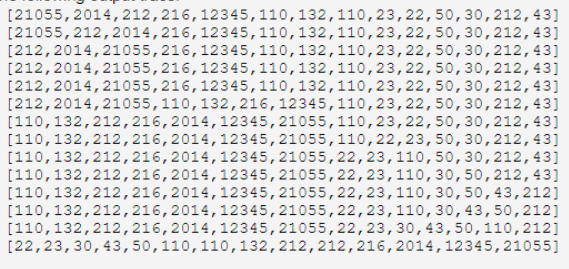

<div align="center"><h1> COS 212 Exam 1 </h1></div>
<div align="center"><h4> Spanning Tree & Topological Sort; Graph Coloring </h4></div>

## Question 1: [Spanning Trees](https://gitlab.com/Paul_Wood_96/tutoring/-/tree/master/COS212/notes/GraphsPart5)

For all questions that follow assume the following Graph. During traversal if at any point you must make a choice of
where to move next chose the next vertex alphabetically.


1.1) Using Kruskal's eager Algorithm identify the list of edges that will be part of the spanning tree. Only identify
the list of edges that will be part of the resulting spanning tree.

1.2) For the following statements indicate whether the provided statement is true or false, provide a reason for your
answer:

1.2.1)

```text
Dijkstra's Spanning Tree Algorithm will never look at every edge within the graph before terminating.

```

1.2.2)

```text
Kruskal Algorithm has the potential to look at every edge within the graph
```

1.2.3)

```text
In Dijkstra's algorithm complexity is added in determining the lowest values in cycles
```

#### For All questions to Follow

Assume the following Graph, if at any point you must make a choice of which vertex to select, chose the next vertex
alphabetically.


1.3) Apply the topological sorting algorithm on the graph below, provide the order for each vertex in the graph.

| Vertex | Order |
| --- | --- |
| A |  |
| B |  |
| D |  |
| E |  |
| F |  |
| G |  |
| H |  |
| J |  |
| P |  |
| X |  |
| Z |  |

## Question 2: [Graph Coloring](https://gitlab.com/Paul_Wood_96/tutoring/-/blob/master/COS212/notes/GraphsPart6/README.md)

For all questions that follow assume the following Graph and color table, and answer the questions that follow.


2.1) Assuming the Brelaz coloring algorithm was applied to the graph, indicate the selected color for each vertex after
having applied the coloring algorithm. Use the color index provided in the image.

| Vertex | Color |
| --- | --- |
| A |   |
| B |   |
| C |   |
| D |   |
| E |   |
| F |   |
| G |   |
| H |   |

## Question 3: [Sorting](https://gitlab.com/Paul_Wood_96/tutoring/-/blob/master/COS212/notes/Sorting/README.md)

3.1) Insertion sort works by intuitively sorting a list, placing elements in order at each iteration. The algorithm is
made up using a combination of an inner and outer loop. The outer loop iterates through the elements in the list from
left to right, the inner loop sorts the array up until the counter of the outer loop selecting the element to place at
each index.

Implement a recursive implementation of the insertion sort outer loop which will created a sorted. Your implementation
should explore the elements going from the back of the list first.

```kotlin

fun insertSort(array: Int[], index: Int) {

}

```

3.2) For each of the following stamens select the statement that is correct

.1)

```text

    i. Only Radix sort has the potential to have a complexity of `O(n)`
    ii. Only Count sort has the potential to have a complexity of `O(n)`
    iii. Neither Radix sort nor Count sort has the potential to have a complexity of `O(n)`
    iv. Both Radix sort and Count sort have the potential to have a complexity of `O(n)`
```

2. When sorting identical elements, which of the following algorithms will **NOT** guarantee that the identical elements
   order in the list will remain unchanged after the algorithm has been applied.

```text
    i. Selection sort & Insertion sort
    ii. Heap sort and Count sort
    iii. Merge sort and Radix sort
    iv. Comb sort and Shell sort
```

3. If swap operations are expensive which of the following algorithms is the least efficient on average?

```text
    i. Shell sort
    ii. Count sort
    iii. Selection sort
    iv. Quick sort
```    

4. Which of the following algorithms is the most efficient for sorting a list that is in order

```text
    i. Insertion sort
    ii. Radix sort
    iii. Count sort
    iv. Quick sort
```    

#### For each of the following

Please specify the algorithm that was used to result in the following output.

3.3)

.1 

```text

```

.2 

```text

```

.3 

```text

```

4. 

```text

```

5. 

```text

```

6. 

```text

```

## Question 4: [Hashing](https://gitlab.com/Paul_Wood_96/tutoring/-/blob/master/COS212/notes/Hashing/README.md)

Assume the following data:

> 122 14 16 17 5 8 35 27 13

Assume that Coalesced Hashing with a cellar was being applied to the data above using the following Hash function:
`H(K) = 2k % 7 + 3`.

4.1.1) Insert the following table where each row indicates the fields value and coalesced pointer. Insert the data and
indicate the pointer values for each collision you encounter, in the case of multiple collision you should make use of
Quadratic Probing. The cellar starts at index 8


4.1.2) Assume the element 8 was deleted, describe the steps needed to perform this operation

4.1.3) Assume element 27 was deleted, show the table after this operation has been performed

## Question 4.2: [Hashing Cichelli’s](https://gitlab.com/Paul_Wood_96/tutoring/-/blob/master/COS212/notes/Cichellis/README.md)

Given the following words, in no particular order.

> January February March April May June July

4.2.1) Perform Cichelli's algorithm to perfectly hash the following words into a table. for each greek letter indicate
the correct response

|  |  |
| --- | ---|
| 0 | i |
| 0 | ii |
| 0 | iii |
| 0 | iv |
| 0 | v |
| 0 | vi |

4.2.2) Give the offset values for each letter used after applying Cichelli's algorithm

## Question 5: [Encoding](https://gitlab.com/Paul_Wood_96/tutoring/-/blob/master/COS212/notes/Encoding/README.md)

5.1) Assume the following string needed to be encoded in a way that would best make use of memory, while still being
able to decoded.

> Sassy Susy sells seashells

.1) Which encoding algorithm would be best suited to encode this string and why?

```text

```

.2) Name a few disadvantages of Adaptive Huffman over regular Huffman

```text

```

5.2.1) Assume the following records were kept which tracked the recorded percentages of rain fall in each month of a
given year. You may assume that no rain fell in months that are not recorded. You are required to encode this data using
Huffman encoding please provide the Huffman tree once you have finished encoding each of the specified months

|January | February | June | September |October | November | December |
| --- | --- | --- | --- | --- | --- | --- |
| 0.17 | 0.12 | 0.02 | 0.25 | 0.11 | 0.11 | 0.22 |

5.2.2) Please fill in the Huffman encoding values for each month in the table below

|January | February | June | September |October | November | December |
| --- | --- | --- | --- | --- | --- | --- |
| | | | | | | |

5.3)

The adaptive huffman is an extension to the regular Huffman tree which does not require the probability of each value to
be known beforehand. Assume the following string

> abeebac

Please apply the adaptive huffman to the input string above but please read all questions first before moving on from
this point, you may assume the following alphabet node


5.3.1) Provide the encoded text for the String after the 4 input chapter has been added

```text

```

5.3.2) What is the encoded value for the letter b after it has been inserted the second time

```text

```

5.3.2) If you were to add the letter `f` to the encoded string after all the values had been added, what would you add
to the Encoded String after the letter `f` has been placed in the huffman tree.

```text

```

## Question 6: [String Matching](https://gitlab.com/Paul_Wood_96/tutoring/-/blob/master/COS212/notes/StringMatching/README.md)

Assume you were applying the Knuth-Morris-Pratt algorithm for the pattern `cacctaca`

fill in the values below for the next array

|Ptt: | c | a | c | c | t | a | c | a |
| --- | --- | --- | --- | --- | --- | --- | --- | --- |
| j | 0 | 1 | 2 | 3 | 4 | 5 | 6 | 7 |
| next | | | | | | |
