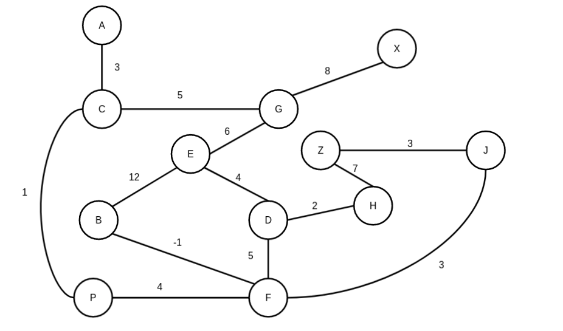
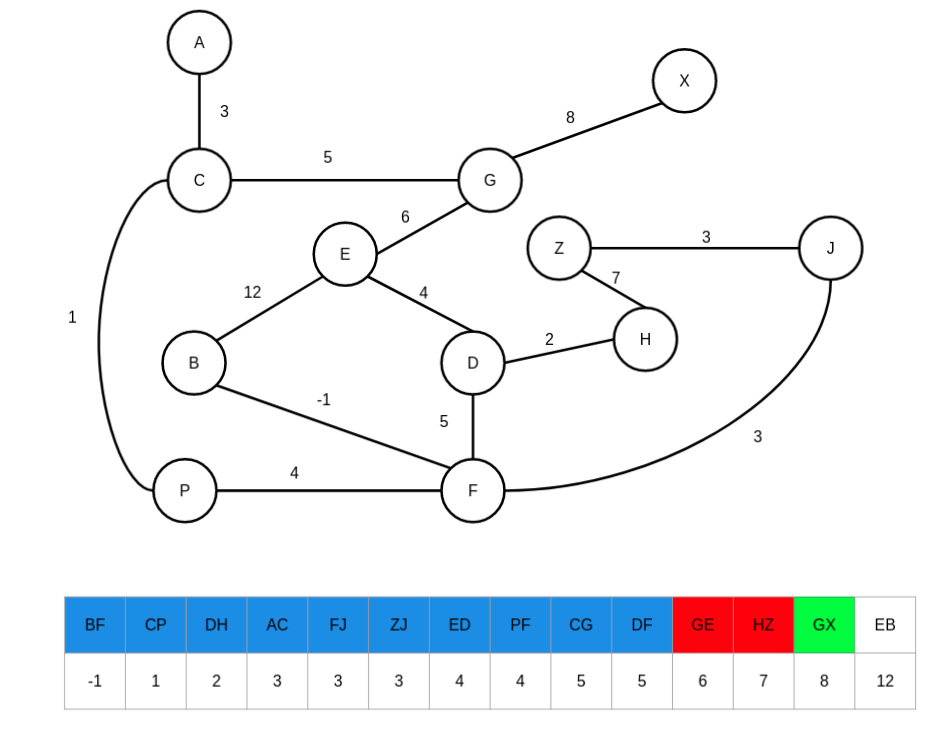
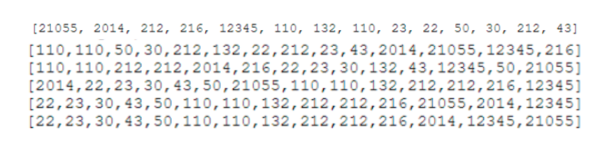

<div align="center"><h1> COS 212 Exam 1 </h1></div>
<div align="center"><h4> Spanning Tree & Topological Sort; Graph Coloring </h4></div>

## Question 1: [Spanning Trees](https://gitlab.com/Paul_Wood_96/tutoring/-/tree/master/COS212/notes/GraphsPart5)

For all questions that follow assume the following Graph. During traversal if at any point you must make a choice of
where to move next chose the next vertex alphabetically.



1.1) Using Kruskal's eager Algorithm identify the list of edges that will be part of the spanning tree. Only identify
the list of edges that will be part of the resulting spanning tree in the format AB, AC, AD in the case of edges between
AB, AC and AD being a part of the spanning tree.



1.2) For each of the following statements indicate whether the provided statement is true or false, provide a reason for
your answer:

1.2.1)

```text
Dijkstra's Spanning Tree Algorithm will never look at every edge within the graph before terminating.

```

```text
FALSE: Dijkstra's algorithm is lazy (does not sort the edges before traversal) and will look at every edge within the graph and ensure to remove the greatest edge in a cycle once 
it is detected.
```

1.2.2)

```text
Kruskal Algorithm has the potential to look at every edge within the graph
```

```text
TRUE: The stopping condition for Kruskal algorithm is; when the number of edges added in the spanning tree is 
equal to 1 less than the number of vertices in the graph. This is not a condition that will always result in fewer 
iterations than edges. A scenario in which the greatest value edge is the only path to a Vertex will result in 
a situation where every edge will being visited when applying Kruskals algorithm. 
```

1.2.3)

```text
In Dijkstra's algorithm complexity is added in determining the lowest values in cycles
```

```text
TRUE: When detecting a cycle within the spanning tree, the edges which make up that cycle will have to be sorted 
in order to remove the largest weighted edge and keep the lowest weighted edges. Sorting algorithms can add 
complexity to the algorithm. 
```

#### For All questions to Follow

Assume the following Graph, if at any point you must make a choice of which vertex to select, chose the next vertex
alphabetically.


1.3) Apply the topological sorting algorithm on the graph below, provide the order for each vertex in the graph.

| Vertex | TS |
| --- | --- |
| A |  4 |
| B | 9 |
| C | 5 |
| D | 8 |
| E | 12 |
| F | 7 |
| G | 10 |
| H | 1 |
| J | 3 |
| P | 6 |
| X | 11 |
| Z | 2 |


## Question 2: [Graph Coloring](https://gitlab.com/Paul_Wood_96/tutoring/-/blob/master/COS212/notes/GraphsPart6/README.md)

For all questions that follow assume the following Graph and color table, and answer the questions that follow.


2.1) Assuming the Brelaz coloring algorithm was applied to the graph, indicate the selected color for each vertex after
having applied the coloring algorithm. Use the color index provided in the image.

| Vertex | Color |
| --- | --- |
| A |   |
| B |   |
| C |   |
| D |   |
| E |   |
| F |   |
| G |   |
| H |   |

 
 

## Question 3: [Sorting](https://gitlab.com/Paul_Wood_96/tutoring/-/blob/master/COS212/notes/Sorting/README.md)

3.1) Insertion sort works by intuitively sorting a list, placing elements in order at each iteration. The algorithm is
made up using a combination of an inner and outer loop. The outer loop iterates through the elements in the list from
left to right, the inner loop sorts the array up until the counter of the outer loop selecting the element to place at
each index.

Implement a recursive implementation of the insertion sort outer loop which will created a sorted. Your implementation
should explore the elements going from the back of the list first.

```java
public class Sorting {

    public int[] insert(int[] unsortedArray, int index) {

        int[] sortedArray;

        // base case, return the sorted array with the last element
        if (index == unsortedArray.length - 1) {
            sortedArray = new int[unsortedArray.length];
            sortedArray[index] = unsortedArray[index];
            return sortedArray;
        }

        int[] partiallySortedArray = insert(unsortedArray, index + 1); // holds the sorted list from the last iteration
        sortedArray = new int[unsortedArray.length]; // empty list

        int newValue = unsortedArray[index]; // the new value we want to add in at this recursive call
        int lastIndex = partiallySortedArray.length - 1;
        boolean added = false;


        // loop through partially sorted array which starts at one index higher than current index
        for (int i = index + 1; i <= lastIndex; ) {

            if (!added && newValue < partiallySortedArray[i]) {
                sortedArray[index++] = newValue;
                added = true;
            } else {
                sortedArray[index++] = partiallySortedArray[i++];
            }
        }

        if (!added) {
            sortedArray[lastIndex] = newValue;
        }

        return sortedArray;
    }
}

```

3.2) For each of the following stamens select the statement that is correct

.1)

```text
    i. Only Radix sort has the potential to have a complexity of `O(n)`
    ii. Only Count sort has the potential to have a complexity of `O(n)`
    iii. Neither Radix sort nor Count sort has the potential to have a complexity of `O(n)`
    iv. Both Radix sort and Count sort have the potential to have a complexity of `O(n)`
```

```text
iv
```

2. When sorting identical elements, which of the following algorithms will **NOT** guarantee that the identical elements
   order in the list will remain unchanged after the algorithm has been applied.

```text
    i. Selection sort & Insertion sort
    ii. Heap sort and Count sort
    iii. Merge sort and Radix sort
    iv. Comb sort and Shell sort
```

```text
ii
```

3. If swap operations are expensive which of the following algorithms is the least efficient on average?

```text
    i. Shell sort
    ii. Count sort
    iii. Selection sort
    iv. Quick sort
```

```text
i
```

4. Which of the following algorithms is the most efficient for sorting a list that is in order

```text
    i. Insertion sort
    ii. Radix sort
    iii. Count sort
    iv. Quick sort
```    

```text
i
```

#### For each of the following

Please specify the algorithm that was used to result in the following output.

3.3)

.1 

```text
merge sort
```

.2 

```text
heap sort
```

.3 

```text
shell sort
```

4. 

```text
radix sort
```

5. 

```text
bubble sort
```

6. 

```text
selection sort
```

## Question 4: [Hashing](https://gitlab.com/Paul_Wood_96/tutoring/-/blob/master/COS212/notes/Hashing/README.md)

Assume the following data:

```text
122    14    16    17    5     8     35    27    13    3
``` 

Assume that Coalesced Hashing with a cellar was being applied to the data above using the following Hash function:
`H(K) = 2k % 7 + 3`.

4.1.1) Assume the following table where each row indicates the fields value and coalesced pointer. Insert the data and
indicate the pointer values for each collision you encounter, in the case of multiple collision you should make use of
Linear Probing. The cellar starts at index 8


4.1.2) Assume the element 8 was deleted, describe the steps needed to perform this operation

```text
The element 8 would be deleted and no further action would be needed
```

4.1.3) Assume element 35 was deleted, show the table after this operation has been performed

```text
We can remove the element 35 from the table data and leave its Coalesced pointer, to the 
next element in the list, for the time being we can mark the data as removed but handle its deletion 
in the case of another new collision. 
```

## Question 4.2: [Hashing Cichelli’s](https://gitlab.com/Paul_Wood_96/tutoring/-/blob/master/COS212/notes/Cichellis/README.md)

Given the following words, in no particular order.

> January February March April May June July

4.2.1) Perform Cichelli's algorithm to perfectly hash the following words into a table. for each greek letter indicate
the correct response


|  |  |
| --- | ---|
| 0 | January |
| 1 | February |
| 2 | April |
| 3 | May |
| 4 | July |
| 5 | vi |

[img.png](../images/cichillis_result.png)

4.2.2) Give the offset values for each letter used after applying Cichelli's algorithm

| Letter | Offset |
| --- | ---|
| y | 0 |
| J | 0 |
| M | 0 |
| F | 0 |
| A | 1 |
| L | 3 |
| E | 1 |

## Question 5: [Encoding](https://gitlab.com/Paul_Wood_96/tutoring/-/blob/master/COS212/notes/Encoding/README.md)

5.1) Assume the following string needed to be encoded in a way that would best make use of memory, while still being
able to be decoded.

> Sassy Susy sells seashells

.1) Which encoding algorithm would be best suited to encode this string and why?

```text
Adaptive huffman, because you do not know the frequency of each character before hand. The adaptive, 
huffman could dynamically map the encoded strings as it counts the frequency of each character encountered.
```

.2) Name a few disadvantages of Adaptive Huffman over regular Huffman

```text
* More complex decoding algorithms 
* You have to store the Huffman Tree as well, whereas regular Huffman could be calculated on each iteration. 
```

5.2.1) Assume the following records were kept, which tracked the recorded percentages of rain fall in each month of a
given year. You may assume that no rain fell in months that are not recorded. You are required to encode this data using
Huffman encoding please provide the Huffman tree once you have finished applying the algorithm

|January | February | June | September |October | November | December |
| --- | --- | --- | --- | --- | --- | --- |
| 0.17 | 0.12 | 0.02 | 0.25 | 0.11 | 0.11 | 0.22 |


5.2.2) Please fill in the Huffman encoded values for each month in the table below

|January | February | June | September |October | November | December |
| --- | --- | --- | --- | --- | --- | --- |
| 110 | 010 | 1111 | 10 | 011 | 110 | 00 |

5.3)

The adaptive huffman is an extension to the regular Huffman tree which does not require the probability of each value to
be known beforehand. Assume the following string

> abeebac

Please apply the adaptive huffman to the input string above **NB** please read all questions first before moving on from
this point, you may assume the following alphabet node


5.3.1) Provide the encoded text for the String after the 4<sup>th</sup> input chapter has been added


```text
10011000110101
```

5.3.2) What is the encoded value for the letter b after it has been inserted the second time


```text
11
```

5.3.2) If you were to add the letter `f` to the encoded string after all the values had been added, what would you add
to the Encoded String after the letter `f` has been placed in the huffman tree.


```text
110010
```

## Question 6: [String Matching](https://gitlab.com/Paul_Wood_96/tutoring/-/blob/master/COS212/notes/StringMatching/README.md)

Assume you were applying the Knuth-Morris-Pratt algorithm for the pattern `cacctaca`

fill in the values below for the next array

|Ptt: | c | a | c | c | t | a | c | a |
| --- | --- | --- | --- | --- | --- | --- | --- | --- |
| j | 0 | 1 | 2 | 3 | 4 | 5 | 6 | 7 |
| next | 0 | 0 | 0 | 0 | 0 | 0 | 0 | 1 | 
