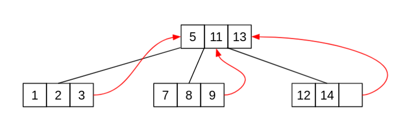
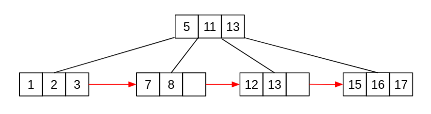
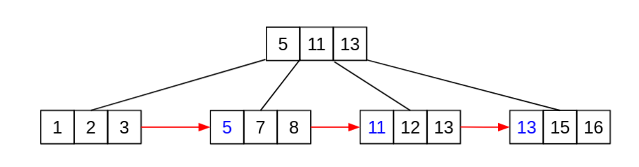
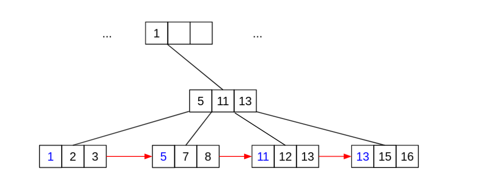
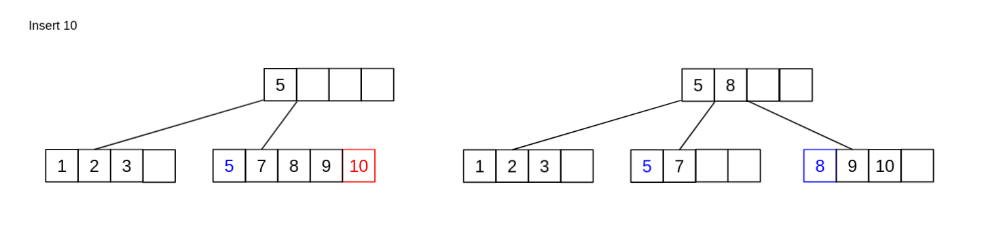
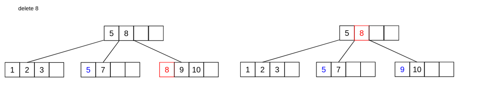

<h1> B+ Trees</h1>

B Trees and B* Trees are really efficient but both are poor at one thing;

## Inorder Traversal

To traverse through a M-Way tree inorder we would end up needing to visit a parent node m-1 times before visiting all of
its children once. This becomes tedious, and thus we need to modify our BTree so that we can access the Tree in order
without revisiting parent nodes over and over again.

We do this by adding two modifications to our BTree, you can implement a B+ tree as a B* Tree but for the time being we
will just modify a BTree.

* All leaf nodes hold a reference to the next leaf node going from left to right.
* All parent values are also placed in leaf nodes

When every leaf node references the next node, we end up creating two ways to load in memory or search for nodes. The
first method is to load in nodes by `sequence`, in this case we iteratively search through the leaf node level to find
nodes in the tree. The second method is to search by `index` this is to search using a standard tree search
implementation.  
The benefit of having all the Nodes on a single level is for InOrder traversal in a simple non-recursive manner

## How Nodes with Parents Look

If a node is a non leaf node then all children values from index 1 onwards will hold a copy of the divider parent, like
so;

But if a leaf has a grandparent, then the parents parent also get repeated on the leaf level.

## Splitting

Splitting works in a standard way to BTrees, except one of the two Nodes needs to take in a copy of the parent divider
element. Usually it is the right node that takes the parent divider, this is because it is easier to place the parent at
a standard index 0, than a dynamic index of 50%. This would look like this

## Deleting

Deleting Nodes works standard to deleting Nodes in a regular BTree, with one exception. Lazy deleting for non-leaf
Nodes. If an element is deleted from a position in a Non-Leaf Node then we can simply remove its reference in the Leaf
Node level and leave its reference in the Non-Leaf position. This is because when the Node underflow's or overflows, the
algorithm would overwrite the element in the Node with the correct value anyway. But for now leave the parent element as
it is not causing any harm.

## Is the Element Still In the Tree

Even though the parent element is still being used as a divider, it is not part of the Tree and thus when searching for
that element we should return false. This tells us that `elements are only accessible IF they are on the Leaf Level`
