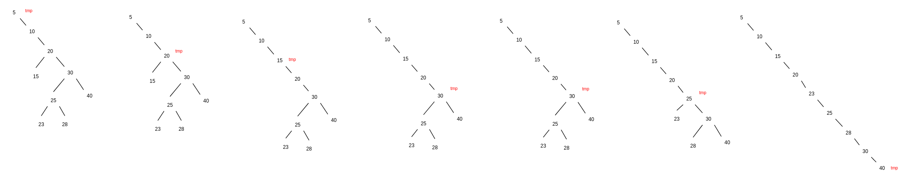

<div align="center"><h1> Balancing a Binary Tree </h1></div>

## A Balanced Tree

A tree is considered balanced if the sum of the height between left and right sibling sub-trees is no less than -1 and
no greater than 1. To calculate the sum of the sibling sub-trees we take the height of the left sub-tree and minus it
from the right sub-tree.

The benefit of having a balanced tree is fewer operations when searching for elements within the tree. To understand
this it is important to understand how many nodes will exist in a perfect tree. In a perfect tree each node has both of
its children therefore, the number of nodes on each level doubles the number of nodes on the level that came before
it. <br />
Assume a perfect tree of height 14, this tree will store `16 383` nodes. When searching for an element in the tree it
will at worst case make only 14 comparisons. Only 14 comparisons will be needed to search an entire 16 000 nodes. If the
same data was instead structured as a Linear Linked List the algorithm would at worst case make all 16 000 comparisons.
Ergo we want to try and keep the tree balanced or as close to perfect as possible.

### Rotations

Before we start looking at balancing a Tree we first need to understand *rotations*. Rotations occur when we swap a
child with its parent, we rotate the child around the parent to be more accurate.

> The direction in which the **child** moves towards the **parent** is the direction of the rotation.

The following is an example of a `right rotation`.


In this example child `ch` was rotated around parent `p`. We can break this down into some steps you can follow for
drawing out rotations which might help initially. Move the child vertically up and attach it to the parent (which has
now technically become its child). Then move that new sub-tree into place and attach the grandparent to the child.

 

There is unfortunately a scenario in which this is not as straightforward and that is whenever our child has a right
child (And we are performing a right rotation). In this scenario, the parent adopts the child's right subtree as its new
left subtree.


It is really important you guys start practicing these rotations, here are a few more examples.


> A rule of thumb anything above the 2-3 nodes being rotated will remain the same. When performing a right rotation you
> only need to worry if the child node has a right child, and you only need to worry about a left rotation if the
> child node has a left child.

## The DSW Algorithm

The DSW Algorithm balances a tree by first deconstructing the tree to a single linked list, we call this the
***backbone***. The algorithm then strategically performs a series of rotations on the backbone creating a balanced
tree.

### Step 1: Creating the Backbone

The first step is to generate the backbone, we do this iteratively starting at root. The algorithm is as followes

```kotlin
fun createBackbone() {
    tmp = root
    while (tmp != null) {
        if tmp has left child
                rotate this child around tmp
                set tmp to this child that has just become the parent // rotate and move up
        else set tmp to right child // move down the tree
    }
}
```

Once this is complete we will have a single linked list, inorder from the smallest element to the largest.



### Step 2: Rotating the Backbone

Rotations happen on every second node, the number of rotations we do at each iteration depends on the algorithm defined
by the following sudo code.

> n = numberOfNode <br />
> m = 2<sup>⌊ Lg(n + 1) ⌋ </sup> - 1(⌊ => means floor)  // **step  1**: get m <br />
> make n - m rotations // **step 2** <br />
> while (m > 1) <br />
> &nbsp;&nbsp;&nbsp;&nbsp;&nbsp; m = m/2 <br />
> &nbsp;&nbsp;&nbsp;&nbsp;&nbsp; make m rotations // **step 3**:

**Step 1** is to calculate m, we use the formula 2<sup>⌊ Lg(n + 1) ⌋</sup> , where `Lg` is log base 2 on your
calculator.

> m = 7

**Step 2** is to first make `n - m` rotations, this will not modify `m`, this is just make this many rotations, this
will look like the following

> rotations = 9 - 7 => 2


**Step 3** is to `divide m by 2` until `m` is no longer greater than 1. for each division perform m rotations, this will
look like the following.


## AVL Trees

The DSW algorithm is great but, not very efficient. We only apply the algorithm every so often, and if the tree is only
partially unbalanced ie. only one small sub-branch is unbalanced then the entire tree is broken up and reconstructed.

It would be much more efficient to only balance the tree when we needed to, and we only need too when we are adding and
deleting nodes in the tree. In that case any operation that modifies the tree should also check to make sure if the tree
is still balanced.

### Checking if the Tree is Still Balanced

The benefit of the AVL tree is `local` balancing instead of `global`, when adding a Node to the tree you will only need
to concern yourself with the branch path you used to add in that node. To check if the tree is unbalanced move up the
branch and calculate the difference in height at each node, if the height of the nodes sub-trees differs by more than 1
the tree is unbalanced at that node. The following trees are all examples of AVL trees the numbers in each node
represent the *balance factors* of each node.


### Balancing and Unbalanced subtree

If we encounter an unbalanced tree, we rotate the first unbalanced node from the bottom of the tree up (from the leaf
nodes), with the child node with the greater of the two heights. For example:


In this tree 3 Nodes have balanced factors greater than 1 or less than -1 (15, 20, 10), but we pick the lowest Node 15
and rotate it with the child with the greatest height 19.


We only need to do *one* rotation when inserting, this is because the rotation will change the balance factor of the
tree back to its previous state.

There is unfortunately a pretty big exception to this rule, lets say we were looking to balance the following tree


Not really that different to the first case, the only major difference now is that the child node has a left child, and
we are going to perform a left rotation. **NB! the same exception would happen if we were performing a right rotation
with a child node that has a right child**. The problem comes in when we try and balance the tree


Because, the parent needs to adopt the left child the tree will not balance itself after the rotation. In such a case we
actually first need to rotate 16 around 17 and then 16 around 17. We need to do a double rotation.


Deleting from an AVL tree works in much the same way, AVL trees favor deletion by copying as it is less likely to
unbalance the tree. When the delete operations is called either the `predecessor` or `successor` will be used to replace
a node, in that case move up the tree from the parent of the former predecessor or successor to check if the tree is
still balanced. Or if the node could be deleted simply without the need to copy the predecessor or successor just move
up from the parent.

## Useful Helper Functions for these Operations

1. `getHeight(BSTNode: n)` : Obviously the get height function will be used frequently to get the heights of each left
   and right sub-tree as you move up the tree.

```java
class BinaryTree {
    private int getHeight(BSTNode node) {

        if (node == null) {
            return 0;
        }

        int left = 1 + getHeight(node.left);
        int right = 1 + getHeight(node.right);

        return (left > right) ? left : right;
    }
}
```

2. `findParent(BSTNode: n)` : Useful for finding the grandparent which will be needed when performing rotations

```java
class BinaryTree {
    private int findParent(BSTNode node) {

        if (node == null || node == root) {
            return null;
        }

        BSTNode tmp = root, prev = null;
        while (tmp != null && !tmp.equals(node)) {
            prev = tmp;
            tmp = (tmp.element.compareTo(node.element) < 0) ? tmp.right : tmp.left;
        }

        return (tmp != null) ? prev : null;
    }
}
```

3. `performLeftRotation(BSTNode child, BSTNode parent)` : This will create a standard way of performing your left
   rotations which you can call from anywhere in your program ie, in insertions or deletions

```java
class BinaryTree {

    /**
     * Assume you will only be calling this function when you need to, so no need to add null checks as you are 
     * making sure to pass in the correct child and parent
     */
    void performLeftRotation(BSTNode child, BSTNode parent) {
        if (child.element.compareTo(parent.element) < 0) {
            // some safety just add this to make sure you don't accidentally perform the wrong kind of rotation
            throw Exception("Calling a left rotation on child that is less than it's parent is not possible");
        }

        // we will need stores to a grandparent to make sure we don't break the tree
        BSTNode grandparent = findParent(parent);
        BSTNode tmpLeftGrandChild = child.left;

        // this swaps parent and child but now we need to sort out the grandparent
        child.left = parent;
        parent.right = tmpLeftGrandChild; // even if we are setting parentRightChild to null this is fine


        // otherwise it means we are swapping with root
        if (grandparent != null) {
            if (parent.element.compareTo(grandparent.element) < 0) {
                grandparent.right = child;
            } else {
                grandparent.left = child;
            }
        } else {
            root = child;
        }
    }
}
```

4. `performRightRotation(BSTNode child, BSTNode parent)` : Same as before now only the right rotation

```java
class BinaryTree {

    /**
     * Assume you will only be calling this function when you need to, so no need to add null checks as you are 
     * making sure to pass in the correct child and parent
     */
    void performRightRotation(BSTNode child, BSTNode parent) {
        if (child.element.compareTo(parent.element) > 0) {
            // some safety just add this to make sure you don't accidentally perform the wrong kind of rotation
            throw Exception("Calling a right rotation on child that is greater than it's parent is not possible");
        }

        // we will need stores to a grandparent to make sure we don't break the tree
        BSTNode grandparent = findParent(parent);
        BSTNode tmpRightGrandChild = child.right;

        // this swaps parent and child but now we need to sort out the grandparent
        child.right = parent;
        parent.left = tmpRightGrandChild; // even if we are setting parentRightChild to null this is fine


        // otherwise it means we are swapping with root
        if (grandparent != null) {
            if (parent.element.compareTo(grandparent.element) < 0) {
                grandparent.right = child;
            } else {
                grandparent.left = child;
            }
        } else {
            root = child;
        }
    }
}
```
