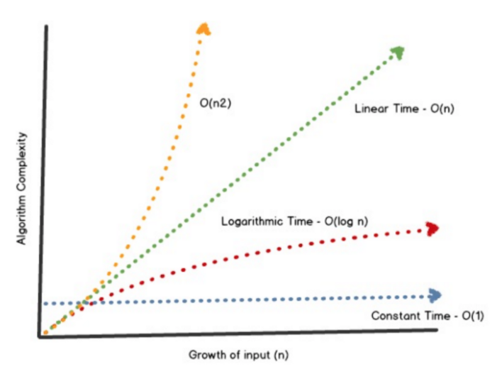

<div align="center"><h1> BigO Notation </h1></div>

We use BigO notation to indicate the complexity of an algorithm, the complexity refers to the amount of effort needed to
apply the algorithm. Now the exact amount of effort needed to solve the algorithm is **NOT** BIG_O notation. We don't
use BigO notation to determine how many assignment operations occur in an algorithm or how many iterations occur in a
couple of while/for loops, instead what we are really trying to focus on, is the factor of the algorithm that will scale
the most given a scalable n.

By ignoring the entire algorithm and only focussing on the largest contributing factor of the algorithm we perform an
approximation of efficiency, commonly known as the *asymptotic complexity*. To understand this it's a good idea to lay out an
algorithm and see which part of the algorithm scales depending on a scalling n value. Let's say we have the following algorithm

> f(n) = n<sup>2</sup> + 100n + log<sub>10</sub>n + 1000

The following table shows you each section of the algorithm, and it's total % of the algorithm at each scaling value n

| n | total # Iterations | n<sup>2</sup> | % of Algorithm | 100n | % of Algorithm | log<sub>10</sub>n | % of Algorithm |  1000 | % of Algorithm |
| --- | --- | --- | --- | --- | --- | --- | --- | --- | --- |
| 1 | 1 101 | 1 | 0.1 | 100 | 9.1 | 0 | 0 | 1 000 | 90.83 |
| 10 | 2 101 | 100 | 4.76 | 1 000 | 47.6 | 1 | 0.05 | 1 000 | 47.6 |
| 100 | 21 002 | 10 000 | 47.6 | 10 000 | 47.6 | 2 | 0.001 | 1 000 | 4.76 |
| 1 000 | 1 101 003 | 1 000 000 | 90.8 | 100 000 | 9.1 | 3 | 0.0003 | 1 000 | 0.09 |
| 10 000 | 101 101 004 | 100 000 000 | 99.0 | 1 000 000 | 0.99 | 4 | 0.0 | 1 000 | 0.001 |

As you can see while n is low the constant value of 1 000 dominated the algorithm, taking up 90.83% of all the total
effort needed to complete the algorithm, but as we scaled the value of n up, the constant value became less and less
significant and the quadratic function, *n<sup>2</sup>* became the more significant.

> When looking at BigO Notation we simplify this behaviour by only concerning ourselves with large values of N

This means we do **NOT** need to worry about scenarios in which n is lower than 10 and 1000 would be the most
significant factor of the algorithm.

With this in mind a general rule of thumb for BigO Notation, is trying to identify the most significant section of an
algorithm when dealing with scaling n values. You will need to understand a bit of math(very little), but it helps to
have a cheat sheet.



With this in mind lets look at how you calculate BigO Notation in an algorith

```kotlin

for (int i = 0;i < n; i++){
    sum += i;
}

```

In this example `i` is assigned and then the for loop iterates `n` times, each execution also updates the value of i and 
assignees a value to sum

> We say this equates to: 1 + 2n thus the asymptotic complexity is O(n)

in a slightly more complicated example

```kotlin
for (int i = 0;i < n; i++) {
    for (int j = 0;j < n; j++){
        sum += i;
    }
}
```

In this example `i` is assigned, the outer for loop executes `n` times updating the value of i each time, the 
inner for loop assigns `j` and also iterates `n` times. 

> We say this equates to: 1 + n(1 + n) = 1 + n + n<sup>2</sup>. Thus the complexity is O(n<sup>2</sup>)


Looking at 2 more special examples with inner for loops

```kotlin
for (int i = 0;i < n; i++) {
    for (int j = 0;j < i; j++){
        sum += i;
    }
}
```

In this example the only thing we have changed is that the inner loop is now iterating proportionate to `i` instead of `n`. 
The important thing to realise here is that as `n` grows so to will the inner  loop, both grow by the size of 
n. the inner loop will execute incrementally to the size of `n`

> We say this equates to: 1 + n(1 + 2 + ... n - 1) = 1 + n (n - 1)  = 1 -n + n<sup>2</sup>. Thus the complexity is O(n<sup>2</sup>) 

```kotlin
for (int i = 4;i < n; i++) {
    for (int j =  i - 3;j <= i; j++){
        sum += i;
    }
}
```

In  this example we need to pay special attention to the inner for loop. How many times will this for loop iterate? It 
will *always iterate 4 times*. Look closely, we initialize `j` to `i - 3`, and then we loop until `j` is greater than `i` 
which is 3 moore than `j` at initialization. Thus the number of iterations in the inner for loop is constant.

> We say this equates to 1 + (n - 4)(1 + 4) = 1 -20 + n + 4n = -19 + 5n. Thus the complexity is O(n) 

# Examples

## 1.Linear O(n)

```kotlin

for (int i = 0;i < n; i++){
    sum += i;
}
```

## 2.Quadratic  O(n<sup>2</sup>) |  O(n<sup>4</sup>)

```kotlin
for (int i = 0;i < n; i++) {
    for (int j =  0;j < n; j++){
        sum += i;
    }
}
```

```kotlin
for (int i = 0;i < n; i++) {
    for (int j =  0;j < n; j++){
        for (int k =  0;j < n; k++){
            for (int l =  0;j < n; l++){
                sum += i;
            }
        }
    }
}
```

## 3.Exponential  O<sup>n</sup>

```kotlin
recursive()
{
    //stuff 
    return recursive() * recursive ();
}
```

## 4.Log based O(Log<sub>n</sub>)

```kotlin

for (int i = 0;i < n; i++ * 2){
    sum += i;
}
```

## 5.Linear and Log based O(n(Log<sub>n</sub>))
```kotlin

for (int i = 0;i < n; i++ * 2){
    for (int j =  0;j < n; j++){
        sum += i;
    }
}
```

## 6.immediate  O(1)

```kotlin

function()
{
    return 1
}
```
