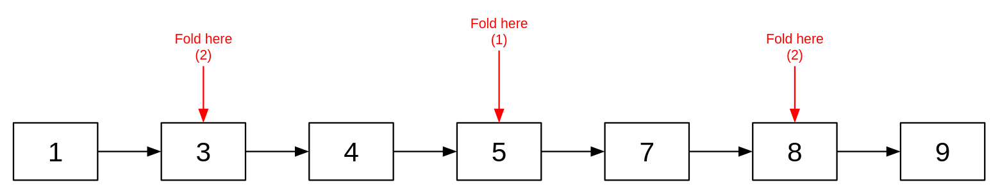
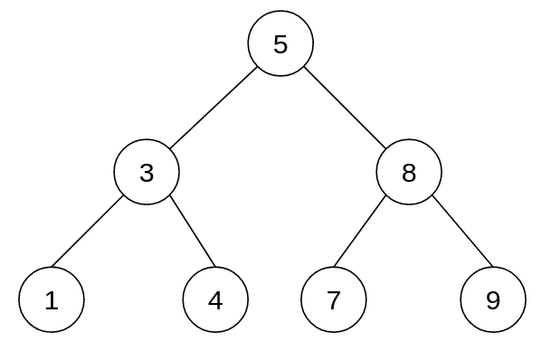
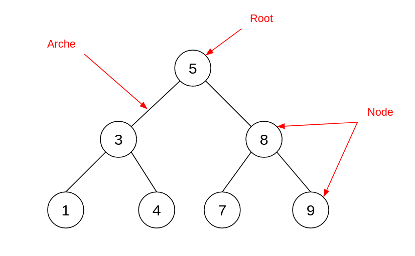
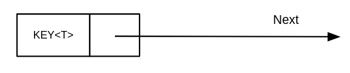
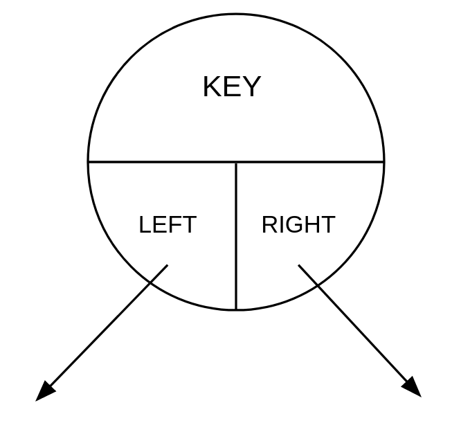
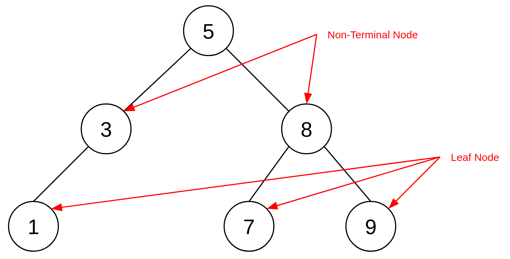
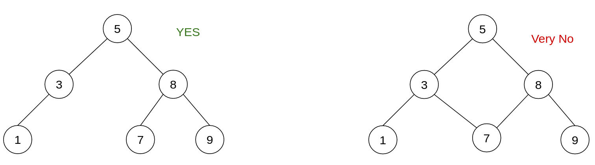
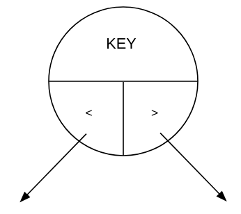
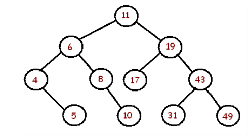

<div align="center"><h1> Binary Trees </h1></div>

Linked List are limited, searching small Lists is easy but as soon as the size of the list becomes large searching
becomes expensive. As we have seen with sorting algorithms, the worst case complexity is always `O(n)`. Skip Lists are
somewhat more efficient and is closer to a `O(log(n))` complexity, but with random values this is not always the case.

So we need an efficient way of reducing the comparisons needed to find items in our list. Well what if we folded our
sorted list at key points.

 <br />


When we "fold" the list like this we create a hierarchical structure, this structure is called a *Tree*. Folding the
tree looks cool but we do not want to just fold a list for the sake of giving the list a hierarchy, we do it because it
significantly reduces the number of comparisons need to search for items in our set. Actually the complexity of a *
complete* binary tree is `O(log(n))`. 

> Quick recap the difference between a set and a list, is that items are unique in a set (they only appear once) and
> they can be duplicated in a list. Also, by default sets usually do not worry about order were the order in a list
> is very important. Binary Trees store ordered sets over lists (they do not allow duplicates).

### Binary

The "Binary" part refers to the number of children each parent can have, trees are not limited to only having two
children at each level, some have 3 or 4 and some even have arrays of children, but Binary trees only have 2.

## Components of Trees

Trees are made of 3 components

1) Nodes
2) Arches
3) Root



### Nodes

Let's recap a simple Node in a Linked List



Each Node holds two fields, a key and a reference to the next Node in the List. There are variations where we hold a
previous but for now that's not really something to worry about.

A Node in a Binary Tree looks like this.



Each node holds 3 fields, a key, and a left and right pointer/reference to the next Node in the Tree. Both Nodes at the
left and right are **Children** to the current Node, the current Node is the **Parent** Node to both left and right
Nodes.

Any Node that does not have a child is referred to as a *Leaf Node*, keeping with the theme of trees, imagine that the
paths to each node is similar to a branch and each "branch" eventually leads to a single leaf. <br />
Every Node that does have at least 1 child is referred to as a *Non-terminal Node* so completely drop the tree theme for
this one. Basically it just means "Not Ending", it is not ending because there is at least one child that comes after
this Node.



### Arches

Are the imaginary connectors between Nodes, when we get to Graphs, Arches become objects but in the case of trees they
are mostly used to help draw out our tree relationships. It is important to understand the relationship between Nodes
and Parents so that drawing Arches becomes easier. A child Node can **only** ever have **1** parent, but every Parent
can have **at most 2** children.



### Root

The Root of the tree is just the first element inserted in the tree, or the top of our Tree.

## The Relationship between Left and Right

The rules of a Binary Tree are to place all keys less than the parent key on the left-hand side of the parent and all
keys that are greater than the parent on the right-hand side.

> Remember Left is Less than => Less, Left and < all look like they start with "L"



## Consistencies of Binary Trees

Let's look at a simple tree



1. The minimum value in the tree is always the value the farthest left from root

```kotlin
fun finMinimum(): T {
    if (root == null) {
        return null
    }

    val tmp: BinaryTreeNode<T> = root
    while (tmp.left != null) {
        tmp = tmp.left
    }

    return tmp.key
}
```

2. The maximum value in the tree is always the value the farthest right from root

```kotlin
fun finMinimum(): T {
    if (root == null) {
        return null
    }

    val tmp: BinaryTreeNode<T> = root
    while (tmp.right != null) {
        tmp = tmp.right
    }

    return tmp.key
}
```

3. To find a Nodes **Predecessor** (the Node that would come before it if we were to unfold this tree as an ordered
   List) go one Node left and as far right as possible, if the Node does not have a left child but does have a parent
   then the predecessor is the first parent Node that has a right child relationship to the node.

```kotlin
fun <T> findPred(node: BinaryTreeNode<T>): BinaryTreeNode<T> {
    // if node.left is null && the node is the minimum it means there is no pred value
    if (node == null || (node.left == null && findMinum() == node.key)) {
        return null
    }
    // if you do not have a left find your predecessor by looking at your parents
    else if (node.left == null) {
        var parent = findParent(node)
        var child = node
        while (parent.right != child) {
            child = parent
            parent = findParent(parent)
        }
        return parent
    }

    val tmp: BinaryTreeNode<T> = node.left
    while (tmp.right != null) {
        tmp = tmp.right
    }

    return tmp
}
```

4. To find a Nodes **Successor** (the node that would come after it if we were to unfold this tree as an ordered List)
   go to the right child and then from that subtree go as far left as possible, if the Node does not have a right child
   but does have a parent Node that has a left child relationship to the Node.

```kotlin
fun <T> findSuccess(node: BinaryTreeNode<T>): BinaryTreeNode<T> {
    // if node.right is null and the node is the maximum node it means there is no successor value
    if (node == null || (node.right == null && findMaximum() == node.key)) {
        return null
    }
    // if you do not have a right child find your successor through your parents
    else if (node.right == null) {
        var parent = findParent(node)
        var child = node
        while (parent.left != child) {
            child = parent
            parent = findParent(parent)
        }
        return parent
    }

    val tmp: BinaryTreeNode<T> = node.right
    while (tmp.left != null) {
        tmp = tmp.left
    }

    return tmp
}
```

## Adding Nodes to a Tree

To add a node we start at the root of the Tree and work our way down. At each node we compare the value we want to add
with the key of the Node, if the key we want to add is greater than the key at the Node we move to the Nodes right
child, if the key is less than the node we want to add we move to the Nodes left child. We repeat this until we find an
empty child at the correct position we wish to add the key.

## The Importance of the Order in which Keys are Added

Let's imagine we want to add a sorted List into a Tree, look what happens

> Add 1 -> 2 -> 3 -> 4 -> 5 -> 6 -> 7

The outcome is disasters, the solution is no better than a Linked List. How often and how likely is it that keys will be
added in a sorted list plays a big role in deciding how to handle unbalanced trees. In a later chapter we will look at
AVL trees which ensure the Tree is always balanced.

### Strict Trees

A Strict tree is a Binary Tree in which every non-terminal Node has a non-empty left subtree, and a non-empty right
subtree, but Leaf Nodes are not necessarily on the same level.

### Complete Trees

A Complete Tree is where every non-terminal node has a complete left and right subtree and all the leaf Nodes are on the
same level. We can calculate how many Nodes are in each row of a Complete tree simply by using the sum of powers of
2<sup>lvl - 1</sup>.

For example:
> There are 2<sup>1 - 1</sup> nodes in a level 1 tree, <br />
> There are 2<sup>7 - 1</sup> + 2<sup>6 - 1</sup> + ... 2<sup>1 - 1</sup> nodes in a level 7 tree

Or you can simply tell the number of Nodes at a single row by 2<sup>lvl - 1</sup>.


