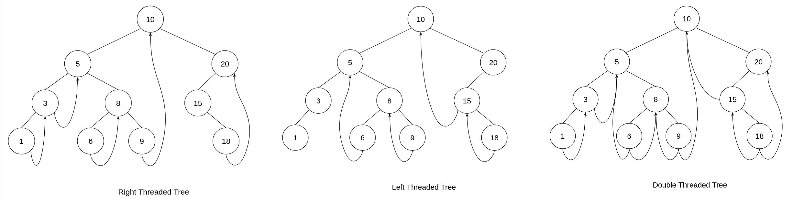
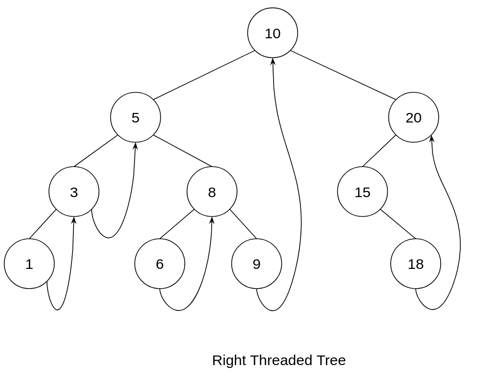

<div align="center"><h1> Binary Trees Part 2.2: Threaded Trees </h1></div>

Traversal using the stack, either with an explicit Stack or Recursion can be quite costly, especially if the tree is
quite heavily skewed to one side. If we wanted to achieve Stackless depth first traversal we can make use of *Threads*.

Threads are references to a Nodes ***Predecessor*** and ***Successor*** by means of *inOrder traversal*. Meaning a node
will reference/point to its *successor* if it does not have a right child, and a node will reference/point to its
predecessor if it does not have a left child.



## The Effect on Nodes

Threads are no different to children references, in that a Nodes left fields points to another Node, and in a Thread
environment a Node will point to its predecessor Node if it does not have a left Node reference. Both Thread and Left
Child point to the same data object (another TreeNode), same goes for threads and right children.

The question then is, do we add another duplicate field on each Node `rightThread` and `leftThread`? No. That would be
silly, we would essentially double the amount of storage now required for each Node. The fields point to the same type,
not only can they be used interchangeably, but they have the underlying condition that if one exists the other should
not.

> IF we **have** a left child we can **NOT** have a left Thread. IF we have a right child we can **NOT** have a right thread.
> IF we **do not have** a left child we **SHOULD** have a left thread. IF we **do not have** a right child we **SHOULD**
> have a right thread.


Instead of then adding a left and right thread field we can just mark, if this node is pointing to a thread by adding a
Boolean.

```java

class BinaryTreeNode<T>() {

    public key T;
    public BinaryTreeNode<T> left, right;

    //    public BinaryTreeNode<T> leftThread, rightThread;    we dont want this 

    // boolean indicates we are pointing to a successor on the right
    public boolean hasSuccessor;

    // boolean indicates we are pointing to a predecessor on the left
    public boolean hasPredecessor;
}
```

## Stackless Depth First Traversal

For the sake of simplicity we will only assume a singly right threaded tree. We want to make use of the threads to be
able to simulate that backtrace effect you would get using a stack, we will use the right thread to immediately find a
Nodes successor. </br >



To traverse the graph using the threads we will need start by going as far left as possible and starting with the lowest
Node in the tree. From this point on we can only visit a Node if we are moving up and in a right direction, if we ever
start going down we need to stop and restart the process, this will ensure Nodes are visited in order. To move back up
and to the right we make use of the Nodes right thread, if the Node does not have a right thread we need to stop and
restart, going as far left as we can from the right child subtree.

```kotlin

fun depthFirstThreaded() {
    if (root == null) {
        return
    }

    var tmp: BinaryTreeNode = root
    var prev: BinaryTreeNode = null
    
    // go as far left as you can
    while (tmp.left != null) {
        tmp = tmp.left
    }
    
    // last nodes right will be null
    while (tmp != null) {
        print(tmp)
        prev = tmp
        
        // if our node is now the right child to previous 
        if (p != null && !prev.hasSuccessor){
            // go as far left as you can, restart the process
            while (tmp.left != null) {
                tmp = tmp.left
            }
        }
    }
}

```
