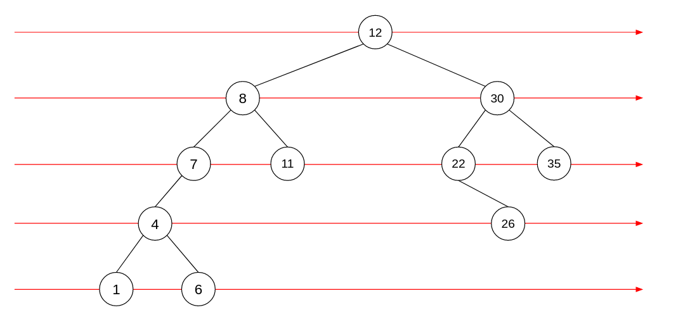

<div align="center"><h1> Binary Trees Part 2: Tree Traversal </h1></div>

There are two common Tree Traversal Strategies

1. Breadth First
2. Depth First

## Breadth First Tree Traversal

Breadth first tree traversal is the easier of the two to determine the result, but the harder of the two to implement.
What I mean when I say determine result is; breadth first traversal on a Tree is quite simple to read. If you were to
look at a Tree and perform Breadth First Traversal all you need to do is read the Tree from left to right row by row.
Simple!



Traversing the Tree using a Breadth first algorithm, the Nodes would be visited in the following order.

> 12 -> 8 -> 30 -> 7 -> 11 -> 22 -> 35 -> 4 -> 26 -> 1 -> 6

### Implementing the Breadth First Traversal

To implement a breadth first traversal we must make use of a Queue (In the case of 212 they usually allow you to use an
Array List. Just use an Array list and make sure to only add to the back and to only remove the first element rather
than making your own queue class). The algorithm is simple add root to the queue. Then continue to remove items from the
queue until it is empty, when you have removed an item from the queue it is considered to have been visited, add all of
its non-null children to the queue and repeat.

```kotlin

fun <T> breadthFirst() {

    if (root == null) {
        return
    }

    // use new ArrayList()
    val queue = ArrayList<BinaryTreeNode<T>>()
    queue.add(root) // add without an index adds to the back of an ArrayList just like the enqueue method 

    while (queue.isNotEmpty()) {
        val node: BinartTreeNode<T> = queue.removeAt(0)
        // print the node once it is removed from the queue
        print(node)

        // add all your children to the queue
        if (node.left != null) {
            queue.add(node.left)
        }
        if (node.right != null) {
            queue.add(node.right)
        }
    }
}

```

## Depth First Tree Traversal

Is the easier of the two to implement but not so straight forward in determining the order in which nodes are visited.
This is also due to the multiple Types of Depth First Traversal which are:

1. PreOrder where parents are visited before children, in this case all non-terminal nodes are visited before their leaf
   nodes in a single branch
2. InOrder in this case the Nodes are visited in the sorted order of an unfolded List
3. PostOrder where children are visited before parents, in this case all leaf nodes will be visited before their
   non-terminal nodes in a single branch.

Implementing the Depth first traversal requires a Stack, so instead of creating an explicit Stack (or using an Array
List as a stack) we can make use of recursion

> NB! Remember **Depth First** uses a **Stack** and **Breadth First** uses a **Queue**

Let's look at a simple tree and see how the different algorithms will change the order in which nodes are visited

### Implementing PreOrder Depth First Traversal

```kotlin

fun <T> preOrder(node: BinaryTreeNode<T>) {

    if (node == null) {
        return
    }

    // visit the node
    print(node)
    // go visit the children
    preOrder(node.left)
    preOrder(node.right)
}
```

If we take the tree from above and apply the **PreOrder** algorithm the nodes will be output in the following sequence:

> 12 -> 8 -> 7 -> 4 -> 1 -> 6 -> 11 -> 30 -> 22 -> 26 -> 35

Visit the node first then go to the left child, as soon as you are at the node visit it, when you eventually return to
the point where you called visit left, visit the right child after that.

### Implementing InOrder Depth First Traversal

```kotlin

fun <T> inOrder(node: BinaryTreeNode<T>) {

    if (node == null) {
        return
    }

    inOrder(node.left) // first visit left
    print(node) // then visit the node
    inOrder(node.right) // then visit the right
}
```

If we take the tree from above and apply the **InOrder** algorithm the nodes will be output in the following sequence:

> 1 -> 4 -> 6 -> 7 -> 8 -> 11 -> 12 -> 22 -> 26 -> 30 -> 35

Before visiting the Node go as far left as possible, then when you can go left no further visit the node, then go right.
Really Simple way to print the tree out as an Ordered List. Can also be used to print the list in declining order.

### Implementing the PostOrder Depth First Traversal

```kotlin

fun <T> postOrder(node: BinaryTreeNode<T>) {

    if (node == null) {
        return
    }

    postOrder(node.left)
    postOrder(node.right) // visit both children first
    print(node) // then visit yourself
}
```

If we take the tree from above and apply the **PostOrder** algorithm the nodes will be output in the following sequence:

> 1 -> 6 -> 4 -> 7 -> 11 -> 8 -> 26 -> 22 -> 35 -> 30 -> 12

Before visiting the node go as far left and as far right as possible and only then visit yourself. 
