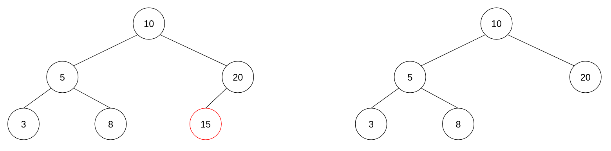
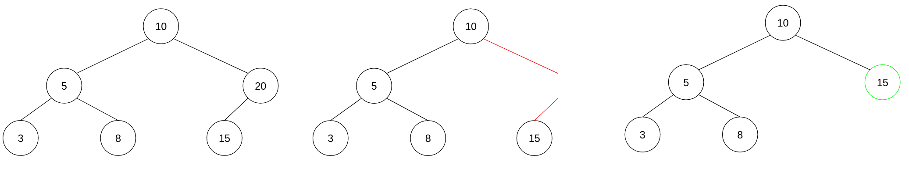
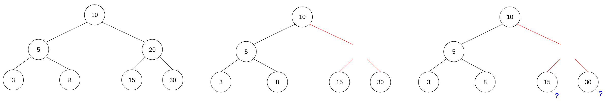
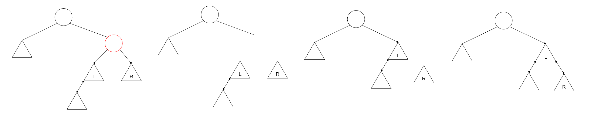
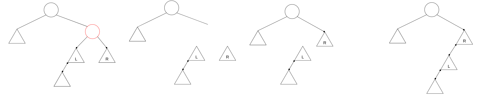
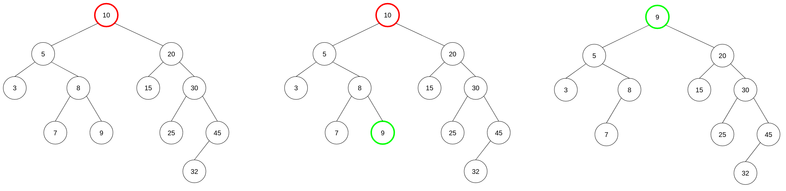

<div align="center"><h1> Binary Trees Part 3: Tree Operations </h1></div>

## search()

Searching a tree can be done quite easily, start from the top of the tree and them move from left to right depending on
the relationship of the element being searched, to the element stored in the Node.

```java 
class BinaryTree {
    public T search(T elem) {

        // Condition 1. root = null
        if (root != null) {
            BinaryNode<T> tmp = root;

            // if the while loop breaks we run down to the final return statement and return null
            while (tmp != null) {

                // Condition 2. element is found
                if (tmp.key.equals(elem)) {
                    return tmp.key;
                }
                // if elem at tmp is < elem being searched; go right else go left 
                tmp = (tmp.key.compareTo(elem) < 0) ? tmp.right : tmp.left;
            }
        }

        return null;
    }
}
```

## add()

Iterate through the tree in a similar method to search, if you already find the key do not add the element a second
time. Iterate through the tree until you find an empty space, then add the element in that space.

```java
class BinaryTree {
    public void add(T elem) {

        // Condition 1. root = null
        if (root == null) {
            root = new BinaryNode<>(elem);
            return;
        }

        BinaryNode<T> tmp = root, parent = null;

        while (tmp != null) {

            // Condition 2. element already exists
            if (tmp.key.equals(elem)) {
                return;
            }

            parent = tmp;
            // if tmp element is smaller than element coming in, set left else set right
            tmp = (tmp.key.compareTo(elem) < 0) ? tmp.right : tmp.left;
        }

        // Condition 3. add the new node either on the left or right
        if (parent.key.compareTo(elem) < 0) {
            // if parent is less than the element being added go right
            parent.right = new BinaryNode<>(elem);
        } else {
            // if parent is greater than the element being added go left instead
            parent.left = new BinaryNode<>(elem);
        }
    }
}
```

## getHeight()

The get height algorithm is slightly tricky, it is much easier to tackle it using recursion. Each visited non-null node
should be counted as a node, but we should only reference one node per level. Therefore, to calculate the longest branch
each visited left and right subtree must be compared, and the largest subtree selected as the path to reach the largest
branch in the tree.

```java
class BinaryTree {
    private int getHeight(BinaryNode<T> node) {

        if (node == null) {
            return 0;
        }

        int left = 1 + getHeight(node.left);
        int right = 1 + getHeight(node.right);

        return (left > right) ? left : right;
    }
}

```

## Delete

Deleting a Node in a tree is a challenge because...branches are not linear. There are 3 conditions we need to consider;

1. A Node is a leaf Node (it has no children)
2. A Node has one child, either left or right
3. A Node has both children

If a Node is a leaf Node the delete operation is simple just remove the Node from the Tree.



If a Node only has one child the delete operation would be also be simple, just take the only child and place it where
the parent used to be.



When there are two children though, which child do we choose?



### Delete by Merging

The solution is one of 2 algorithms the first being *delete by merging*. In this scenario we take either the left or
right child and replace it with the deleted parent. We then move the opposite child to the furthest opposite node of the
first child which replaced the parent.

In the case of selecting the left child as the Node to replace the deleted parent, move the right sibling of the left
child to the rightmost subtree of the left child (the parent nodes *predecessor*).



> In this image the Triangle depicts an entire subtree not just 3 Nodes, this is used to indicate that
> the tree could have multiple child nodes at each of these points we are only concerned about the edges

In the case of selecting the right child as the Node to replace the deleted parent, move the left sibling of the right
child to the leftmost subtree of the right child (the parent nodes *successor*).



> Delete by merging has a high likelihood of creating an unbalanced or skewed tree

### Delete by Copying

The more elegant of the 2 solutions is, *delete by copying*. In this scenario we delete the Node by finding either its
`Predecessor` or its `Successor`. We then copy the value in that Node and place the value in the Node we want to delete,
we then remove the Successor or Predecessor from the tree. We can do this because we know a Nodes Successor or
Predecessor have the guarantee of at most having 1 child, if the did not they would not be the Successor or Predecessor
of the Node we are deleting.



> Delete by Copying is far less likely to unbalance the tree
