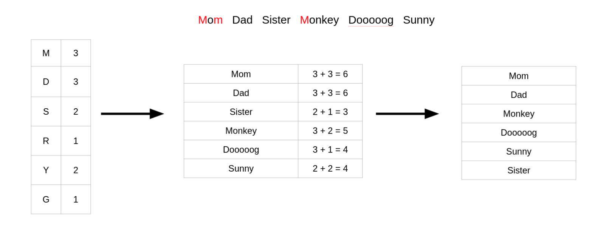
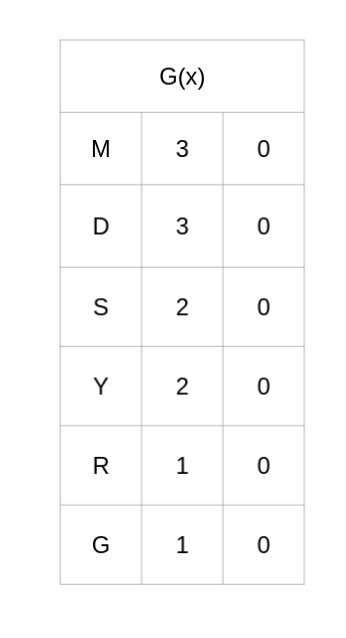
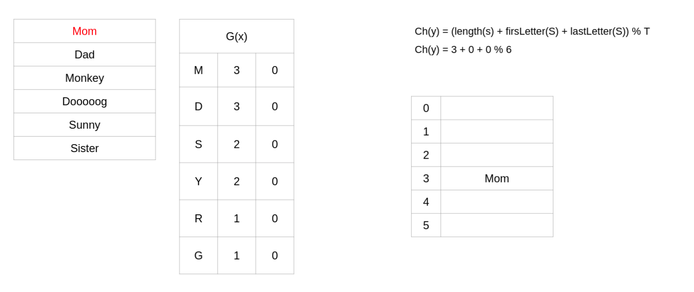
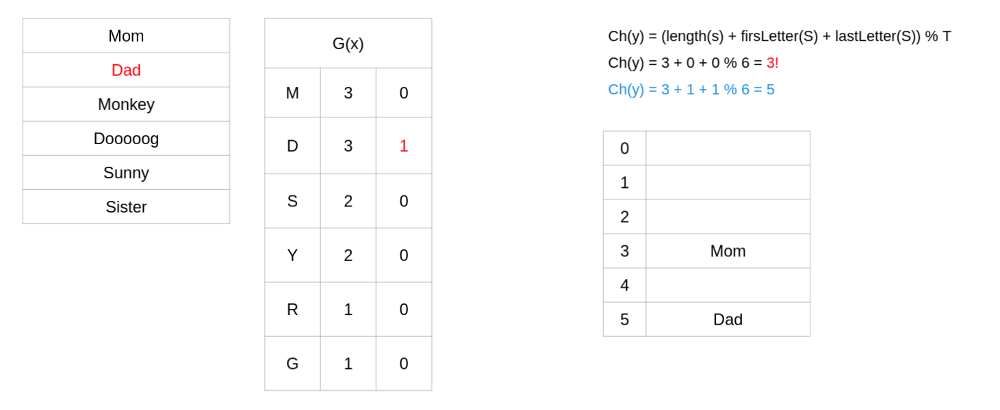
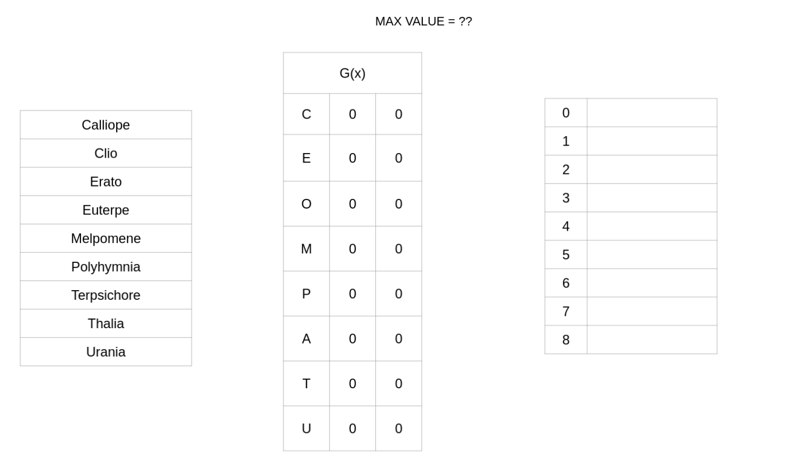

<h1> Cichelli’s Algorithm </h1>

Is the perfect Hashing for words, makes use of a technique we used early on in recursion and that is Backtracing.

The algorithm works by sorting and finding the frequency of first and last letters, we will then assign a value to each
of these letters. The value we assign to these letters will be used with the words' length to find the perfect Hash.

So basically the algorithm is trying to find a smart wat to use the words' length to perfectly hash each word. The
purpose of finding the frequency of the first and last letters, and then ordering them, is so that we can find update
values in a way that prioritizes affected as few words as likely possible.

The value we assign to each letter will be like an offset, so we will take the words length and then add the offset of
the first and last letter to get the Hash. The algorithm looks like this.

> Ch(y) = (length(s) + firsLetter(S) + lastLetter(S)) % T

## Example

Lets use the following words and go through the steps we would need to take to perform the algorithm.

Mom Dad Sister Monkey Dooooog Sunny

## Step 1: Order by the Frequency of 1st + last letters

Count the number of times each letter appears as either a first or last letter, then sum the value of each word by the
frequency of the first and last letter in that word. Finally, sort the words in that order.

## Step 2: Make an Offset Table

As I said we will use an offset for each value so to keep reference to that offset I highly suggest you guys make out a
table for yourselves. The letters in the offset table should be inserted inorder, and the values can be next to them as
a reference if it helps, but initially the offset value of each letter should be set to 0.

## Step 3: Start Hashing

Now we start taking the words off our sorted List and attempt to Hash them, using the formula.

> Ch(y) = (length(s) + firsLetter(S) + lastLetter(S)) % T

## Collisions

In the case of a collision we increase the offset of the words first or last letter. We choose the letter we wish to
offset by moving up our offset table. The reason we do this is so that we pick letters with a lower frequency first.

Now every instance of the letter `D` will add the offset value 1 when ever it is used.

## NB!! : The Max Value

But how do we know when to stop incrementing one value and start incrementing another? We need to calculate a max value
which is the highest number of increments we can perform on a letter before we need to start incrementing the other
letter in the word. Usually this value is quite simple, the number of words / 2 or table size divided by 2.

## Your Example 

Perform Cichelli's algorithm on the following words

> Calliope Clio Erato Euterpe Melpomene Polyhymnia Terpsichore Thalia Urania

