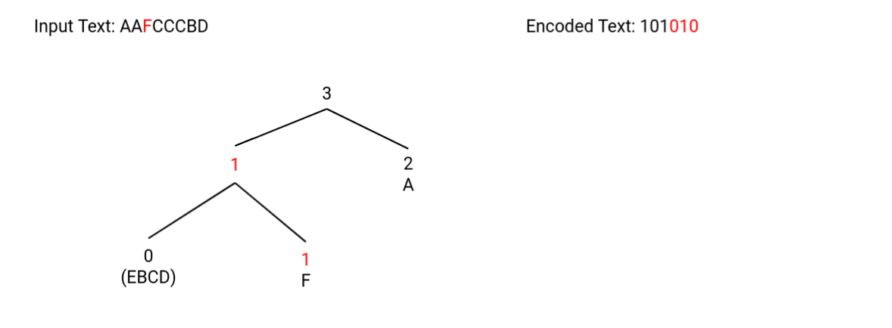

<h1> Encoding </h1>

Encoding is finding the smallest number of bits to represent the same data, which is smaller?

Obviously the 1's and 0's right. Both rows depict the same data, but the second row is using far fewer bits. This is
what we will try to achieve with encoding algorithms.

## Practical Data with more than 2 Options

Imagine we had a set of weather data which suggested:

We would like to give a symbol for each of the 4 weather conditions that appear in this table, which would use the
fewest number of bits. Since it is more likely for it to be Sunny than rainy we would like to prioritize a smaller
symbol for it being Sunny than it being Rainy.

Therefore, a simple solution would be something like this, where we assign the two weather conditions with the highest
probability with the smallest number.

But this is not a good idea imagine the bit sequence

> 0110

Is that a sequence of `SUNNY,CLOUDY,CLOUDY,SUNNY` or `RAINY,FOGGY` and how could we tell. The problem here is there are
too many encodings that have the same Prefix. So a rule of thumb is each symbol must also have a unique Prefix.

Here is an example of encodings where no symbol contains the same prefix. In the case of

> 0110

There is only one combination of weather conditions that would result in that sequence `SUNNY,RAINY`

### Prioritizing Higher Frequencies

As I said before the chance of the weather being sunny is higher than it being rainy so in our solution the number of
bits we decided to use for sunny was only one, but the number of bits we used for rainy is 3. Remember the goal of
encoding is to use as few bits as possible to represent the same data.

## Finding Unique Prefixes

In the real world we won't just be given a table with the smallest prefix values possible, instead we will be asked how
to find those prefixes. To do this we chose to use **Huffman Encoding**

## Huffman Encoding

We arrange the symbols in descending order of frequency from left to right. Then we create a Tree like structure. Each
left branch is a 0 each right branch is a 1. At each step we will connect the two branches with the lowest frequency and
then add them summing up the two frequencies. We will continue to pick the two lowest frequencies including the sum of
the two previous branches until the tree has a single root.

Using the weather example from before.

Now each code is the path of the branches you took to reach that symbol. Remember each left branch is a 0 and each right
branch is a 1.

## Example

Now do the same thing for the example:

> Hannah anna banana

The first step is to calculate the frequency of each letter within the word, there are also two spaces between the
words.

#### Downside to Huffman

There is a downside to this algorithm. It requires that we know the frequency of each character in the word before we
apply the algorithm, unfortunately this is rarely the case. The fix is the **Adaptive Huffman**

## Adaptive Huffman

Dynamically build the perfect encoding for characters while simultaneously counting the frequency of each character
encountered. This the encoding we apply for a character may not be the same throughout the course of the algorithm.

Adaptive huffman also works with a tree, but we are going to order the tree like this.

So siblings must be ordered in ascending order from left to right. This will make more sense as we go through an
example.

We will start with a single Node which contains the alphabet of all characters expected in the sequence.

Each character in the alphabet will be reprsented by a sequence of 1's, the number of 1's is an indication of the letter
in th alphabet

When we encounter a letter from the alphabet Node we are going to output the path we took to get to the alphabet node
plus the position of the letter in the alphabet Node. Otherwise, if we are accessing a letter that has already been
encountered we will output the path we took to get to that Node.

Assume the Following

So far the `Encoded Text` is equal to `10` (The encoded text is the result of the adaptive Huffman).

## NB!!

Notice what happens to the alphabet when we take a character out of it, we swap it with the character at the last
position and pop it off. `F` Which was at the last position now moves to the front of the alphabet Node and `A` was
popped off the back.

Moving on we see the second character accessed in the input string was a second `A`

All we add to the Encoded Text now is the path we took to get to the letter A, remember that the same as with regular
Huffman, right branches are represented as a 1 and left branches are represented as a 0.

## Adding a New character in our Alphabet

The next letter is an F, we have not yet added an F to the huffman tree yet, so we output the path we take to the
alphabet node and remove it. When we remove it we remove output its position from the alphabet Node as well.

Notice the Encoded text, we added the sequence `010`, the first 0 was the path we took to get to the alphabet Node and
then we output F's position in that Node which was `10`. All positions have a trailing 0 to signal the end of the
character.

## Adding C

Adding C will follow a similar process.

Again Notice the added encoded String `001110` the first sequence `00` represents the path we took to get to the
alphabet node, and the next sequence `1110` represents C position in the alphabet Node before we have removed it.

## Tree Shifting: Adding a Second C

Remember that in the Adaptive Huffman nodes must be ordered from right to left top to bottom, well notice what happens
when we add the next C.

Notice the Encoded text, the path we add was the path we took to `C` before we shifted the tree. This step of looking to
see if we need to shift the Tree should always be applied after every insert it just so happened that we did not need to
update the tree before this step.

## Finish this Example

The remaining input text is `CBD`

