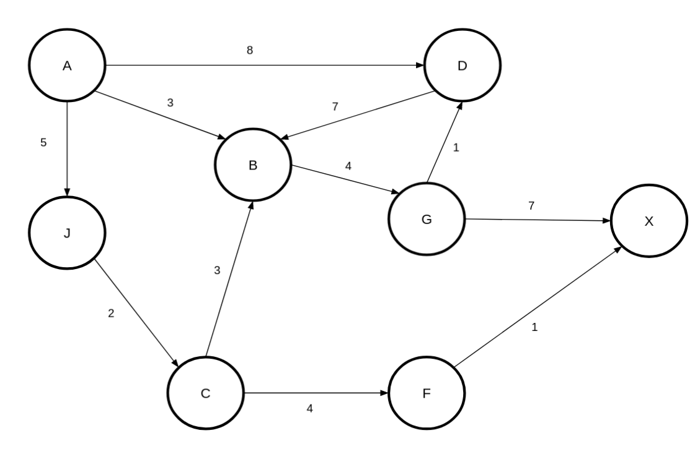
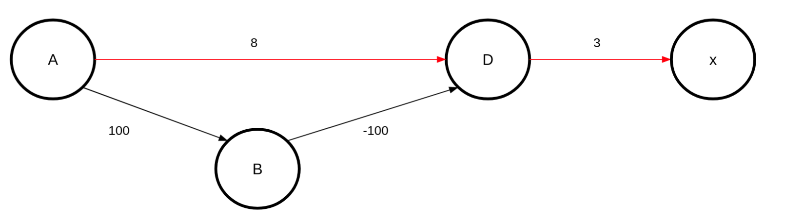
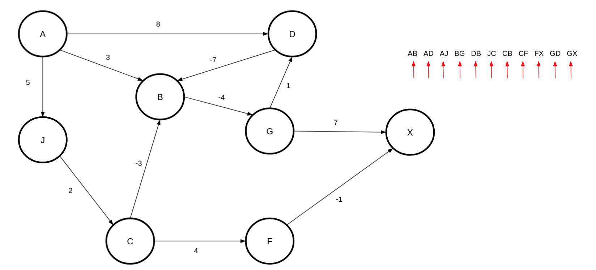
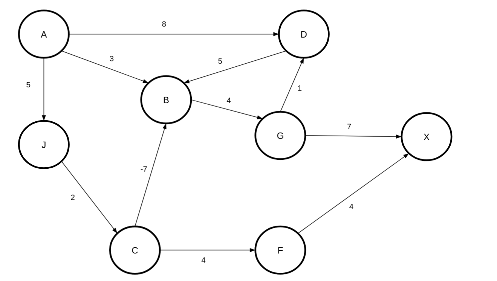
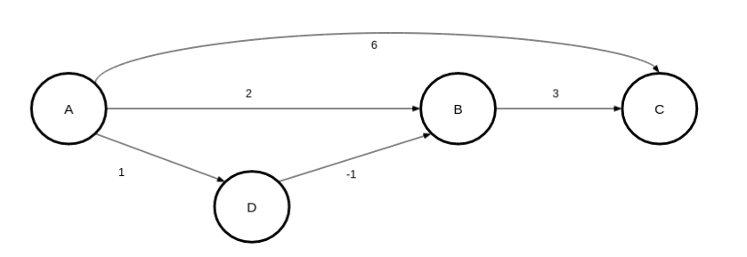
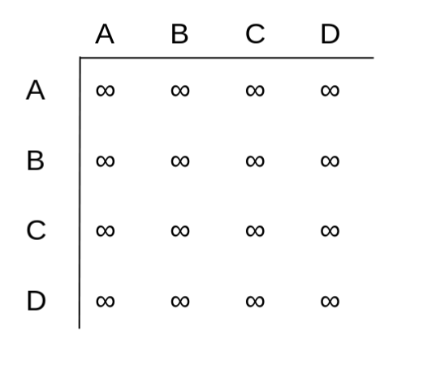
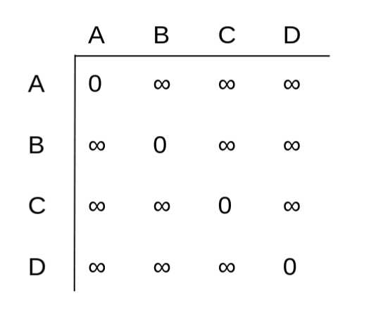
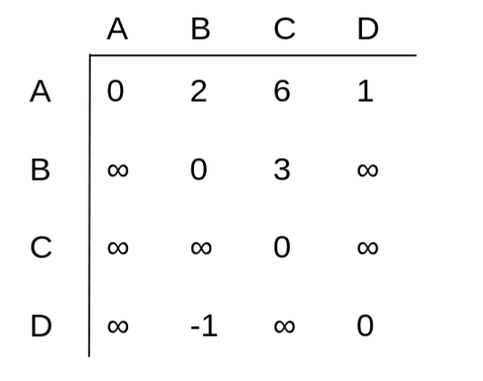
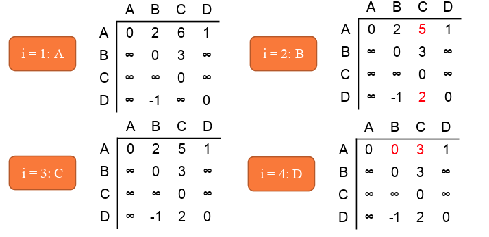

<div align="center"><h1> Graphs Part2: Shortest Path </h1></div>

Throughout the next few lessons we will mostly be looking at algorithms on Graphs not so much creating Graphs. The
important thing to note is that if you understand the algorithms you will very easily be able to answer the questions on
them in your exams, so from this point on practice each of the following algorithms, and you will be fine.

## 4 Different algorithms

There are 4 different algorithms for Shortest Path, be very sure you know which one they are asking you for in the exam
therefore, READ THE QUESTION.

The four algorithms are as follows:

1. Dijsktra’s algorithm
2. Ford algorithm
3. Dijsktra’s (Fixed)
4. Shortest Path ALL to ALL (unique)

## The Shortest Path

There are two things we want to know when want to find the shortest Path, the total distance and the path we took to get
there. Therefore, we need to add 2 variables to the Vertex class, a `previous` field and a `distance` field.

```java
class Vertex<T> {
    T value;
    Edge[] edges;
    Vertex<T> prev; // newly added
    Int dist; // newly added

    public Vertex(T v) {
        value = v;
        prev = null;
        dist = MATH.INFINITY;
    }
}
```

We are going to use the `prev` field to highlight the path back from the shortest path and we are going to use
the `dist` field to calculate the shortest path.

## Dijsktra (The God of Datascience)

Dijsktra proposed an algorithm that visits every Node once and selects the *"closest"* neighbour first from a priority
queue. Here is the sudo code

````kotlin

import java.util.*

fun dijsktra(start: Vertex) {

    foreach(v in vertices) {
        v.dist = INFINITY;
    }

    start.prev = null;
    start.dist = 0;

    val unvisited: PriorityQueue<Vertex> // in this case a Min Heap would work very well
    unvisited[0] = start;

    while (unvisited.isEmpty().not()) {
        val curr = unvisited[0] // the NEXT LOWEST/CLOSEST neighbor by dist

        unvisited.remove(curr) // visited so we don't need to look at it again right??


        for (neighbor: Vertext in curr.nighbors) { // you will have to traverse the edges to get the neighbors here
            val dist = curr + curr.edgeBetweenThemWeght

            if (dist < neighbor.dist) {
                neighbor.dist = dist
                neighbor.prev = curr // to make a path
            }
        }
    }
}
````



### There was a flaw in my Approach (yes I like Overwatch)

Dijsktra does now work well with negative numbers. Example



## Bellman-Fords Algorithm

Instead of looking at all the Vertices look at all the Edges. Here is the sudo code:

```kotlin

fun ford() {
    forech(vertex in Graph) {
        v.dist = INFINITY
    }

    start.dist = 0
    while (there is an edge(v, u) such that u . dist > v . dist +length(v, u))
    {
        u.dist = v.dist + length(v, u)
    }
}
```

 

While there is at least **one** edge that reduces the dist of a Vertices, loop through all the edges in the Graph
updating all the Vertices you can. Ends only when you loop through all the edges, and you update no vertices.

## Dijsktra's fix

The Bellman-Ford algorithm works but look how many times we loop through the edges, this can be quite an expensive
operation. Surely it would be beneficial to try and fix Dijsktra's algorithm so that we can improve efficiency.

We can, instead of just removing vertices once they have been visited, add them to a Queue **IF** the dist value has
been updated.

```kotlin
fun dijsktrasFix() {

    val toBeChecked: Queue
    foreach(v in Graph) { // Initialization
        v.dist = INFINITY         // Unknown distance
        v.prev = null             // Previous node in shortest path
    }

    start.dist = 0
    toBeChecked.add(start);
    while (!toBeChecked.empty()) {

        curr = toBeChecked.removeVertex()
        foreach(v of curr.edges) {  // even the visited ones 

            newDist = curr.dist + length(curr, v)

            if (newDist < v.dist) {
                v.dist = newDist;
                v.prev = curr;

                if (!toBeChecked.contains(v)) {
                    toBeChecked.add(v);
                }
            }
        }
    }
}
```

This algorithm has two fixes,

1. Vertices can be looked at again by possibly being added to the queue multiple times
2. It is no longer necessary to use a priority queue and pick your closest neighbor

 

## All to All

The above 3 algorithms will help you find the shortest path from A-B, but the All to All finds the shortest path between
all vertices in the Graph. Luckily it is not too complex. It is not likely to come up in an exam question but has been
coming up in your pracs over the past few years, so it is worth understanding.

The algorithm is also named Floyd–Warshall, a tribute to its creators.



The algorithm works with a |V| x |V| matrix, where |V| is the number of vertices in the Graph. Once you have defined
your Matrix there are 3 initial steps we need to follow.

1. Set all distances to Infinity

   

2. Mark the diagonals as 0 (where [v]=[v])



3. Add the weights of every edge at the appropriate position in the Matrix



Once the initial set up is done you can use the following algorithm

```kotlin
fun allToAll() {
    for (val i in 0..V) {
        for (val j in 0..V) {
            for (val k in 0..V) {

                if (weight[j][k] > weight[j][i] + weight[i][k]) {
                    weight[j][k] = weight[j][i] + weight[i][k] // this is on your matrix
                }
            }
        }
    }
}
```


