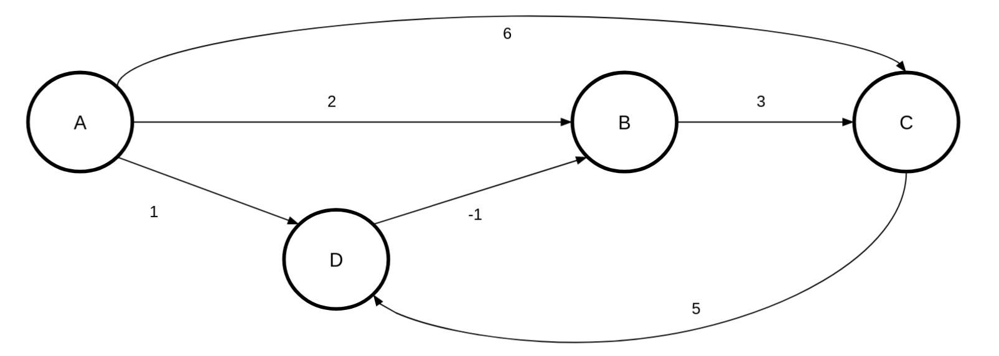
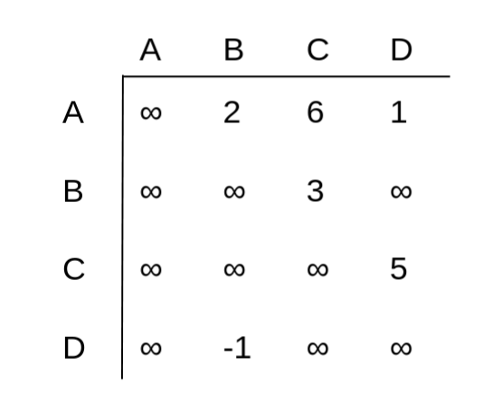
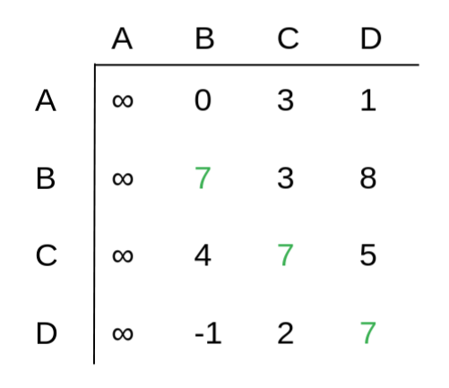
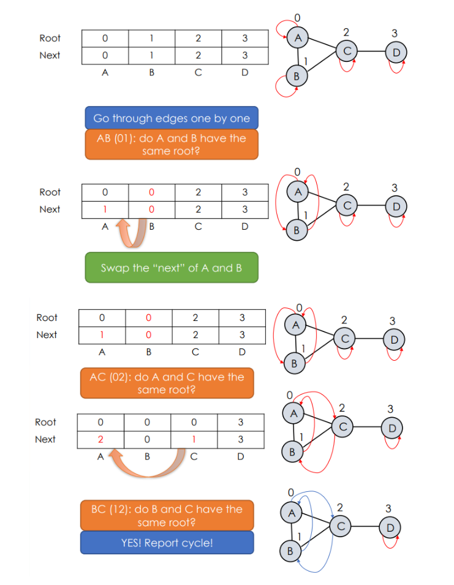

<div align="center"><h1> Graphs Part3: Detecting Cycles </h1></div>

There are 3 algorithms we can use to Detect Cycles

1. All To All adaptation
2. DPT traversal adaptation (meaning we could also use Breadth first as well)
3. Union's

## All To All

We can use the all to all algorithm from before to detect cycles, to do this we need to leave out step 2, of the initial
set up.




Step 2 set the diagonal values to 0, that was because the diagonals represented the distances from Vertex A to Vertex A,
naturally this distance can be assumed as 0, because why would it ever cost more or less to visit a position you are
already on. But a non-Infinite figure in the All to All Matrix represents a path from 1 Vertex to another, therefore if
we can set a diagonal value, we can detect a cycle. But if the diagonals are always set to 0, we will never be able to
overwrite this value so instead we leave the diagonals as INFINITY for now.




If any of the diagonals update after we perform the algorithm, then we can have determined a cycle exists between these
vertices. Diagonals with the same value are likely part of the same cycle.



## DPT First Search

A clearer algorithm that detects cycles, and ithe cycles path, is a slight modification of the depthFirst search. In
this we modify the algorithm to look for prev fields, specifically we look to encounter vertices that have already been
visited and had a prev set.

If the previous value has been set, and it is not current then we have encountered a cycle.

```kotlin
fun depthFirstSearch() {
    for (v in Graph) {
        num(v) = 0
    }

    while (a vertex v exists such that num(v) = 0)
        digraphCycleDetectionDFS(v)

}


fun digraphCycleDetectionDFS(v) {
    num(v) = i++

    for (u in v.edges)
        if (num(u) == 0) { // unvisited 
            pred(u) = v
            digraphCycleDetectionDFS(u)
        } else if (num(u) is not ∞) {
        pred(u) = v
        cycle detected
    }
}
```

## Union

Finally, an algorithm that looks for cycles using set theory (looks for vertices in the same set)

Set up a table with each node, as a counter starting at 0, set up a root and a next field.

Go through the edges, when you encounter an edge between `(u)(v)` set the `Root` to `u` as both u and v are originating
from the same origin, the swap there next fields. Keep doing this until you encounter vertices that have the same root.
If vertices with the same root are encounter, a cycle has been detected.



