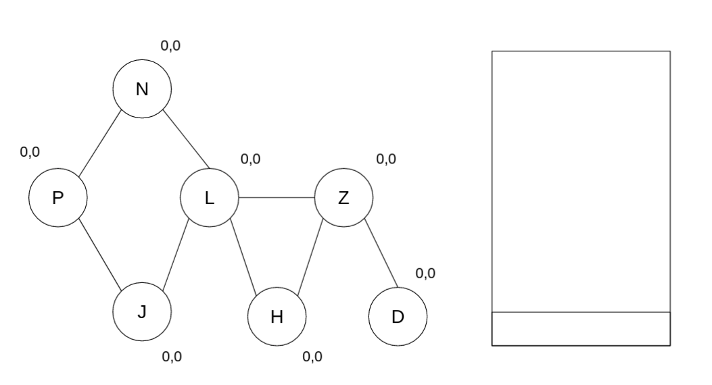
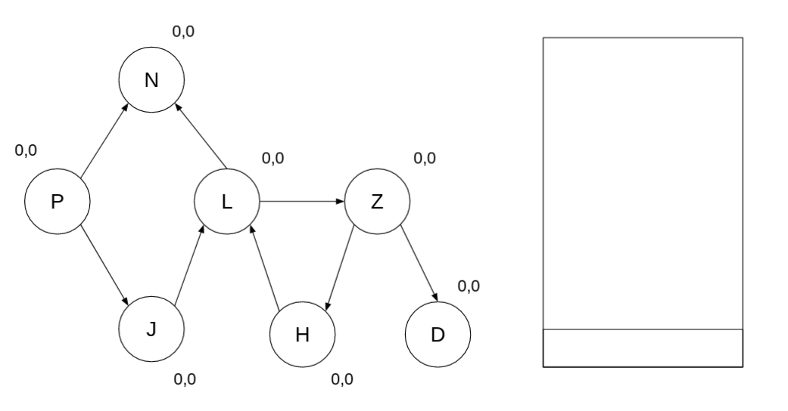

<div align="center"><h1> Graphs Part4: Connectivity </h1></div>

## Finding Articulation Points

Vertices which are always included in the path of any other vertex in a subgraph.

In any graph we could potentially have vertices which could potentially divide two sub-graphs, these points represent
weak points in the graph, where if removed could potentially slow down algorithms within the graph, therefore finding
these points is very important.

To find these points we can manipulate the depth first search making use of an explicit stack as well to keep track of
the edges. The algorithm is looking to find multiple points of entry for each vertex, because if a vertex has multiple
points of entry then it is not an articulation point. To find out if a vertex must be included in the path between A and
B, assign each vertex and predecessor order with the use case of making sure, that the current verteces order is always
less than its neighbours, because if true a vertex already defined has a pathway to B.

Lets look at the following Sudo code

```kotlin

fun blockSearch() {

    foreach(v in vertices) {
        num(v) = 0 // initialize all vertices as unvisited
    }

    i = 1

    while (there is a vertex v such that num (v) == 0 { // checks all subgraphs
        findArtPoints(v)
    }
}


fun findArtPoints(v) {
    pred(v) = num(v) = i++;

    foreach(u in v) { // u => neighbour to v
        if (edge(vu) not on stack) {
            push(edge(vu)) // onto a stack
        }

        if (u.pred is 0) {

            findArtPoints(u) // break here: Look it calls it recursively

            if (pred(u) >= num(v)) { // this is important!!! Finds an articulation point
                e = pop()
                while (e != edge(vu)) {
                    println(e) // print edge
                    e = pop()
                }
                println(e) // print edge
            } else { // multiple paths to vertex
                pred(v) = min(pred(v), pred(u))
            }

        }

        // examine this if else statement
        else (if u is not the parent of v) {
            pred(v) = min(pred(v), num(u)); // update when back edge(vu) is found
        }
    }
}
```



## Strongly connected Points

Strongly connected points in a graph are points in which a path exists from u to v and ultimately back to u. They are
points that are part of a cycle.

To find Strongly connected points we use the following algorithm

```kotlin
fun sccSearch() {
    foreach(v in vertices) {
        num(v) = 0 // initialize all vertices as unvisited
    }

    i = 1

    while (there is a vertex v such that num (v) == 0 { // checks all subgraphs
        blockDFS(v)
    }
}

fun strongDFS(v) {

    pred(v) = num(v) = i++
    push(v)

    foreach(u in v) { // u => neighbour to v
        if (u.pred == 0) {
            strongDFS(u) // break here: Recursive calls will return control here

            pred(v) = min(pred(v),pred(u)) // after visiting neighbor set parent to min of parent and neighbor
        }

        else if (u.pred < v.pred && u is on stack) {
            pred(v) = min(pred(v),num(u));
        }
    }
    
    // after visiting all our neighbours
    if (pred(v) == num(v)) {
        w = pop()
        while (w != v) {
            println(w)
            w = pop()
        }
        println(w)
    }

}
```


