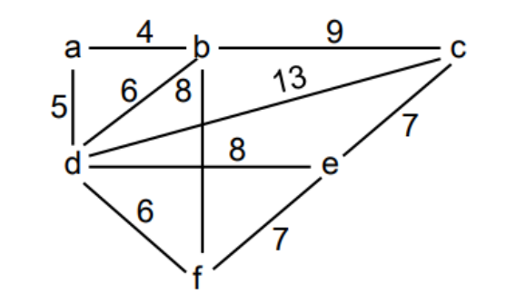

<div align="center"><h1> Graphs Part5: Spanning Trees </h1></div>

We have now discussed the shortest path from A to B, but what about a scenario that is trying to find the shortest path
for visiting all vertices **EXACTLY ONCE**. What is the shortest possible path we can take to visit each Vertex without
revisiting the same Vertex twice.

Such a scenario lead to algorithms responsible for Spanning Trees. Spanning Trees look like regular Trees in that they
have a single root and many children, the difference is Spanning Trees have a variable number of children at each Node.

There are two Algorithms which we can use to find the shortest path to visit each vertex exactly once

1. Kruskal algorithm
2. Dijkstra algorithm

## Kruskal

Kruskal's algorithm is the one we will look at first and is known to be the more eager of the two. We say it is eager
because it requires some operation to be applied on the graphs edges before we look at the algorithm. However, the
actual algorithms itself is really quite simple.

 ```kotlin
val vertices: List<Vertex>

fun kruskal() {

    val edges = edges.sort(edge.weight) // sort the edges in ascending order

    // add the two vertices connected by the first edge to the spanningTree
    val spanningTree: MutableList<Vertex> = mutableListof(
        edges[0].from,
        edges[0].to
    )

    val i = 1

    // if false all vertices have been added to spanning tree (all have been visited)
    while (spanningTree.lenght != vertices.length - 1) {

        if (edges[i] not cause cycle) { // does not cause a cycle
            spanningTree.add(vertices in edges not already in spanningTree)
        }

        i++
    }
}

```

First sort the edges by weight, and then loop through the sorted edge list and add an edge to the spanning tree if
adding the vertex does not cause a cycle



## Dijkstra algorithm

Dijkstra algorithm is funny, and lazy. In this algorithm we don't bother sorting all the edges, Instead we just loop
through all the edges. Therefore, in Kruskal the complexity comes from sorting the list, in Dijkstra the complexity
comes from what comes next.

Dijkstra's algorithm will attempt to add each edge to the spanning tree, however when a cycle is detected it will remove
the edge with the biggest weight in that cycle

 ```kotlin
val vertices: List<Vertex>

fun dijkstra() {

    val edges: List<Edge> // unsorted list of edges
    val spanningTree: MutableList<Vertex>

    for (edge in edges) {

        if (edge creates a cycle) {

            val cycle = findCycle(spaningTree, edge) // make the cycle 
            cycle.remove(edge with largestWeight) // remove the edge with the biggest weight in the cycle

        } else {
            // if no cycle add the vertices to the spanning tree
            spanningTree.add(vertices in edges not in spanningTree)
        }
    }
}

// returns a list of all the edges in a cycle
private fun findCycle(spanningTree, edge) {
    ...
}

```


