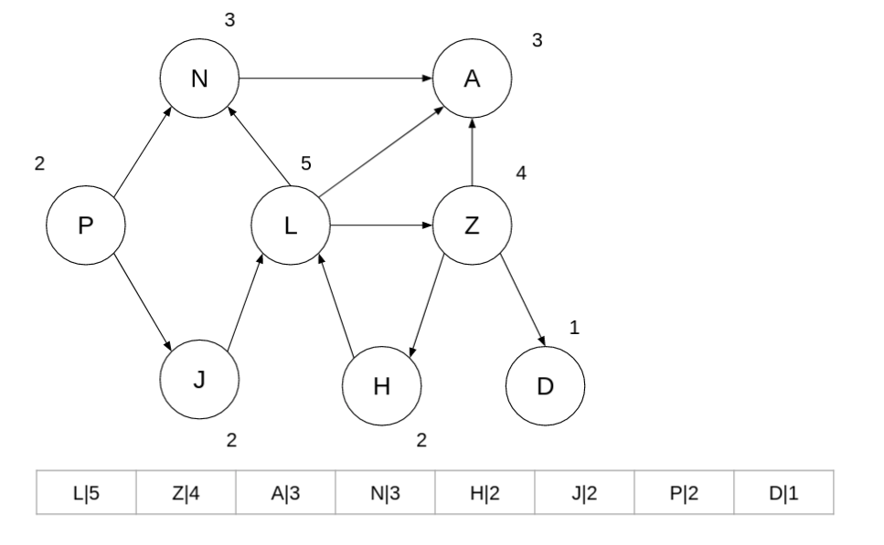
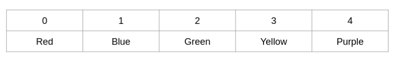
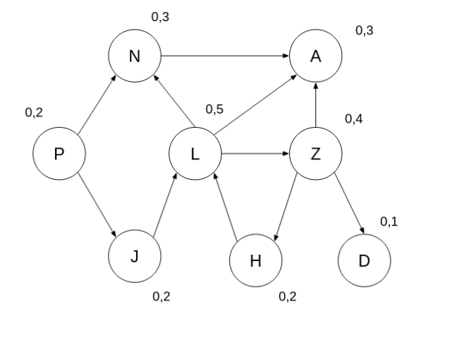
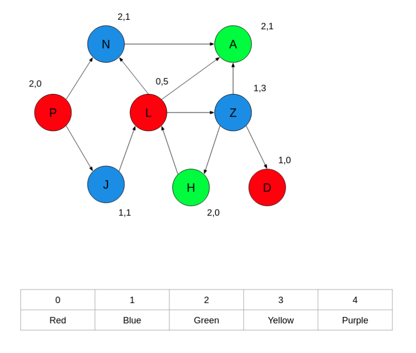

<h1> Graphs Part5: Graph Coloring </h1>

## Graph Coloring

Is an attempt to color vertices in a graph with the condition that no two adjacent (connected by an edge) vertices can
have the same color, in the most efficient way (using the least possible colors)

### Scenario

Imagine trying to generate a timetable, if you had a graph in which each vertex represented a subject/module and each
edge represented the number of students enrolled in both courses, then you would want to efficiently find a time when
students can attend both classes that do not overlap. In our use case the "time" is going to be represented as a color.

There are 2 algorithms we will look at

1. Sequential
2. Brelaz

## Sequential Coloring

Very simple start by organizing your vertices into a `Priority Queue`, the sorting value of the queue is the
vertices ***"highest degree"***.

### Highest Degree

The number of edges going both in and out of the Vertex, when we need a Priority queue a good implementation would
always be a heap and in our case we need a max heap because we are going to be popping the vertex with the highest
number of edges.

We then create an array of colors, the indices of the colors is very important, as we will be looking for the lowest
*valid index* in the color array to assign to each vertex.

### A Valid Index

In the sequential graph coloring algorithm we will `pop()` vertices from the priority queue, we will then pick the
LOWEST color in the color array that is NOT already assigned to the neighbours of the vertex (both incoming and outgoing
neighbours).

## Brelaz

The Brelaz algorithm works similarly to the Sequential algorithm when it comes to picking a color to assign to a graph
but it does not make use of a Priority Queue.

Instead, it works by assigning two new values to each vertex, a *Saturation number*, and a *Uncolored Neighbors number*.
The Saturation number will initially be set to 0. The number of uncolored neighbors should be set to the number of
neighbors to each vertex.

## Picking the Next Vertex

The algorithm will always try and pick by **SATURATION NUMBER** first, if a tie exists it will pick by number of
uncolored neighbors. When a vertex is selected we assign the vertex a color and then update all of its neighbors, each
neighbors `number of uncolored neighbors` will go down by 1, and the number `saturation number` will go up by 1. In
essence, you could say the "saturation number is number of colored neighbors".

But sometimes the algorithms will both determine the same solution.

This is not always the case.
