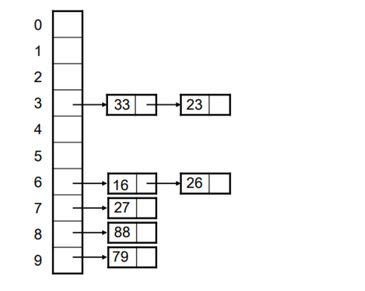

<h1> Hashing </h1>

Hashing is the process of applying a hashing function to a value in order to manipulate the value into a unique index to
be used as an index for an array. Using the result of the hashing function as an index results in significantly reduced
complexity for storage and retrieval of values. The complexity thus becomes the complexity of the Hash function.

## Hash Function

Usually we draw out a hash function like so

> F(x) = (5 * x) % 11

All this does is take the value multiply it by 5, and mod the result by 11. Nothing too scary although the math does
tend to freak some students out. Just remember to look at the question and replace the value of X with the value you are
working with, then the question reads like a normal sum.

## Insert into the Hash Table

When hashing into a table we must always mod the result of the Hash Function by the size of the Hash Table. So if the
question specifies the size of the table explicitly then be sure to add the mod of the table size.

In the example above you can assume the mod 11 is the table size.

### Example

Insert the following data into a hash table, using the hash function: ` F(x) = (5 * x) % 11`

4 7 14 22

> F(x) = (5 * 4) % 11 => 9  
> F(x) = (5 * 7) % 11 => 2  
> F(x) = (14 * 5) % 11 = 4  
> F(x) = (22 * 5) % 11 = 0  

## Collisions

Using a mod by table size is not a guarantee that data will fit into the table uniformly without clashes, sometimes the
result of the hash function coupled with the mod of table size may result in two identical values

Take for example the values 22 and 0 in the above Hash Function example

> F(x) = (0 * 5) % 11 = 0  
> F(x) = (22 * 5) % 11 = 0  

In this case both the values 0 and 22 will want to occupy the index 0 in our table. To fix this we can use one of 4
equations (which one we pick is dependent on the question so please read the question in your exam carefully)

1. **Linear, Quadratic and Random Probing**
    * Try and find another unoccupied space in the table by adding values.
2. **Double Hashing**
    * Hashing using a different hash function on collision so as not to get the same result.
3. **Chaining**
    * Use a linked list on collisions. Efficient if there are very few collisions, can be really ineffecient if there
      are multiple clashes.
4. **Coalesced Hashing and Coalesced Hashing with a cellar**
    * Combining chaining with probing.
5. **Bucket Hashing**
    * Similar to chaining but instead use a row, in a table format each new row is called a bucket.

## Probing

Probing can be implemented in 3 different ways

1. Linearly
2. Quadratically
3. Randomly

### Linear Probing

Add values to the result of the hash until a blank space is found, the resulting equation looks like this

> F(X) = ((5 * x) % 11) + i

Where i is the incremental value for probing.

### Example

Given the following hashing function H(K) = (K % 10) + i: Insert the following array into a table of size 10:  

> `22 3 14 53 16 42 88`

 

The problem is the data is now clumped, and if we were to clash at the top of the table we would have to traverse down
the entire table until we found a free spot, this becomes very inefficient.

### Quadratic Probing

Quadratic probing counters 2 limitations of linear probing, clumping of data in a single point and inadbility to move up
and down the table.  
Quadratic probing uses squares of `i` but it can go both up and down the table.

> (F(K) + i2)  
> (F(K) + i-2)

When performed on the same example as before

Given the following hashing function H(K) = (K % 10) + i: Insert the following array into a table of size 10:  

> `22 3 14 53 16 42 88`

Unfortunately when scaled up quadratic probing doesn't’t really get rid of the clusters it just spreads them out, so it
is not a solution to our cluster problem.

### Random Probing

Random probing does as the name suggests it uses a random, number instead of a counter, or a quadratic formular to find
the next space in the table.

> (F(K) + r

Potential to be more efficient but also much worse, as previously incorrect random values could be evaluated again.

## Double Hashing

As the name suggests we use 2 hashing functions, we only use the second hashing function though if we have a collision
from the first.

### Example

Assume the following hashing function H(K) where `H(K) = (K * 3 % 13 % T)`, where T = 10 and then for collision make use
of double hashing with the function `H(2K) = K * 2 % T`

> `22 3 14 53 16 42 88`

Problem, what do we do if we collide on the second function???

## Chaining

Array stores a linked lists instead of the value and all you do is chain the collisions together in a single linked
list.

## Coalesced Hashing

Coalesced tables will have two columns one for the actual value stored, the second will be a pointer or a reference to a
value after the collision.

In the case of a collision apply linear or Quadratic probing to find a new space, then in the reference column store the
index of where the new element has been stored.

### Coalesced Hashing with a Cellar

Same idea with the referencing but just rather add a cellar. A cellar is a couple extra blocks at the bootom of the
table that should only be used for collision, as such the indices of the cellar should not be included when we mod by
table size. When we fill the cellar, we resize the table. For multiple collisions in the cellar we apply probing.

## Bucket Hashing

Similar to Chaining instead of a linked list make use of a table, or a 2d array. Using X buckets means adding columns on
top of your original column, thus the total number of columns will be x + 1. for example 3 buckets will look like this.

If we overflow our buckets, as in we have more than 3 collisions in the above example, we will need to use Probing (
Quadratic or Linear they will specify in the question)

