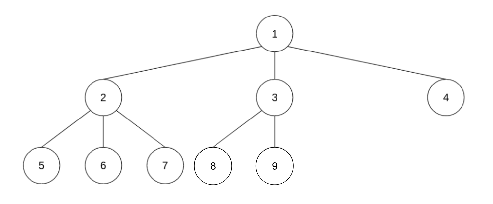

<div align="center"><h1> Heaps and Treaps </h1></div>

## Heaps

First heaps are ***NOT*** trees, they are arrays we draw as trees. Heaps are smart ways of writing perfectly balanced
trees, a Heap will always be perfectly balanced as long as there are no gaps in the array. The following array can be
turned into a Binary heap as follows:

> 1, 2, 3, 4, 5, 6, 7, 8, 9


The same array can be turned into a Ternary (3) heap as follows



What's important to notice here is we are just drawing out the array in a clever way, but there are no connectors
between elements in the array. Elements in the array do not hold references to their children and children do not hold
references to their parents. From an implementation level this mean nodes in the array do not need to hold a left and
right field. Instead, to find a Nodes immediate descendent you use the following formula.

> ch = (k * d) + n

Where:

* `ch` is the descendent or child you want to find
* `k` is the current index of the parent
* `d` is the number of children each parent is allowed to have (binary heap has 2 children)
* `n` the child number you are looking for, ie looking for your first child => +1

If we take our first array example and fill in some values in the formula we can see how it works. We will first assume
the binary tree example, therefore `d` will be set to 2.

> `(index, key)`
> [(0, 1), (1, 2), (2, 3), (3, 4), (4, 5), (5, 6), (6, 7), (7, 8), (8, 9)]

Find the `second` child of `1`:

```text
ch = (k * d) + n
ch = (0 * 2) + 2
ch = 2 (this is the index hence value is 3)
``` 

Find the `first` child of `4`:

```text
ch = (k * d) + n 
ch = (3 * 2) + 1
ch = (7 this is the index hence the value is 8)
```

The formula hold if we increase the number of children a node can have, ie imagine a ternary tree

Find the `third` child of `2`

```text
ch = (k * d) + n 
ch = (1 * 3) + 3
ch = (6 this is the index hence the value is 7)
```

To find the parent given the child's index we can use the following formula:

> k = (ch-1)/d -- floored

where:

* `k` is the index of the parent we are trying to find
* `ch` is the index of the child
* `d` is the number of children each parent in the heap is allowed to have

Find the `parent` of `3` in a binary heap

```text
k = (ch - 1) /d -- floored
k = (2 - 1) / 2 -- floored
k = 0 
``` 

Find the `parent` of `6` in a ternary heap

```text
k = (ch - 1) /d -- floored
k = (4 - 1) / 3 -- floored
k = 1
``` 

## Min and Max Heaps

As with trees, there's an order to the elements being inserted into heaps. Trees are useful for reducing the cost of
searching for elements quickly, we don't use heaps for that. We use heaps specifically when we want to give an order to
the items being removed. This algorithm is also known as a *Priority Queue* and Heaps are perfect solution.

A Priority Queue will remove a key with the highest priority in the case of heaps we can assign the `largest` value as
the value with the highest priority in a `max` heap, and we can assign the `smallest` value with the highest priority in
a `min` heap.

### Max heap

In a max heap every parent element must be `greater than or equal` to all of its descendants. Another important
difference between heaps and Binary Search Trees is that heaps can store duplicates, therefore parents can be equal to
their descendants


### Min Heap

In a min heap every parent element must be smaller than all of it's descendants

 

## Inserting and Deleting

### Inserting

To insert and element into a heap add the element at the back of the array, then compare the element to that of it's
parent, if the element has a higher priority than its parent swap the elements (this would be if the element was greater
than its parent in a max heap, but smaller than its parent in a min heap), since heaps are just arrays the swap
operations are just simple swap operation not tree rotations. Keep swapping the element until the element is in the
correct position. The benefit of using a heap is that we have a guarantee complexity of `O(log(n))` when inserting the
item in the data structure.

 <br />


### Deleting

Deleting an item in the heap works similarly to deletion by copying in a tree. Remembering we use heaps to delete the
item with the highest priority, we remove the first element in the array. This value will always hold the highest
priority value, so we just remove it, but we can't just leave a whole in the heap we need to re-balance the heap. <br />
To fill in the missing gap we take the last item in the heap and place it at root (this is the similarity to the
deletion by copying I mentioned earlier), we then compare that element with all of its descendants and replace it with
the dependent that has the higher priority. I am specifically mentioning all of its descendants as there is no guarantee
heaps will only have 2 children. Once we have found the highest valued descendant, we swap that child with the root
element, we repeat this process until the new element satisfies the conditions of the heap (it is either greater than
all of its children or smaller). In effect, we trickle down the last element in the heap until it finds a valid
position.


## Floyds Algorithm

Floyds algorithm is used to convert a standard array into a heap, from the bottom up. The algorithm has the following
sudo code

```kotlin
fun <T> floydAlgorithm(data: T[])  {
    for (i = indexOfLastNonLeaf ... 0)
    callMoveDown(i) // the trickle down operation for removing
}
```

to calculate the index of the last non leaf non use the following formula

> i = [n/2-1], n being the array size

Assume the following example an array `[2,8,6,1,10,15,3,12,11]`

## Treaps

Heaps are very useful in that they maintain a perfectly balanced tree, but they are quite useless when it comes to
searching for any item other than the item with the highest priority. Binary Trees are quite useful for searching, but
they are also quite unreliable for maintaining a balanced tree. A Treap tries to combine the balance of a heap (maybe
not as high on the enforced list) with the searching abilities of a tree, hence a treap is a combination of heaps and
trees, this is also evident in the name.

### Inserting into a Treap

Treaps differ from heaps in that they are Trees, again, but they differ from trees in that Nodes now also have a second
heap specific field; priority. In a Treap values are inserted into the tree using a data field, as standard to any
regular binary tree, but once they are placed in the tree they are also given a **Randomly generated priority**. This
priority is then compared to their parent, if the parents' priority is higher than the node just inserted then nothing
happens, however if the node being added has a higher priority we rotate the child with the parent. We continue this
process possibly rotating the node inserted with its initial grandparent until the priorities of the Treap are valid.

> **NB!** In a heap we just **SWAPPED** a child with a parent, in a Treap we need to **ROTATE** a child around its parent,
> this is because Heaps are array and Treap are trees.

### Removing from a Treap

Removing items from a Treap works similarly to heap deletion, but without the copying method and only the move down
operations. Deleting a Node with only one child or a leaf Node is simple and requires no extra explination, just remove
the items from the tree. <br />
When, however, we encounter a node that has both children, we first determine the child with the highest priority and
then rotate that child with the parent to be deleted. We continue this process until the Node is either a leaf node or a
node with only one child and were the deletion operation would be simple.
