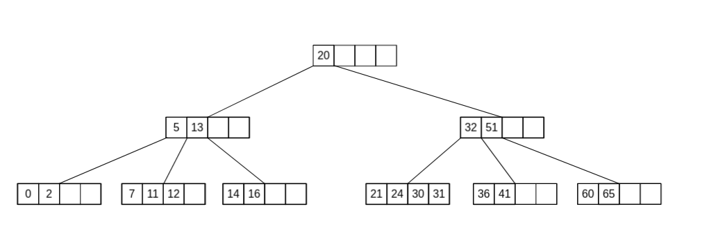
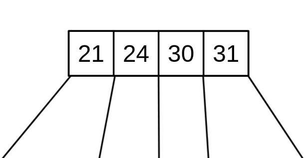
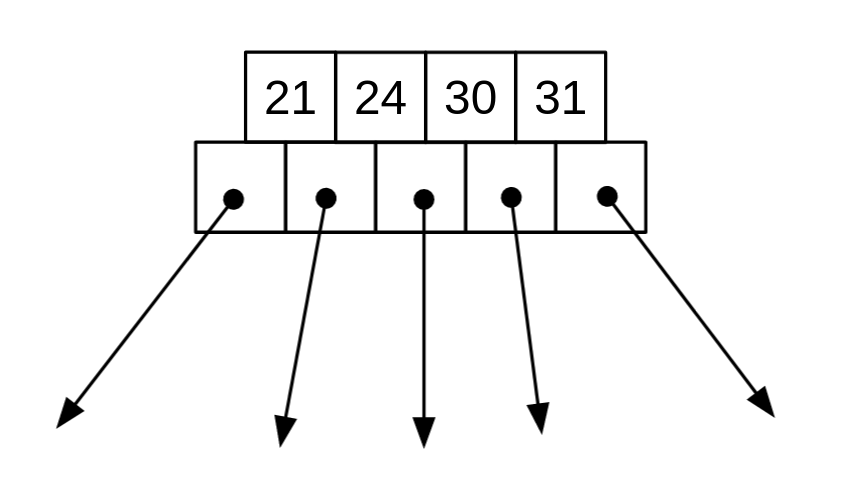
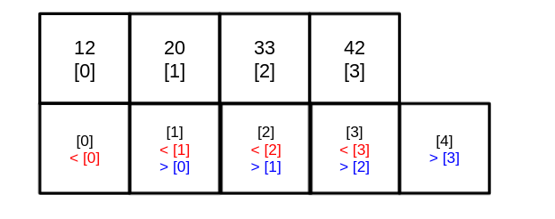

<div align="center"><h1> M-Way Trees Part 1: Introduction</h1></div>

## Multiway Trees

A multiway tree is an tree that can can have more than 2 children, and an M-Way tree, is one which can have a maximum of
m children. We use the terms M-Way tree and B Tree interchangeably  <br />
In fact instead of just "more than 2" children M-Way trees stores what almost resembles an array of children.



However, the nodes do not hold one array but two. In your notes the Nodes of an M-Way tree will usually be drawn like
this;



But what is actually happening beneath the scenes is more like this;



Each Node has two arrays, the first array (top) is an array of `keys`, the keys array stores the values of the node,
furthermore the keys must be written in ascending order. This array just holds the data of the Node much like in a
regular Binary search Tree. <br />
The Second array (bottom) holds references to other Nodes, this is synonymous to the `Left` and
`Right` fields in Binary Search Node. These fields point to their descendent nodes, with the rule that all keys in the
descendent node at reference index will be lesser than the key at index in the parent key array, and all descendants at
reference index + 1 will be greater than the keys at index of the parent key array.



## Max degree

The number of references (the size of the child array) is known as the *max degree* of a B-Tree. The number of keys (the
size of the key array) is always 1 less than the max degree.

There are a further few properties of the Nodes in an M-way tree

1) Root must have at least two subtrees unless it is a leaf node
2) Nodes must be at least 1/2 full (except for root)
3) The number of keys in each Node must be one less than the number of Nodes in the reference array
4) All Leaf Nodes are on the same level

The Node class for an M-Way tree will most likely look like this

```java
class BTreeNode<T extends Comparable<? super T>> {

    private T[] keys;
    private BTreeNode<T>[] children;

    private boolean isLeaf;

    BTreeNode(int m, boolean il) {
        keys = new CompsLeafarable[m - 1];
        children = new BTreeNode<>[m];

        isLeaf = il;
    }
}
```

## M-Way Tree Traversal

Traversal is the first step in any algorithm we learn, in a M-Way tree we start at root and work our way down just like
in a binary tree. In the case of an M-Way Tree we loop through each item in the key array, unttil we find the value or a
value bigger than the item we are searching, if we find an item bigger than the item we are searching for we move to the
reference Node at the index we are currently on. If we find an item bigger than the item we are looking for and we are
on a leafNode then we return a false, in the item was not found within the B-Tree. <br />
The above steps can be written out in the following sudo code

```kotlin
fun searchBTree(item: T): Boolean {
    if (tree isNotEmpty ()) {

        tmp = root
        while (tmp != null) {
            for (0 .. tmp.keys) {
                
                if (tmp.keys[i] == null) {
                    return false
                }
                if (tmp.keys[i] == item) {
                    return true
                }  
                
                if (tmp.keys[i] > item && !tmp.isLeaf) {
                    tmp = tmp.children[i]
                } else if (tmp.keys[i] > item && tmp.isLeaf) {
                    return false
                }
            }
        }
    }
}
```

## Get Height

Getting the height of an M-Way tree is relatively straightforward as we will soon see, all leaf nodes must be on the
same level. Therefore, to determine the height of an M-Way tree all we need to do is visit our first reference Node in
each node starting at root until we encounter a Leaf Node.

```kotlin
fun getHeight() {
    if (root == null) {
        return 0
    }

    val tmp: BTreeNode = root
    val height = 1
    while (!tmp.isLeaf) {
        tmp = tmp.children[0]
        height++
    }

    return height
}
```
