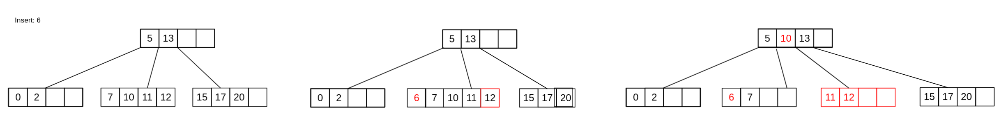

<div align="center"><h1> M-Way Trees Part 2: Insertion and Deletion</h1></div>

## Inserting Into a Tree That is Always Balanced

M-Way trees ensure that all leaf nodes are on the same level, this ensures that the tree is always balanced which as we
have seen in the past is the desired state of trees. M-Way tress ensure that all leaf nodes are on the same level by
inserting nodes not from the root down, but from the bottom up.

Binary Trees would insert from root down, to leaf Nodes


Whereas all insertions in an M-Way Tree start from the leaf Nodes and work their way up the tree.


We always add element on the leaf level, and if the node oveflows we split the node into two and move elements up within
the M-Way tree. Assume we start with a single Node, we insert elements into the Nodes child array as they come in,
foreach new element add the element into the `child array` in `ascending` order.

### Inserting elements into the Array in Order

A lazy approach would be to insert the element in the back of the array and then call a sorting algorithm on the array,
an alternative (eager) approach would be to instead insert the items in order from the start. If you which to perform an
inorder insertion. To do this you can make use of the following sudo code

```kotlin
fun <T> insert(node: BTreeNode, element: T) {

    val tmpArray = new element [node.children.length - 1]

    for (i in 0..node.children.length) {

        if (node.children[i] == null) {
            tmpArray[i] = element

            node.children = tmpArray
            return
        }

        if (node[i] > element) {
            // we need to shift all the values from this point up by 1 after we add the new value in tmp
            tmpArray[i] = element
            while (node.children[i] != null) {
                tmpArray[i + 1] = node.children[i++]
            } // there is a slight problem with this code you'll see it now

            node.children = tmpArray
            return
        }

        tmpArray[i] = node.children[i]
    }
}
```


### What happens when we Overflow?

The above code works very well if and only if the number of elements in the array is **NOT** greater than the size of
the children's Array. If true we could run into an `INDEX_OUT_OF_BOUNDS` exception or worse the code could finish
executing without adding the element at all, and at no point write out any warning as to why the element was not added (
In programming this is called a silent error and is really bad).


### Solution

Well thanks to us writing smart code we don't really need to change much at all. A good solution is to always create an
array 1 size larger than the child array and to handle the scenario in which you would overflow the child array only
when that happens. To do this we can modify the first line in the above code to the following.

> `val tmpArray = new element [node.children.length]`

Now `tmpArray` is always one bigger than child array. All that's left to do is handle the case when child array
overflows, we can tell when the child array would have overflown if the last value in `tmpArray` is not `null`.

```kotlin
fun <T> insert(node: BTreeNode, element: T) {

    val tmpArray = new element [node.children.length] // tmp is 1 size bigger

    for (i in 0..node.children.length) {

        if (node.children[i] == null) {
            tmpArray[i] = element

            // don't set child array yet
            break // break instead of returning now
        }

        if (node[i] > element) {

            tmpArray[i] = element
            while (node.children[i] != null) {
                tmpArray[i + 1] = node.children[i++]
            }

            // don't set child array yet
            break // break instead of returning now
        }

        tmpArray[i] = node.children[i]
    }

    // check to see if you should split the node
    if (tmpArray[tmpArray.length - 1] != null) {
        splitNode(tmpArray, node)
    } else {
        // copy tmpArray into child array 
        ...
    }
}
```

## Node Splitting

Node Splitting is what happens when a Nodes child array overflows, in this case we take one Node and make it two. There
are 2 types of Node overflow, the first is a regular overflow of a Leaf Node or Non-Leaf Node.


### Splitting non Root Node

In this case the element is added to the child array the array must be ordered in a new array of child array size plus
1, then the value at the middle position of the array (this works better when the *max degree is odd*) is selected as a
divider. The middle element moves up and is placed in the parents key array in order. The two remaining halves of the
element key are then places in two Nodes, (you already had one you will need to create a second node and place the right
half of the elements in that Node). The new Node is then placed in the parents reference array and that array must then
be adjusted as well.



### Splitting on Root

The second case of Splitting is Splitting the root Node. Every time you split the root Node, the height of the tree
grows by 1. You follow the same process as before with the root node, you order the key array with n + 1 elements, split
by middle element and create a new node. This new Node becomes the new Root and only has the single middle element you
split the array with. You then create another new node which will contain the right half of the previously overflowing
Node. Once you have the two new Siblings you will have to update each of their children arrays to make sure that they
are valid, in that each immediate child to Roots children arrays contain 1 + the number of keys in the elements array.


> **NB!!** In summary inserting has the following few conditions you should make sure you are looking out for

1. Insert happened on a leaf node and no overflow occurred
2. Insert happened on a leaf node and overflow did occur
3. overflow traversed up all the way to root node

## Deleting Elements

Deleting elements in a BTree is one of the hardest operations in this course. If you can manage to understan this the
rest of the course will be easy.

There are 2 Primary cases

1. Deleting from a Leaf Node
2. Deleting from a non Leaf Node

### Deleting a Leaf Node

When deleting from a leaf there are 2 Secondary conditions:

1. The leaf remains at least half full
2. The leaf underflow's

#### Deleting and no Underflow

When deleting an item from the leaf and the item does not key array does not underflow all that happens is the item is
removed, and we move all the other item in the array up by one.


You can make use of the following sudo code:

```kotlin
fun <T> removeFromLeaf(element: T, node: BTreeNode) {

    val underflowIndex = node.children.length / 2
    val tmpArray = new T [node.children.length]

    for (i in 0..node.childre.length) {

        if (node.children[i] != null && node.children[i] == element) {
            while (i + 1 < node.children.length && node.children[i + 1] != null) {
                tmpArray[i] = node.children[++i] // this ++i updates i before it is used in the assignment
            }
            break
        }

        tmpArray[i] = node.children[i]
    }

    node.children = tmpArray

    if (node.children[underflowIndex] == null) {
        mergeNodes()
    }
}

```

## Merge Nodes

If splitting is what happens when a Node overflows then Merging is what happens when a Node underflow's. In this
scenario there are an additional two cases we need to consider.

1. Either the Nodes left or right sibling has at the minimum amount of nodes after deletion
2. Neither the left nor right sibling has a greater than minim number of keys after deletion

### Help from a Sibling

If either the right or left sibling has a spare element, meaning if we take an element from their key array they will
not underflow, then we can `"borrow"` one of their elements. The default behaviour is to first check the left sibling
and then check right sibling but make sure to read the question to know which rule applies to you.

#### Borrowing from the Left Sibling

When borrowing from the left sibling take the rightmost key and move it up to the parent divider key, then move the
parent divider key and move it down to into the leftmost position in the underflowing Node.


#### Borrowing from the Right Sibling

When borrowing from the right sibling take the leftmost key and move it up to the parent divider key, then move that
parent divider key and place it at the rightmost position in the underflowing Node


#### There are 2 Edge cases to consider

The Leftmost child node will not have a left Sibling, and the Rightmost node will not have a right sibling. In each case
we must deffer to only using one sibling as a reference this means we will also need to add the condition has a Left or
Right Sibling.

### No Help from a Sibling

In the event that neither the Left nor Right sibling has any spare Nodes you can borrow, merge with you Left Node. In
the event that you can not merge with you immediate left Node (you do not have a left sibling merge with your right
Sibling). <br />
When you merge with a sibling Node you combine the key arrays of the two sibling Nodes, **WITH** the `parent key` that
divides the two keys as well, this means you will be removing an item from the parent Node as well, so be sure to check
if the parent underflows as well.

## Deleting Non Leaf Nodes

Deleting non leaf nodes would be quite an illogical operation, keys and references would need to be rebalanced, and the
whole tree restructured. We can circumnavigate such a scenario by ensuring that we instead only delete on leaf nodes.

To make sure we only delete on leaf nodes we can make use of a familiar technique delete by `copying with predecessor`
or delete by `copying with successor`. Which algorithm you chose depends on the question asked, always ensure that you
read the assignment spec carefully.

### Finding the Predecessor or Successor

As before to find the immediate predecessor go one left and as far right as possible. To find the Successor go one right
and as far left as possible.

When looking for a predecessor for a Node that is not one level above the Leaf Nodes level you will have to make use of
the rightmost reference node in each level until you encounter the leaf level, the inverse applies to finding the
successor of the element (make use of the leftmost node).

## Deletion Summary

> In Summary deleting an element from an M-Way tree has the following conditions which you should look out for

1. Deleting from a Leaf Node
    1. When deleting a Leaf the Node does not underflow
    2. When deleting a Leaf the Node does underflow
        1. When the Node underflows, Left sibling has a spare element
            * Has a Left Sibling
        2. When the Node underflows, Right sibling has a spare element
            * Has a Right Sibling
        3. Neither Left nor Right sibling has a spare element
            * Merge left if has Left sibling
            * Merge right if you do not have a Left sibling
2. Deleting from a Non Leaf Node
    1. Using delete by Predecessor
    2. Using delete by Successor

## Helpful Link

You can make use of the following [online visualizer](https://www.cs.usfca.edu/~galles/visualization/BTree.html) to
build an M-Way tree from scratch and see how it is generated.
