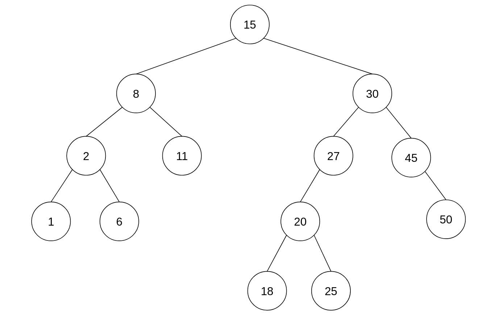
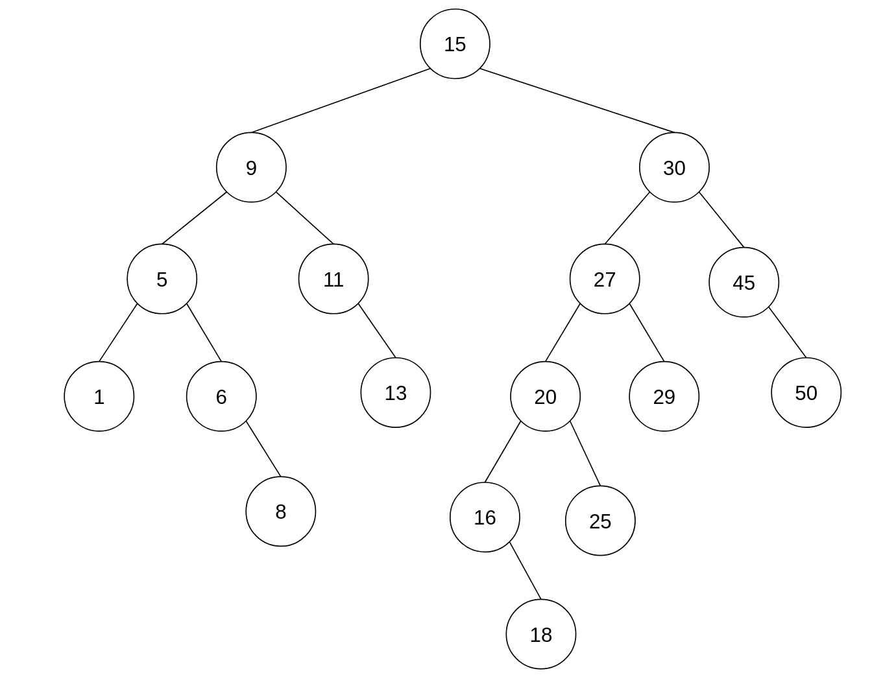

<div align="center"><h1> Balancing a Binary Tree Questions </h1></div>

## The DSW Algorithm

### Question 1.

The DSW algorithm is being applied a tree of 35 Nodes, how many leaf nodes with the resulting tree have once it is
balanced?

 ```text

```

### Question 2.

How many rotations will happen on the first rotation on the backbone?

### Question 3.

For all questions that follow assume the following Binary Tree



When performing the DSW algorithm, we first deconstruct the tree into a backbone using the following algorithm. Read all
question to follow before constructing the backbone

```kotlin
fun createBackbone() {
    tmp = root
    while (tmp != null) {
        if tmp has left child
                rotate this child around tmp
                set tmp to this child that has just become the parent // rotate and move up
        else set tmp to right child // move down the tree
    }
}
```

3.1) Draw the resulting tree when `tmp` will be set to the node with the value
`2` for the first time.

```text

```

3.2) How many times will the `tmp` value be set to 15 when applying the `createBackbone` algorithm?

```text

```

3.3) Draw the resulting tree when `tmp` will be set to node with the value 20 for the second time.

```text

```

3.4) Draw the backbone for the tree

```text

```

3.5) Now that you have the backbone perform the second step of the DSW algorithm, the rotations that balance the tree.
For each iteration or set of rotations show your work by drawing the resulting tree after you have applied the correct
rotations.

## AVL Trees

### Question 1

For each of the following questions assume the following AVL Tree, for each question assume any modifications you make
to the tree will be applied to the next question.



1.1) Examine the AVL tree closely, what was most likely the last operation that modified the tree and why?

```text

```

1.2) Perform the rotation or rotations to balance the AVL Tree. Draw the Tree after it is has been balanced

```text

```

1.3.1) Assume a Node with the value `7` was added to the balanced tree. Would the tree need to perform any rotations
once the value has been added? If yes indicate which rotations would need to occur in the format
of `a left rotation of x around y` etc, if no give a valid reason why not.

```text

```

1.3.2) Draw the tree after the Node with the value 7 was added

```text

```

1.4) Assume a Node with the value `33` was added to the balanced tree. Would the tree need to perform any rotations once
the value has been added? If yes indicate which rotations would need to occur in the format
of `a left rotation of x around y` etc, if no give a valid reason why not.

```text

```

### Question 2

A Node with the key `F` has two children with keys `C` and `K`. Node `K` has two children with the keys `Z` and `I`
. Node `C` has one child with the key `A`. Node `C` is deleted from the tree. Rebalanced the tree by completing the
following sentence by substituting the letters in place of the roman numerals.

Rotate (i) about (ii) and then rotate (iii) about (iv)

```text
i.
ii.
iii.
iv.
```

### Question 3

Assume the keys 1-15 where added into an AVL tree in ascending order, draw the tree out after you have added a unique
set of 3 keys, therefore drawing the tree 5 times (draw the key after adding 3, after adding 6, after adding 9...)

```text

```

## Splay Trees

For each question assume the following Splay Tree, for each question assume any modifications you make to the tree will
be applied to the next question.


Assume the following Cases which you will need to use to answer the questions that follow:

> `CASE 1:` Immediate descendant to Root; `CASE 2:` Homogeneous; `CASE 3:` Heterogeneous

1.1) Assume the Node `18` was accessed, perform all the necessary rotations needed to rotate Node 18 to the root of the
tree. For each series of rotations you will need to make, indicate which case you made using the above mentioned. Draw
the final resulting tree and indicate underneath the tree the sequence of steps you took to get 18 to root.

```text

```

1.2) Assume the Node `8` was accessed, draw the resulting tree and indicate the sequence of cases you took to rotate 8
to root as you did before in question 1.1.

```text

```
