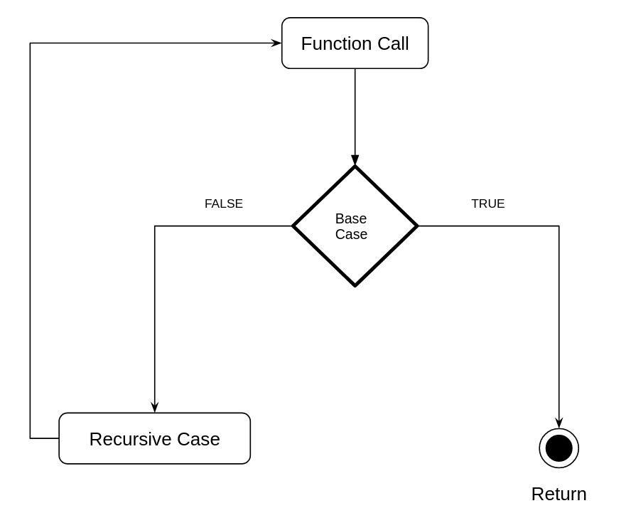
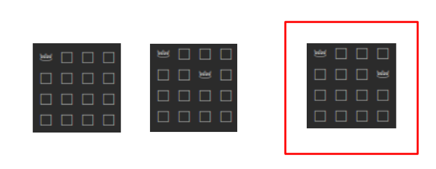
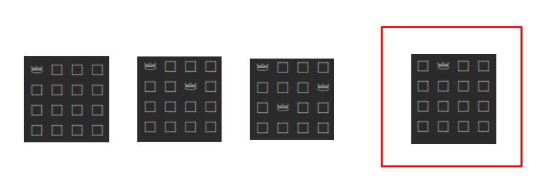

<div align="center"><h1> Recursion </h1></div>

Recursion happens when a function calls itself, the recursive calls will continue until the call reaches a specified
**stopping condition**. This is similar to loops (which execute the same block of code until a stopping condition), in
general, recursion can be thought of as an alternative way to writing iterative loops using function calls. Generally
recursive calls are cleaner, shorter, and more powerful than the standard iterative calls.

## Base Case

As mentioned before recursive calls will continue to execute until a stopping condition, this stopping condition is
referred to as the *base case*. In general the base case of a recursive function, is the part of the function that
would **NOT** continue to call the function and simply return.

## Recursive case

Where the function calls itself again, it is also where the function will return once all further calls have finished
executing.



### The Difference between a Recursive condition and an Iterative condition

In an iterative environment the condition is *the condition that tells the program to **CONTINUE** repeating a block of
code*. For example, a simple while loop holds a condition that, while true, will continue to execute a specified block,
this will continue to happen until the condition becomes false.

```kotlin
fun iterativeMethods() {

    while ( /* condition = */  true) {
        // continue to execute this block
    }
}
```

The condition of the base case is the opposite. *The base case is the condition that will **STOP** repeating function
calls*. For example continue to call a function until we reach a limit

```kotlin
fun recursiveMethod() {

    if ( /* condition = */ true) {
        // stop calling the function recursively
    } else {
        // otherwise call recursively
        recursiveMethod()
    }
}
```

> This means when we are converting Iterative methods to Recursive methods we must swap the condition and vice-versa

## Converting Methods Examples:

Very simple iterative print array function

```java
class Main {

    public void simpleWhileLoop() {
        int i = 0;

        while (i < array.length) { // iterative condition
            System.out.println(array[i++]);
        }
    }
}
```

Converted to a recursive function looks like this

```java
class Main {

    public void simpleRecursiveFunc(int i) {
        if (i >= array.length) { // base case
            return;
        } else {
            System.out.println(array[i]);
            simpleRecursiveFunc(i + 1);
        }
    }
}
```

Notice the base case and the iterative case. The condition for the iterative case is `while (i < array.length)` meaning
any value less than the array length would return true. The inverse of this condition (the condition looking for all
values that would return false) is any value greater than or equal to the arrays length `if (i >= array.length)` and if
we look at our base case, that is the exact condition.

## Types of Recursion

### Tail Recursion

Only `one` recursive call `at the end of the function`, with no other operations after the recursive call. In this way
the recursive call tails the function, hence the name tail recursion. Tail recursion is used as an alternative to simple
iterative calls, like a replacement for a while loop.

```kotlin
fun method(x: Int) {
    if (x < 0) return
    else method(x - 1)
}
```

### Non-Tail Recursion

The recursive call is not the last operation, where at least one operation happens after the recursive call, this can be
any mathematical operation to a returned value, multiple recursive calls, lines of code after the recursive call etc...

```kotlin
fun method1(x: Int): Int {
    if (x < 0) return 0
    else {
        return x + method1(x - 1) // single addition operation after the recursive method
    }
}
```

```kotlin
fun method2(x: Int, y: Int): Int {
    if (x < 0) return y
    else {
        return method2(x - 1, y * 2) * method2(x - 2, y * 4) // multiple operations after recursive calls
    }
}
```

### Indirect Recursion

Functions calling functions that create a loop ultimately calling the function that started the sequence again. Indirect
recursion can lead to tricky to follow code and is sometimes considered an anti-pattern. A specialization is *Mutual
Recursion* where only two functions call each other back and forth.

```kotlin
fun wash(clothes) {
    iron(clothes)
}
fun iron(clothes) {
    hangUp(clothes)
}
fun hungUp(clothes) {
    wear(clothes)
}
fun wear(clothes) {
    wash(clothes) // start at the beginning again
}
```

### Nested Recursion

Functions where the input of one recursive call is determined by the result of another recursive call, the most
computational expensive function calls taught in 212. Nested recursive functions scale very quickly up very quickly and
are often never used because of this

```kotlin
fun nestedFun(i: Int) {
    if (i == 0) return 0
    else if (i > 4) return i;
    else {
        return nestedFun(2 + 2 * nestedFun(2 * i)) // nested call
    }
}
```

## Using Recursion, When and Why?

Recursion can and should be used interchangeably with iterative calls when the recursive functions are easier to read
and follow, but there is a separate scenario were recursive functions are more adapt than regular iterative calls.

Recursion is incredibly useful in scenarios where we need to return to a specific point in time, and at a specific state
of the program. This is because we are not just passing a single variable to each recursive call but the entire
function, this is thanks to the fundamental structure of recursion. Recursion uses the stack to keep state of each
function at a point in the program, when a recursive call ultimately reaches its base case it returns to the previous
penultimate function in the iteration. When the program returns to the previous function it has the exact same state it
had just before it called the final function, and each function that came before the penultimate function would have its
state returned to it in the exact same way as with the second to last function. This means we have access to previous
state when we start traversing backwards through the function calls. <br />
When we make use of the stack we are taking advantage of **non-tail** recursion, and it is incredibly useful in
scenarios which require any form of backtracking.

### Backtracing

Some algorithms require you to first explore a few options before realising the solution will unfortunately require some
changes to one of the previous steps. Backtracing is a programs' ability to go backwards to a previous step in the
algorithm.

One such scenario is the N Queens algorithm. The N queens algorithm tries to place N queens on a NxN chess board in a
position where no queen is attacking another. Queens can move vertically, horizontally and diagonally. The sudo code for
the algorithmn is describes as follows

```kotlin
fun placeQueen(row: Int) {
    foreach col at a valid position
            place queen at position
            if (row < rows)
                placeQueen(row + 1)
            else
                printBoard()

    remove queen at position
}   
```

implementation can be
seen [here](https://gitlab.com/Paul_Wood_96/tutoring/-/blob/master/COS212/code/demo-recursion/src/Queens.java)



In the scenario the first 2 queens are added by simply finding the first available rows and column going from left to
right, top to bottom. However, as it stand with the set up as is there is no valid position to add a queen in the third
row, so the algorithm backtraces and moves the queen in the second row one place further hoping that it clears up a
space for a queen to be added in the third row.



Moving the queen in the second row did allow us to add a queen in the third row, but the algorithm runs into a similar
problem when we try to add a queen to the forth row. The algorithm backtraces one row up and tries to move the queen at
row 3 but unfortunately there is no valid space, so we move up again to the second row, but still there is no valid
position to add the queen. The algorithm backtraces all the way to the first row and moves the queen at this row, after
that the algorithm will try adding queens to rows again as expected and it is with this backtrace step that the algorith
eventually finds a valid setup.


