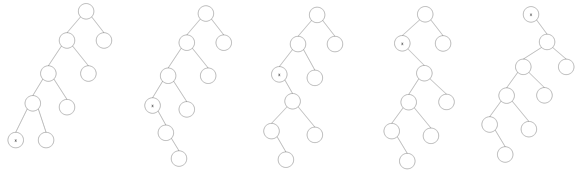
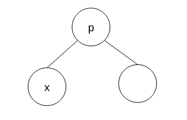
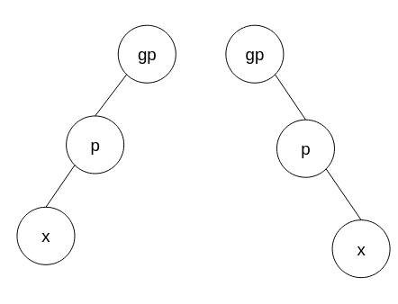
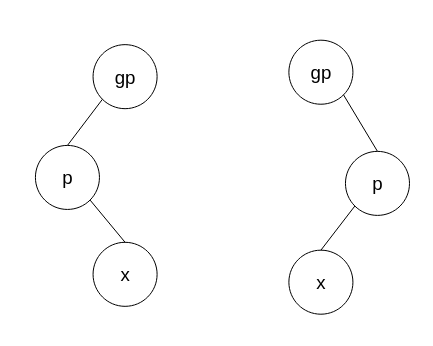
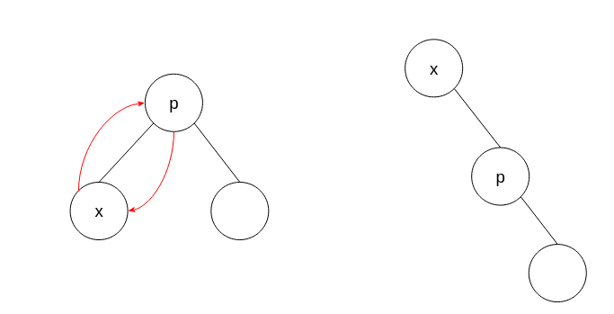
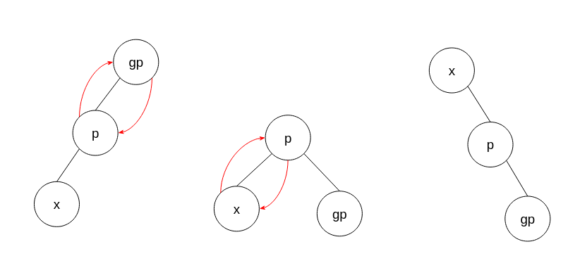
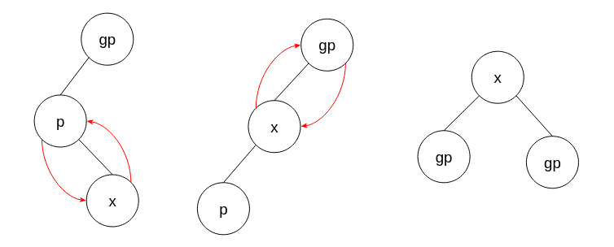

<h1> Self Adjusting Trees </h1>

Just like moving elements closer to the front of the list to speed up search time in
[Self Organizing Lists](https://gitlab.com/Paul_Wood_96/tutoring/-/tree/master/COS212/notes/SelfOrganizingLists/README.md)
we can edit trees to move elements to the top of the tree as well. There are two common strategies for performing a self
adjusting tree.

1. Single rotation: Like the transpose assumes nodes accessed more frequently will likely make their way higher up the
   tree and therefore be able to be retrieved faster
2. Move-To-Root: Like move to front assumes nodes accessed will likely be accessed again and thus should be moved closer
   to the top of the list.

## Blind Rotations

Unfortunately both solution suffer from rotations that actually could leave the tree more unbalanced in the case of an
elongated tree, while this not the primary goal of Self-Adjusting trees it should still be avoided. Take for example
this series of single rotations in order to perform a move-to-root operation on element `x` being accessed.

Just applying single rotations has left the tree unbalanced and worse off than when we started. A solution to this
problem is known as ***Splaying***

## Splay Trees

Splaying is a more strategic series of rotations, specifically `pair` rotations, a rotation with a parent and
grandparent. The rotations consider the relationships between `child-and-parent` and `parent-and-grandparent`. If we are
going to consider the relationship between 3 nodes, there are 3 cases which we must consider.

1. Child nodes immediate parent is root, therefore only a single rotation is possible

2. If Child is the left child to Parent, then Parent is the left child to Grandparent `OR` if Child is the right child
   to Parent, then Parent is the right child to Grandparent

> This is called a ***HOMOGENEOUS*** configuration (HOMO means same).

3. If Child is the left child Parent, then Parent is the **right** (opposite) child to Grandparent `OR` if Child is the
   right child to Parent, then Parent is the **left** (opposite) child to Grandparent.

> This is called a ***HETEROGENEOUS*** configuration (HETERO means different)

### Case 1:

No further operation is needed we just rotate once around the parent

### Case 2: Homogeneous

In this case the first rotation is a rotation of our parent round our grandparent, and then child around the parent.

### Case 3: Heterogeneous

In this case first rotate the child around its parent and then the child around its grandparent.

Splay trees will keep assessing and performing pair rotations until the node accessed has made it to root
