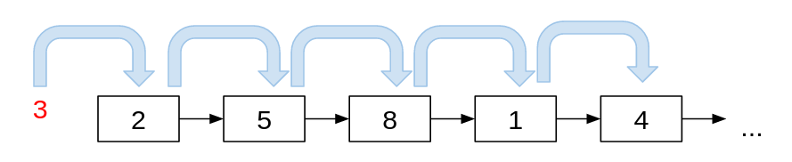
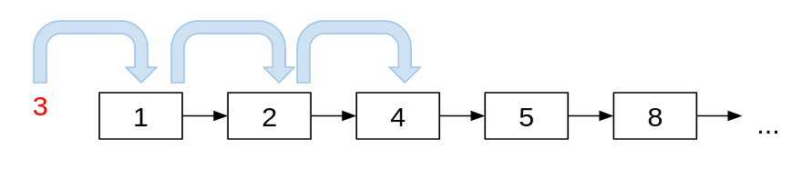
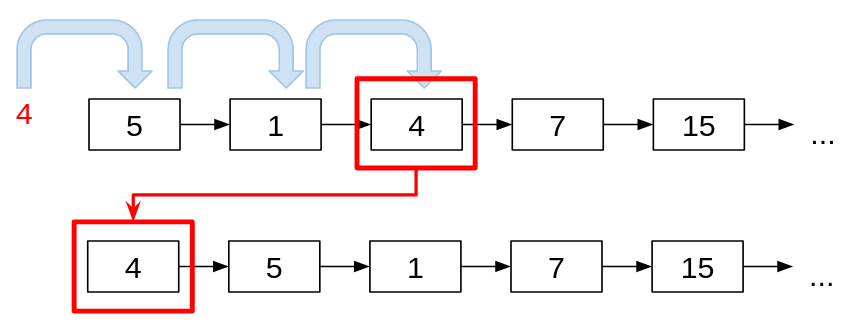
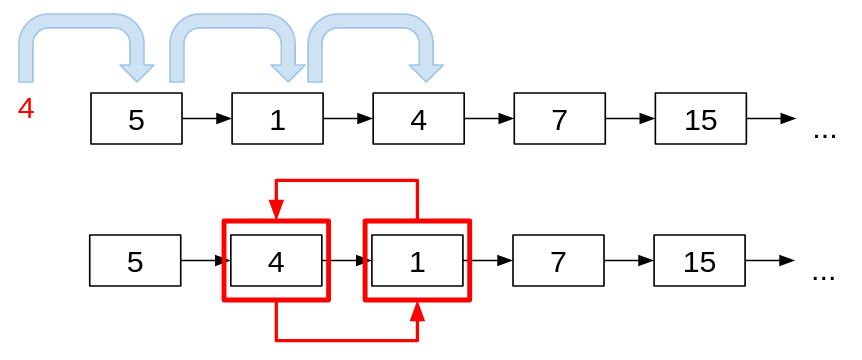
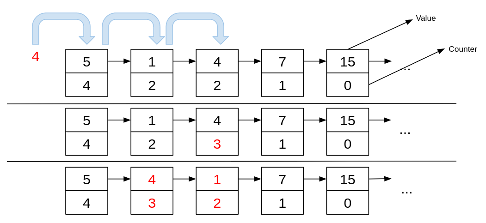

<div align="center"><h1> Self Organizing Lists </h1></div>

Linked lists on their own are not very efficient, searching through Linked Lists becomes more and more expensive as the
list grows.

### Searching for items in the list

As computer scientist our goal should always be to reduce complexity in an algorithm, searching is one of the most
important operations in any data storage environment. For example say you where storing student ID's for a class of
students. Now say you would want to find a particular student, in a standard Linked List you would need to iterate over
every item in the list and check is that student id equal to the student ID you are looking for.

> Let's say we were looking for the student with the ID 3



In the case of a standard unordered Linked List, we start from the first element in the list, and start comparing each
value with the key we are looking for. This becomes quite expensive if we have a very large list and even more
undesirable if the item was not in the list in the first place.

The most natural solution is to create an ordered list. Taking the same scenario we can limit the amount of comparison
operations needed to find the student with the id `3` dramatically.



This is because as soon as we get to the key 4 we can deduce without any doubt that the value 3 does not exist within
the list, because 4 is greater than 3, and we know that our list is ordered. 3 would have to have appeared before 4 in
the list if it was present. This same pattern can be used on Strings as well, it's not limited to number values, for
example Dictionaries are good examples of ordered lists.

## Other Sorting Strategies

Ordered Lists are the most natural, but there are other approaches we can take to make searching more efficient as well.
These strategies are all based off the following common assumptions

> Items queried are more likely to be queried again, and items queried more often than others will likely continue
> to be queried in the future


It's a strategy that instead tries to tackle the probability of an item being queried. There are 3 common strategies

1. Move to Front
2. Transpose
3. Count

## Move to Front

The most extreme of the 3, if any item in the list is accessed (searched for), move it to the front of the list. The
operation to move it to the front of the list is at least constant, but it will always add the extra step to the search
method.



```kotlin

fun moveToFront(item: T) {
    var tmp: Node<T> = head
    var prev: Node<T>? = null

    // no need to check for an empty list
    while (tmp != null) {
        if (tmp.key == item) {
            break
        }

        prev = tmp
        tmp = tmp.next
    }

    if (tmp != null) {
        prev.next = tmp.next
        tmp.next = head
        head = tmp
    }
}
```

## Transpose

The bubble sort of self sorting, everytime an item is accessed (searched for), swap it with its predecessor, except in
the scenario where, the item is at the head of the list. Like the move to front the operation is at least simple and
constant if you the swap operation needs to occur.



```kotlin

fun transpose(item: T) {

    if (head == null || (head != null && head.key == item)) {
        return
    }

    // this is a safe assignment
    var tmp: Node<T> = head.next
    var prev: Node<T> = head
    var prevPrev: Node<T> = null

    while (tmp != null) {
        if (tmp.key == item) {
            break
        }

        prevPrev = prev
        prev = tmp
        tmp = tmp.next
    }

    if (tmp != null) {
        // check for? 
        if (prevPrev == null) {
            prev.next = tmp.next
            tmp.next = prev
            head = tmp
        } else {
            //      PP   P    T
            // 1 -> 2 -> 3 -> 4 -> 5 => before 

            prevPrev.next = tmp
            prev.next = tmp.next
            tmp.next = prev

            //      PP   T    P
            // 1 -> 2 -> 4 -> 3 -> 5 => After
        }
    }
}
```

## Count

Keep track of how often the item has been accessed (searched for) and sort the items in the list by that value. Adds a
complexity as the move operation is dependent on a sort operation which can be dynamic.



```kotlin

fun transpose(item: T) {

    var tmp: Node<T> = head

    while (tmp != null) {
        if (tmp.key == item) {
            break
        }

        tmp = tmp.next
    }

    if (tmp != null) {
        tmp.count++
        sort(tmp)
    }
}

fun sort(tmp: Node<T>) {
    TODO()
}

```

## Drawbacks of Each

* Add complexity or effort needed to the search algorithm
* You will need to search the entire list when looking for an element not in the list, 0(n) complexity in worst case
* Assumes that items are not accessed randomly
* (Count specific) doubles the storage needed as nodes now need to store the key, and a count variable
* (Count specific) long-lasting lists run the risk of overflowing count variables
