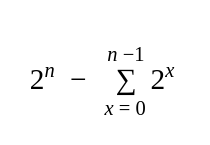

<div align="center"><h1> Skip Lists </h1></div>

A Skip List is a variation of a Linked List, the addition being that you are able to jump over (or skip) a few elements
in the List in order to traverse the list. The only condition we have with Skip Lists is that they have to be ordered to
work.

Skip Lists work with levels of lists, but I like to call them towers.


Each level of the skip list can be seen as its own subset of the entire list, except for the base level or level 0. The
base level is equivalent to a standard linked list, if you where to just traverse the base level you would be traversing
a standard linked list. But, if you traversed the second level you would be able to skip certain elements at level 1.
You can do this because the list is ordered, if the list was not structured searching for items in the list would
require you to iteratively traverse the base level. <br />
Because the list is ordered you can skip towers of lower levels IF the value being stored at the next tower is lower
than the element you are searching for.

A nice scenario I think to help remember Skip Lists, imagine you lived in a city with one street, each building on that
street has an address, addresses are incremental. If we stood on top of one of the buildings in our single city street,
we will not be able to see further than any building at the same level as our current building without going through it,
but we can see all the building beneath us. Likewise, higher levels can access all elements below and between towers of
equal length but can not see further than towers with their same level.

# The Amount of Towers at each Level in the Skip List

If we have a Skip List with 4 levels, then we want to distribute the size of the towers level in a scenario which favors
creating towers at level 1, has a slightly lower chance for creating towers at level 2, with an even lower chance for
level 3. And finally we want the lowest chance of creating a tower at level 4. This is because traversing the towers at
level 4, will theoretically skip the most towers (I say theoretically because randomness). So we don't want a lot of
towers at level 4, otherwise we are back to a single linked list and that defeats our whole purpose of the linked list

# Calculating the towers at each level

This is known as calculating the **Array of Powers**. The Array of Powers is like the name suggest an array of the
powers of 2. Why do we want the powers of 2? because we want to keep the probability of creating a tower the same by a
factor of 2 for any max level skip list. We want the chance of creating a tower at level 1 to be a `1/2` chance, level 2
a `1/4` chance level 3 a `1/8` chance etc...

To calculate the powers array for a skip list height of *n* all we do is



At each iteration we save the value as the range needed to determine the level.

### Example

Find the array of powers for a Skip List with a max level of 7.

> 2<sup>7</sup> = 128 <br />
> 128 - 2<sup>0</sup> = 127 ====> [127] level 7 <br />
> 127 - 2<sup>1</sup> = 125 ====> [125 - 126] level 6 <br />
> 125 - 2<sup>2</sup> = 121 ====> [121 - 124] level 5 <br />
> 121 - 2<sup>3</sup> = 113 ====> [113 - 120] level 4 <br />
> 113 - 2<sup>4</sup> = 97 ====> [97 - 112] level 3 <br />
> 97 - 2<sup>5</sup> = 65 ====> [65 - 96] level 2 <br />
> 65 - 2<sup>6</sup> = 1 ====> [1 - 64] level 1 <br />

You can write it out as is or if you wanted you could write it out as follows:

```text
{
  level1: [1-64],
  level2: [65-96],
  level3: [97-112],
  level4: [113-120],
  level5: [121-124],
  level6: [125-126],
  level7: [127]
}
```

Notice how level 1 has a range size of 64, 64 elements is exactly 50% of 128, level 2 has 32 elements, 32 is exactly 25%
of 128 etc. This is why it is known as the powers array.

## Using the Ranges

Now that you have the ranges all that's left is to use a random number (between 1 and 127 inclusive), and if the random
number falls between the range of 97 and 112, lets 100, then you know that you need to create a level 3 tower. If the
number returned was 12, you will create a level 1 tower. Notice here how the odss are heavily stacked in making level 1
towers but this does not mean that you won't ever create a level 7 tower. RNG can create a list of only level 3 if thats
just what gets returned from the RNG.

> NB! When inserting values, the value we are inserting has nothing to do with the random number, the random number
> and the item being inserted are separate entities

## Searching

when searching for items, we start at the max level of our skip list and iterate through it until we find either the
value we are looking for, OR a null next value, OR a next value larger than the value we are looking for.

```java

class SkipList {
    public T search(T key) {
        int lvl;
        skipListNode<T> prev, curr;

        // find the highest non null
        for (lvl = maxLevel - 1; lvl >= 0 && root[lvl] == null; lvl--) {
            // empty body    
        }

        prev = curr = root[lvl];

        // I wouldn't usually make infinite loops like this
        while (true) {
            if (key.equals(curr.key)) {
                return curr.key;
            }
            // compare to next
            else if (key.compareTo(curr.key) < 0) {
                if (lvl == 0) {
                    System.out.println("Item not found in the list");
                    return null;
                }
                // still on root node
                else if (curr == root[lvl]) {
                    curr = root[--lvl];
                }
                // have moved a bit
                else {
                    curr = prev.next[lvl];
                }
            } else {
                prev = curr;
                if (curr.next != null) {
                    curr = curr.next[lvl];
                } else {
                    // find the highest non null from current lvl - 1
                    for (--lvl; lvl >= 0 && root[lvl] == null; lvl--) {
                        // empty body    
                    }
                    if (lvl >= 0) {
                        curr = curr.next[lvl];
                    } else {
                        System.out.println("Item not found in the list");
                        return null;
                    }
                }
            }
        }
    }
}
```
