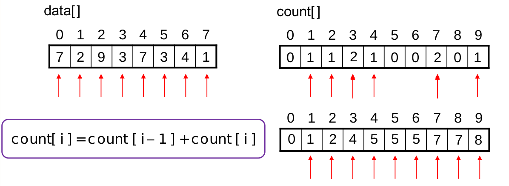

<h1> Sorting </h1>

Sorting involves ordering a List into a desired hierarchy, where keys with higher value are placed at the front of the
list and keys with the lower value are placed at the bototm. The value is whatever we define to be of interest ie. max
or min values

## Good Sorting Algorithms

All sorting algorithms sort lists (obviously right), so why are there so many algorithms out there and which algorithm
should we choose. A sorting Algorithm is considered good if it has a very low complexity.

Meaning the fewer comparisons and steps the algorithm needs to perform the better.

## Insertion Sort

Loop through the list making a smaller list while looping through it equal to the index you are currently on. Insert the
new element into the new smaller list in the correct order.

One of the simplest and easiest sorting algorithm to understand and easy to code as well.

### Complexity

On average pretty bad, we could perform a lot of comparisons before we find the correct index for the element and in the
worst case we could insert all the way at the end performing n2 comparisons.

## Selection Sort

Instead of making a new list equal to the index of your looping function, instead go out and look for the smallest
element in the list and add it at the correct index while looping the list.

So at index 0 find the smallest element, at index 1 find the second smallest item etc etc.

### Complexity

Pretty bad, Selection sort always loops through all the elements in the list to find the correct value at that position,
and the also loops through all the values to find the smallest value in the remaining list. Thus the best case of the
Selection Sort is Equal with its worse case.  
The best and worst case of selection sort is equal to n2

## Bubble Sort

We start from the back and try to move elements into the correct position by comparing them with their direct
predecessor. If the item is smaller than its predecessor swap them, and we always stop one before the previous index,
Ironically this is like a selection sort but in reverse.

### Complexity

Very bad, like with selection sort we have two inner for loops, and we iterate through each position to find the
smallest value for the correct position.

## Comb Sort

Instead of comparing each element with its neighbour first, rather create a gap of comparisons and shrink that gap until
you are comparing neighbouring elements. What ends up happening is that by the time you start comparing neighbours
values will more than likely already be somewhat ordered.

### Gap Size

> In comb sort the gap size is equal to 1.3/n, and we apply that algorithm for each iteration

  
 

## Complexity

Best case n(log(n)) worst case o(n2)

## Shell Sort

Similar to Comb sort but actually an adaptation to Insert Sort. Attempts to apply a quadratic approach to the size of
the list, like splitting the array into a binary tree.  
Attempt to make sub arrays and sort those arrays in insertions sort, decreasing the size of the sub arrays in each
iteration. When the sub list size is equal to the original array size, there will likely be less changes.

### Gap Size

> In a shell sort it works best if you roof(n/2), however they could also tell you what your initial gap
> size should be and how to shrink it so read the question

### Complexity

Best case n(log(n)) worst case o(n2)

## Heap Sort

Attempt to make the selection sort more efficient. We already know a logirithmic way of retrieving the largest and
smallest elements in an array using Heaps.  
Use [Floyd's Algorithm](https://gitlab.com/Paul_Wood_96/tutoring/-/blob/master/COS212/notes/Heaps/README.md#floyds-algorithm)
to transform the list into a max heap.

Then just keep preforming deletes on the heap removing the largest element from the heap and inserting it into the
correct order

 

### Complexity

Best case n(log(n)) worst case n(log(n))

## Quick Sort

We find a pivotal point in the list, and we make sure that element is at the correct position.

The rest of the array might not be sorted but at least 6 is at the correct position, this is a pivotal point.

### Picking a Pivotal point

Always chose the middle element cause as you will see that longer the algorithm is applied the more likely the data is
to be partially sorted.

Then try and find the correct index of this point by performing the following steps

1. Move the element to the front of the list
2. Start looking for the min Index, loop through values at index 1 + pivot point until you find an element bigger than
   your pivot point
    2. This could create a problem, what if your pivot point was the largest element in the array?

> NB! Step 1: Find and place the largest element at the back of the List

3. Start looping from the back and search for elements that are smaller than the pivot point **AND**
   the value we are saving as the smallest index
    4. If the value at the back is smaller than the value in the smallest index, swap the elements and compare the
       smallest index array with your pivot point again
4. When the smallest and largest indices meet you have found the correct index for your pivot point.

## Merge Sort

Divides the Array in two until the array size is == 1 and merges those sub arrays back into one from the bottom up.

One downside is Merge Sort is that the algorithm is memory intensive as you will need to create new arrays for each of
those sub arrays.

### Complexity

Best case n(log(n)) worst case n(log(n))

## Radix Sort

Sorts by the decimal values of keys. Will iterate as many times as the highest decimal value in the list.

123 the decimal value here is 3 as there are 3 multiples of 10

45684 the decimal value here is 5 as there are 5 multiples of 10

So for Radix sort we first sort by lowest decimal, and then we work our way up to the highest decimal

And, then we increment the decimal counter

## Count Sort

Use indices, and the frequency of elements encountered to sort elements. This algorithm is incredibly effiecient but
requires a lot of memory.

You will need a count array with the index of the largest value in the array

And then we sort by finding the value at our count array from the value being stored in the data array.

## How to Spot these Algorithms

In your exam they are going to give you questions with arrays and then the array after an iteration of a certain sorting
algorithm having been performed on the array. Your task will be to determine which sorting algorithm was used to make
those specific iterations.

So some handy tricks that I like to use is determination by negation. So I have a set list of things to look out for,
going from the easiest modifications to spot on the array. If the array does not have what I am looking for I move on to
my next key thing to look out for eliminating those few algorithms I know are associated with what I am looking out for
at each step.

### Pyramids

If after each iteration the array appears to be sorted at each iteration's index it can be one of 3 algorithms,
**Selection Sort**, **Bubble Sort**, **Insert Sort**

Selection and bubble will both place the lowest value in the whole array at index 0 after the first iteration, The
difference is Selection Sort will only swap the value of the index with the largest value where Bubble sort coould end
up moving a lot of other elements in the array as well.

Insert sort only sort by the index it has seen from the original array

### Pyramid means

1. Selection
2. Bubble
3. Insert

#### Inverse Pyramid

If I see that the sorting is being applied from the back of the array as in the largest value is moving into place and
then the second largest, third etc etc then immediately I know it is the Heap Sort.

#### Inverse Pyramid means

1. Heap

### Merge Sort

Merge sort is unique enough that I can spot it just by knowing what to look out for. If I can draw a line down the
middle of the elements, and no element has crossed that line before the final iteration, and each side of the line is
sorted then it is Merge Sort

### Radix Sort

Is also so unique that is actually easier to spot after the first iteration than you might think. If after the first
iteration numbers are sorted by the lowest decimal value, so if you only have multiples of 10 or 0 then it is Radix
sort.

## Final 3

When it is not one of the mentioned above it can only be 1 of 3, Quick Sort, Comb Sort or Shell sort. These 3 are
arguable the hardest to spot with no real quick way of spotting them without performing the algorithms possibly a couple
of times to make sure of your analysis.

### Comb

So with Comb we take the number of elements and divide by 1.3, we then compare swaps and see if the swaps after the
first iteration happened at a distance of 1.3 if so then we have found comb sort.

### Shell

It is similar to Comb so be careful, but remember the original gap size with Shell is half array size, and we can order
sub arrays (more than just 2 elements as with comb)

### Quick sort

It is a little easier than the first two unknowns. An algorithm used quick sort if after the first iteration the only
change was that the largest element went to the back and then the MIDDLE element moves to its correct poition in the
array.

