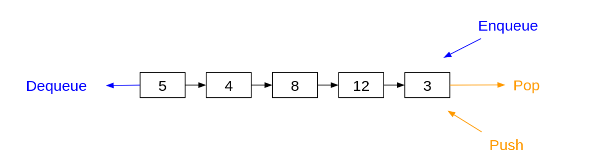

<div align="center"><h1> Stacks and Queues </h1></div>

Stacks and queues are just extensions of Linked Lists with slightly more specific operations. In a Linked List we can
add an item into the list at any given index, however in a stack and queue we can only add items to the back of the
list. The difference between a Stack and a Queue comes from where we remove an item from the list

## Queues

Queues are the easiest of the two to remember since they are the ones that appear more frequently in the real world.
Queues follow the *First-In-First-Out principle* (FIFO). Think of standing in a queue at a supermarket, the person in
front of you entered the queue before you, and thus will leave the queue before you as well.

## Stacks

Stacks are the opposite, stacks follow the *First-In-Last-Out* principle (FILO). In this case the first item in the list
will stay in the list until all items that have been added after that item are removed first. Think of stacking a pile
of plates, you start from the bottom and work your way up, but when you remove a plate you remove the plate at the top,
likewise in a stack environment we remove the item at the top/back of the list.

## Pop and Push, Enqueue and Dequeue

Stacks and Queues have two different terms for adding and removing items from the list. Both a Stack and a Queue add
items to the back of a List, to add an Item in a Stack you call the `push` method and to add an item in a Queue you call
the `enqueue` method. These operations always adds the new item to the tail of the List. <br />
To remove an item from a Queue you call the `dequeue` method, and remember this item must be the item at the front of
the list, at index 0. To remove an item from a Stack you call the `pop` method, this item must be the item at the back
of the list or at index `n` (n being the size of the List).

## Cheat Sheet



## A 212 Classic Question

### Implement this Stack as a Queue

This is an age-old question in 212, they do love asking it, so it's worthwhile practicing. Assume you have the following
queue implemented as a Stack, you have access to the Stacks `pop()` and `push()` methods from the stack as well as the
`isEmpty()` method.

```java

class Queue<T> {

    public Queue() {
        stack = new Stack<T>();
    }

    public void enqueue(T elem) {
        stack.push(elem);
    }

    public T dequeue() {
        // implementation left for us
    }
}

```

Implement the deque method. There are two important things you need to look out for. First if they are asking for a
`pop` or a `dequeue`. In this example I am asked to implement the `dequeue`, this means I have the pop method which
removes an item from the back of the list. I need to remove an Item from the front of the List. The second part that
often catches people out is to remember that the list could be empty, so make sure to make use of that `isEmpty()`
method. You'll notice it if you read the full question.

To implement a Queue as a Stack we first reverse the list so that the item we want to remove will be at the top of the
new temp Stack. Remove the item at the top of the Stack and then reverse the Stack again so that it returns to its valid
state

```java
class Queue<T> {

    public Queue() {
        stack = new Stack<T>();
    }

    public T dequeue() {
        if (isEmpty()) {
            return null;
        }

        Stack<T> tmp = new Stack<T>();
        while (!stack.isEmpty()) {
            // reverse the stack
            tmp.push(stack.pop());
        }

        T tmpValue = tmp.pop();

        while (!tmp.isEmpty()) {
            // reverse the stack again to the correct order
            stack.push(tmp.pop());
        }

        return tmpValue;
    }
}
```
