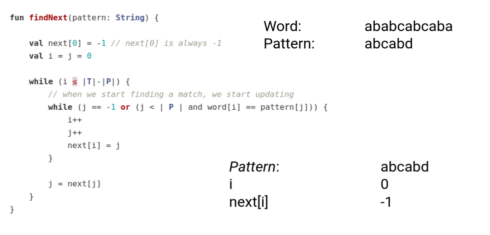

<div align="center"><h1> String Matching </h1></div>

String matching is the process of finding a sub string/pattern within a larger string. One such algorithm we can use to
do this is the

## Knuth-Morris-Pratt algorithm

Works by finding substrings and patterns within the pattern we are looking for. We can use the patterns within the
substring to avoid using a brute force approach and skip ahead to parts of the string we already know match

Here is the algorithm

```kotlin
fun knuthMorrisPratt(pattern: String, word: String) {
    val next = findNext(P)
    val i = j = 0

    while (i ≤ |T|-|P|) {
        while (j == -1 or (j < | pattern | and word[i] == pattern[j])) {
            i++
            j++

            if (j == | pattern |) { // successful match!
                return match at i - | pattern |;
            }
        }

        j = next[j]
    }

    // i does not backtrack
    return no match;
}
```

The algorithm works with two counters `i` and `j`. I will be used to move through the word once character at a time
and `j` will be used to move through the pattern. When the word and the pattern match both `i` and `j` move one
character forward, but when they do not we need to use the next array to move to the next possible point in the sub
array where we could find a possible match. This is the power of the algorithm to skip ahead to a specific point in the
algorithm. To know where we will be able to skip too we need to populate the next array, we can use the same algorithm
to do that.

```kotlin
fun findNext(pattern: String) {

    val next[0] = -1 // next[0] is always -1
    val i = 0
    val j = -1

    while (i ≤ |P|) {
        // when we start finding a match, we start updating  
        while (j == -1 || (i < |P| && word[i] == pattern[j])) {
            i++
            j++
            next[i] = j
        }

        j = next[j]
    }
}
```

So let's apply this findNext() algorithm to this string and pattern



We get the following


Now we can use this next array in the first algorithm and see how by making use of the sub patterns we can skip ahead to
a certain point, so as not using brute fore


