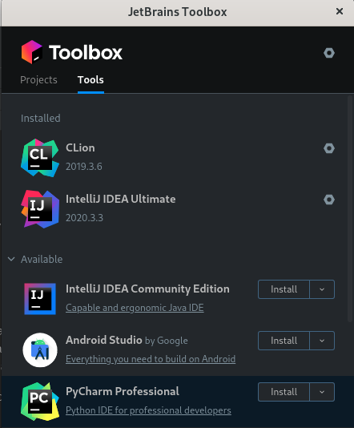

<h1> Installing Intellij </h1>

Intellij is an IDE provided by JetBrains. Intellij is highly popular amongst Java developers for it's superior debugger
and predictive text.

## ToolBox

A support tool for all JetBrains products ToolBox manages and handles all you JetBrains products for you in a
centralised lightweight modal. It is the simplest and easiest way to get started with Intellij IDE, it will also keep
your IDE's up to date or show you when available updates are ready to be installed.

You can use the [following link](https://www.jetbrains.com/toolbox-app/) to quickly download and install JetBrains
toolbox on your system

## Installing Intellij

Once ToolBox has been installed you can open it and install Community Edition of Intellij for free,

